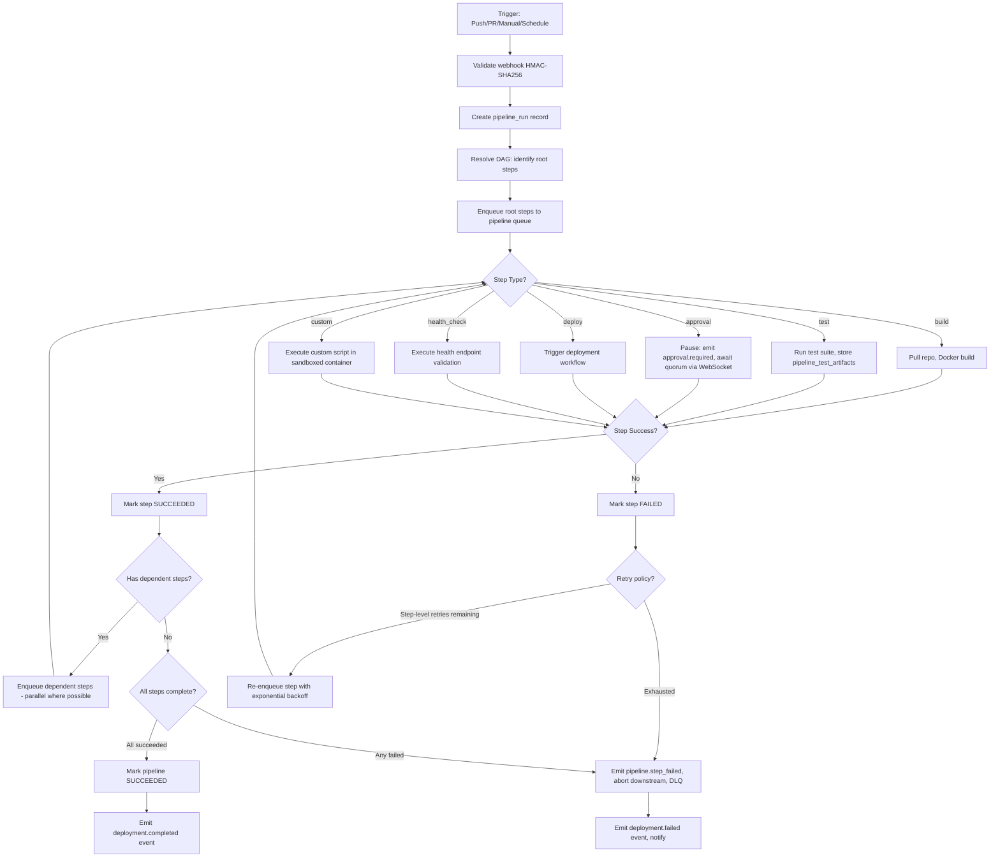
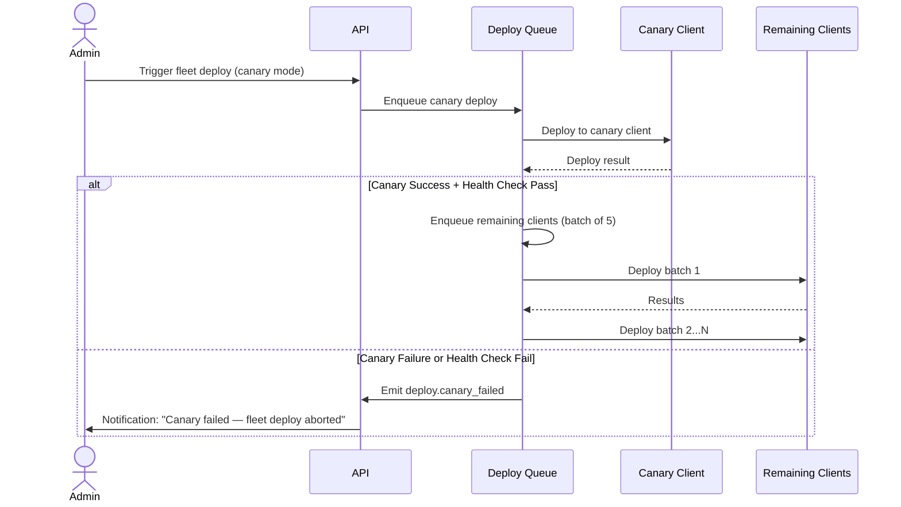
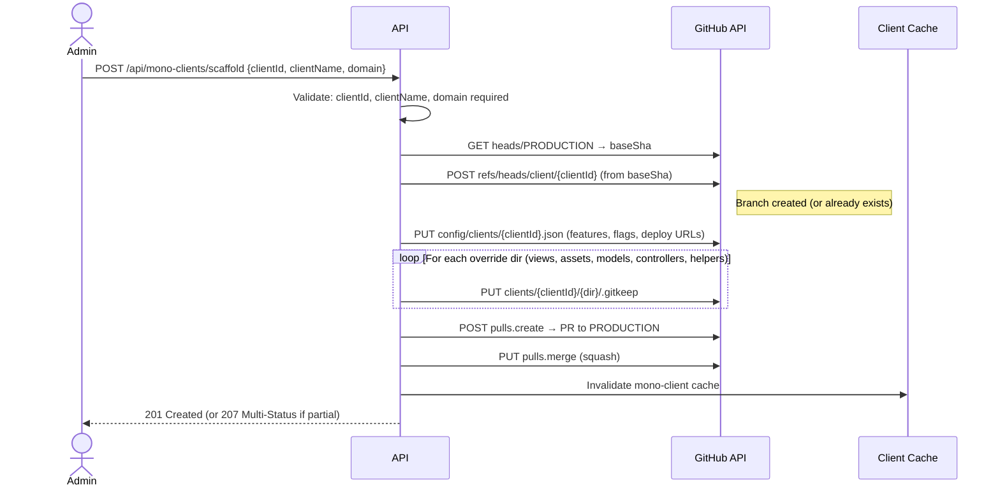
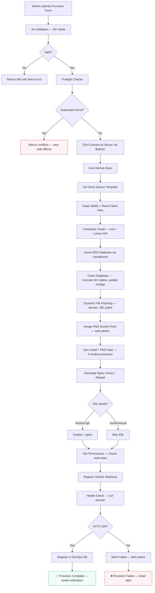
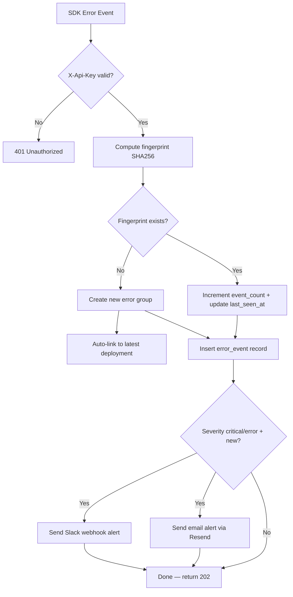
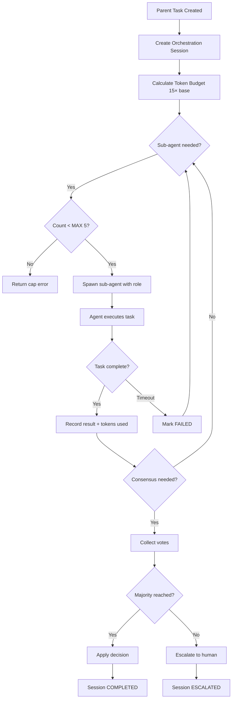

# 🔁 IDP Workflows — Cortexo Platform (v4 Aligned)

> Step-by-step flows with decision points, failure branches, and state machines.
> Every workflow: minimum 10 detailed steps with failure paths at each critical step.

---

## Workflow 1: CI/CD Pipeline Execution

**Detailed Steps**:

1. **Webhook received**: Git provider sends push/PR event. API validates HMAC-SHA256 signature against `source_registry.webhook_secret_hash`. Mismatch → 401, audit log written, no further processing.
2. **Pipeline resolution**: Match webhook payload (branch, event type) to `pipelines.trigger_config`. No match → discard silently (logged at debug level).
3. **Idempotency check**: hash(pipeline_id + trigger_type + git_commit) checked in Redis. Duplicate within 60s → return existing `pipeline_run_id`.
4. **Create pipeline_run**: INSERT with status=`pending`, idempotency_key, triggered_by.
5. **DAG parse**: topological sort of `dag_definition`. Detect cycles → reject with error describing cycle path.
6. **Root step enqueue**: all steps with zero dependencies enqueued to BullMQ simultaneously. Each carries pipeline_run_id + step_name.
7. **Step execution**: worker picks up step, checks step status (idempotency). Executes based on type. Logs stdout/stderr to ClickHouse via worker's own Fluent Bit.
8. **Step completion**: mark step succeeded/failed. If succeeded → resolve dependents with all-dependencies-met check. If all met → enqueue.
9. **Step failure**: check retry policy (step-level, not pipeline-level). Retries remaining → re-enqueue with backoff. Exhausted → cancel all downstream, emit `pipeline.step_failed`.
10. **Pipeline completion**: when all steps terminal (succeeded or failed or cancelled) → compute overall status. Emit appropriate completion event.
11. **Test artifact processing**: for test steps → parse JUnit XML, extract coverage percentage, compute delta vs previous run, flag flaky tests (> 15% fail rate), store in `pipeline_test_artifacts`.
12. **Approval timeout**: if approval step pending > configured SLA → escalate to secondary approver or auto-reject per `pipelines.definition.approval_policy`.

**Key rules**:
- Step-level retry, NOT full pipeline retry
- Cancel downstream on step failure — never leave orphan steps running
- Approval gates: quorum-based (e.g., 2 of 3 leads), configurable timeout + escalation chain
- Re-run from step: restart from any completed step without re-creating snapshot
- Test steps store `pipeline_test_artifacts` (coverage, JUnit XML, screenshots)

---

## Workflow 2: Environment Promotion

**Purpose**: Promote a deployment from staging → UAT → production (or any configured chain).

**Step-by-step**:

1. **Initiation**: developer clicks "Promote to {next_env}" on a successful deployment. API validates that deployment status = SUCCEEDED.
2. **Environment chain validation**: verify `environments.promotion_order` defines a valid path (staging→UAT→prod). If current env not in chain → reject.
3. **Same-artifact check**: verify the exact same `git_commit` SHA will be deployed — artifact tagged with commit SHA at build time. System does NOT rebuild — uses the same Docker image digest. If image not found in registry → fail with IMAGE_NOT_FOUND.
4. **Test gate**: check if target environment requires test_run pass (`environments.config.require_test_run_pass`). If true, verify `test_runs` with status=passed exists for this deployment (manual tester sign-off required for UAT→prod). No run exists → block with "Test run required" message. Admin can override (audited).
5. **Approval matrix**: apply target-environment-specific approval rules. Production may require 2/3 lead approvals. Staging may require none.
6. **Deployment window**: check target environment's `deployment_windows`. Outside window → queue with `WINDOW_BLOCKED` status.
7. **Snapshot adaptation**: create new `deployment_snapshot` for target environment: same git_commit, same module_versions, but env_var_refs swapped to target environment's Vault scope.
8. **Health capture**: record `health_before` for target environment's client.
9. **Migration check**: verify DB migration version compatible with target environment DB. If different → migration worker executes (snapshot DB first).
10. **Deploy execution**: same deploy worker logic. Pull cached image → stop old → start new → health check → verify → swap traffic.
11. **Post-promotion**: record `health_after`. Emit `deployment.completed`. Trigger drift scan. Changelog updated with promotion metadata.

**State machine**: Same as deployment: `PENDING → WINDOW_BLOCKED → APPROVED → BUILDING → MIGRATING → DEPLOYING → VERIFYING → SUCCEEDED | FAILED | ROLLED_BACK`

---

## Workflow 3: Deployment Lifecycle (Direct Deploy)

**Step-by-step**:

1. **Initiation**: API receives deploy request → validate client_id, module, environment_id. Check `clients.status` = active.
2. **Idempotency check**: `X-Idempotency-Key` → Redis lookup. Same key within 24h → return existing deployment record.
3. **Rate limit check**: check tenant quota — `max_concurrent_deploys`. If at limit → 429 with Retry-After.
4. **Lock acquisition**: `lock::deploy::{tenant_id}::{client_id}::{environment}` (TTL: 10min)
   - If lock fails → check queue depth. < 3 queued: enqueue 30s delay. >= 3: reject QUEUE_FULL.
5. **Deployment window check**: current time within `deployment_windows` for client+env? → queue if outside with `WINDOW_BLOCKED` status.
6. **Approval matrix**: evaluate rules (e.g., production requires 2/3 approvals)
   - Emit `approval.required` → WebSocket notification with deep link → wait
   - Timeout: escalate to secondary approver or auto-reject per policy
7. **Snapshot creation** (immutable INSERT only):
   - Git commit SHA, branch, tag
   - Environment variable Vault reference IDs (NEVER raw values)
   - DB migration version, artifact version
   - Module list with individual versions (`module_versions` JSONB)
   - Pipeline step config hash
8. **Record `health_before`**: capture client health score before deploy
9. **Pre-deploy diff**: generate diff preview → files changed, modules affected, risk indicator
10. **Build phase**: Docker build → push to registry → record image digest
11. **Migration phase**: if DB migration needed → snapshot DB → migration worker executes (one retry only)
12. **Deploy phase**: Pull image → stop old container → start new → health check (30s timeout, 3 retries with 10s gap)
13. **Verification**: health endpoint 200, no error spike in ClickHouse logs (30s observation window)
14. **Traffic swap**: update reverse proxy / load balancer config → verify routing
15. **Post-deploy**:
    - Record `health_after` → compute delta
    - Emit `deployment.completed` → changelog worker → notification
    - Trigger drift scan
    - Release lock (in finally block — always released)
16. **On failure at any step**: auto-rollback → emit `deployment.failed` → create bug → preserve snapshot → release lock

**State machine**: `PENDING → WINDOW_BLOCKED → APPROVED → BUILDING → MIGRATING → DEPLOYING → VERIFYING → SUCCEEDED | FAILED | ROLLED_BACK`

---

## Workflow 4: Bug Lifecycle + RCA

**Step-by-step**:

1. **Bug creation** (sources):
   - Manual: user creates via UI with title, description, priority, client_id, module_id
   - Auto (deploy failure): `deployment.failed` event → bug created with linked deployment_id, client_id, module_id
   - Auto (test failure): failed `test_result` → bug with linked test_run_id
   - Auto (log alert): ClickHouse error pattern match → bug with log excerpt
2. **Deduplication**: fingerprint = hash(source + error_signature + client_id). If exists within 24h → link to existing bug as related event
3. **Bug fields**: title, priority, status, `version_introduced`, `version_fixed`, assigned_to, client_id, module_id, source
4. **Bug events**: every state change, assignment, comment → immutable `bug_event` record (timeline)
5. **Auto-triage** (priority assignment):
   - Production deploy failure → `critical`
   - Test failure → `medium`
   - Drift detection → `low`
   - Manual → user-selected, default `medium`
6. **RCA Phase 1** (manual): cause_type, affected_files (JSONB), root_cause_summary, deployment_id
7. **RCA Phase 2** (AI): RCA worker queries ClickHouse logs ±30min + Git diff → `ai_summary`, `suggested_fix`, `confidence_score`
   - **Human review gate** — AI output held until `reviewed_by` populated
   - Display confidence score prominently with colour coding (< 0.5 red, 0.5-0.7 amber, > 0.7 green)
8. **Resolution**: fix deployed → `version_fixed` set → verify via test run → mark RESOLVED
9. **Observation**: 7-day observation period post-resolution. If no regression → auto-CLOSED. If regression → auto-reopen.
10. **Linked deployments**: which deploy introduced the bug (version_introduced), which resolved it (version_fixed)
11. **Test result link**: test run that verified the fix
12. **Analytics**: RCA data feeds pattern detection ("70% of prod bugs are config errors")

**State machine**: `OPEN → TRIAGED → IN_PROGRESS → IN_REVIEW → RESOLVED → CLOSED` (reopenable from RESOLVED or CLOSED)

---

## Workflow 5: Rollback

**Step-by-step**:

1. **Trigger**: manual request from UI/CLI OR auto from failed health check post-deploy
2. **Lock acquisition**: rollback ALWAYS wins over deploy if conflict (safety-first)
3. **Snapshot lookup**: find last successful `deployment_snapshot` for client + module + environment
4. **Validation**:
   - Docker image exists in registry → verify digest. If missing → FAIL, cannot rollback, alert + create bug.
   - DB migration backward-compatible? If DOWN migration exists → execute (with DB snapshot first). If not → skip with warning, mark `PARTIAL_ROLLBACK`.
   - **NEVER auto-run destructive DB operations** (DROP, TRUNCATE) — require explicit DBA approval
5. **Execute**: pull snapshot image → revert env vars (from Vault snapshot refs) → stop current → start snapshot container → health check
6. **Post-rollback**:
   - Emit `deployment.rollback_triggered` with snapshot_id, triggered_by
   - Status = `ROLLED_BACK`
   - Create bug with source=`rollback`, linked to original deployment
   - Release lock (finally block)
7. **RTO target**: < 5 minutes end-to-end. Page on > 8 min. SLA starts from trigger, not from approval.

---

## Workflow 6: Drift Detection

**Step-by-step**:

1. **Triggers**: Scheduled (repeatable BullMQ job, every 6h configurable per-tenant) + on-deploy trigger (`deployment.completed` event)
2. **Client enumeration**: load all active clients for tenant (WHERE deleted_at IS NULL AND status = 'active')
3. **Source state fetch**: for each client → resolve `source_registry` → fetch HEAD of default_branch → extract module paths + file hashes
4. **Deployed state fetch**: load latest successful `deployment_snapshot` → extract module_versions, git_commit
5. **Comparison**: file hash comparison per module. Version string comparison. Config structure diff (excluding secret values).
6. **Report generation**: `drift_reports` INSERT with diff_summary JSONB
7. **Severity classification**: low (docs/comments), medium (config/dependency), high (3+ code files), critical (core module or security-related)
8. **Event emission**: emit `drift.detected` with severity + affected module list
9. **Notification routing**: based on `notification_rules`. Critical → immediate Slack + email. Low → daily digest.
10. **Dashboard update**: drift report with visual diff in comparison UI. Badge on client card. Badge clears on acknowledge.
11. **Health impact**: client health score penalised for unacknowledged drift beyond 24 hours
12. **Accept drift**: admin can mark as acknowledged → `acknowledged_at` + `acknowledged_by` populated → removed from alert backlog
13. **No retry on scan failure** — log and alert only. Next scheduled run will cover.

---

## Workflow 7: Log Ingestion and Query

### Ingestion Flow (Fluent Bit → ClickHouse Direct)

1. **Agent setup**: Fluent Bit/Vector installed on each managed server at onboarding. TLS certificate provisioned.
2. **Tailing**: agent tails application stdout/stderr, deployment output, error log files, system syslog, Nginx/Apache access logs
3. **Enrichment**: agent adds metadata to each line: `server_id`, `client_id`, `tenant_id`, `environment`, `log_source`, `host`, `agent_version`, `timestamp` (UTC nanoseconds)
4. **Batching**: buffer 1000 lines or 5 seconds (whichever first) → ship as batch
5. **Shipping**: batch sent to ClickHouse HTTP interface over TLS (port 9440) — no logs pass through application API
6. **Storage**: ClickHouse MergeTree engine. Partition by `(tenant_id, toYYYYMMDD(timestamp))`. ORDER BY `(tenant_id, client_id, timestamp)`.

> [!IMPORTANT]
> API never ingests logs. API only constructs ClickHouse queries with enforced `tenant_id` filter.

### Query Flow

1. **Interactive query**: user opens log viewer → API constructs ClickHouse query with tenant_id enforced server-side. Default LIMIT 500.
2. **Real-time streaming**: API opens ClickHouse tail query → pushes new lines to subscribed WebSocket clients. Tenant scope re-validated on each push.
3. **Structured search**: full-text + field filters (level, module, time range, server, trace_id). Max 7-day window for interactive.
4. **Export**: API streams ClickHouse result as NDJSON or CSV. Chunked transfer. Max 10M rows. Export action audited.
5. **Correlation**: click trace_id → trace detail. Click error log → open related bug (if exists) or create new bug with log excerpt pre-populated.

### Backpressure
- If Fluent Bit loses connectivity → logs buffered locally on disk (default 1GB limit)
- Alert on buffer > 80% capacity → page infra on-call
- ClickHouse query timeout > 30s → return partial results with truncation notice + "narrow time range" suggestion

**Latency target**: log event on server → queryable in ClickHouse < 30 seconds.

---

## Workflow 8: Onboarding (New Tenant Setup)

**Step-by-step**:

1. **Tenant creation**: admin creates tenant record with name, slug, plan_tier, quota_config
2. **Admin user**: first user created with Admin role + initial password
3. **Git connection**: connect Git provider (GitHub/GitLab/Bitbucket) → OAuth flow → store in `source_registry` with `webhook_secret_hash` → verify via test webhook
4. **Server registration**: add server(s) with hostname, IP, port, region, environment → store in `servers`
5. **Server mount setup**: define deploy target paths per server → store in `server_mounts`
6. **Install Fluent Bit**: automated script installs log shipper on server → configure with ClickHouse TLS endpoint → verify connectivity with test log line
7. **Create first client project**: name, slug, region → store in `clients`
8. **Define modules**: map Git subdirectories to deployable units → store in `modules`
9. **Configure first pipeline**: select trigger type, define DAG steps → store in `pipelines`
10. **First deploy**: trigger pipeline → verify end-to-end flow → confirm logs appear in ClickHouse
11. **Auto-save**: every step saves to `onboarding_states` with resume token — user can close browser and continue later

---

## Workflow 9: Approval Lifecycle

**Step-by-step**:

1. Pipeline step or deployment triggers approval requirement based on `environments.config.approval_rules`
2. Determine approvers: based on `approval_rules.approver_roles` or explicit user list
3. Emit `approval.required` event → notification with deep link to approval UI
4. Approval UI: shows deployment diff, risk indicator, pending approvers, quorum status, one-click approve/reject
5. **Quorum calculation**: configurable (e.g., "2 of 3 leads must approve"). Each approval recorded with timestamp + actor_id
6. **Timeout**: timer job checks pending approvals older than configured SLA (default 4h)
7. On timeout: escalate to secondary approver list or auto-reject based on policy
8. On approval quorum met: emit `approval.granted` → deployment worker resumes pipeline immediately
9. On rejection: pipeline marked failed, deployment cancelled with `APPROVAL_REJECTED` reason, notification sent
10. All approval decisions are audited in `audit_events` — approver, action, timestamp, reason (if rejected)

---

## Workflow 10: Source Sync (Hub → Client Fleet)

> **Origin**: Live Cortexo codebase (`routes/sync.ts`)

**Step-by-step**:

1. **Trigger**: manual (select clients + optional cherry-pick SHA) or webhook (hub repo push to main branch)
2. **Client resolution**: load `sync_configs` for selected clients — verify active, resolve branch mapping
3. **Exclude rules**: load `sync_exclude_rules` for tenant — filter by app_category and layer
4. **For each client** (parallel, with concurrency limit per GitHub API rate):
   - a. Clone hub repo at source branch
   - b. Clone client repo at target branch
   - c. Apply exclude rules (remove client-specific files from diff)
   - d. If cherry-pick mode → apply specific SHA only. Otherwise → full branch merge.
   - e. Create PR from hub → client repo
5. **Track**: INSERT `sync_history` with status=`syncing`, commit_sha, pr_number, pr_url
6. **Wait for CI**: GitHub Actions runs on client PR. Webhook updates status via `POST /sync/status`
7. **Completion states**: `success` (merged), `failed` (CI failed), `conflict` (merge conflict)
8. **Conflict handling**: if conflict → emit `sync.conflict` event → notify client owner with diff link → manual resolution required
9. **Stale sync cleanup**: scheduled job every 5 minutes. Syncs in `syncing`/`pending` state > 15 minutes → auto-fail with timeout message
10. **Divergence analysis**: post-sync → compute divergence score. Files added by client, files modified from hub, files removed. Store in `divergence_reports`.

**State machine**: `pending → syncing → success | failed | conflict | timeout`

---

## Workflow 11: Config Rendering & Deployment

> **Origin**: Live Cortexo codebase (`lib/config-renderer.ts`)

**Step-by-step**:

1. **Trigger**: config data changed in `client_configs` or manual render request
2. **Load template**: fetch `config_templates` for client's source type
3. **Build render context**: flatten `client_configs.config_data` JSONB into section-keyed map. Add derived keys (`CLIENT_UPPER`, `CLIENT_DOMAIN`)
4. **Token resolution**: replace all `{{SECTION.KEY|default}}` tokens. Handle nested references (tokens inside default values). Max recursion depth: 5.
5. **Validation**: scan rendered output for unresolved `{{...}}` markers → fail with CONFIG_UNRESOLVED if found
6. **Diff preview**: compare rendered output against previously deployed config → show changes before applying
7. **Approval**: if production environment → require approval before deploying config change
8. **Deploy**: SSH to client server → write rendered config to deploy path → restart application if configured
9. **Change history**: INSERT `config_history` with section, key, old_value, new_value, changed_by
10. **Health check**: verify client responds 200 within 30s post-config deploy. If degraded → auto-rollback from `config_history`.

---

## Workflow 12: Module Fleet Testing (HTTP Endpoint Validation)

> **Origin**: Live Cortexo codebase (`lib/module-tester.ts`)

**Step-by-step**:

1. **Trigger**: manual (per-client or fleet-wide) or scheduled (daily cron for all active clients)
2. **Module discovery**: parse PHP controller files from source registry. Extract public methods, identify CRUD patterns.
3. **Endpoint generation**: build test URLs from controller name + method name + model name
4. **Session handling**: login to client's admin panel with stored credentials → capture session cookie
5. **Sequential testing**: for each module → for each GET endpoint (skip POST/write operations):
   - Hit endpoint with session cookie
   - Classify result: pass (2xx HTML), auth_required (login page/403), redirect (3xx), error (4xx/5xx), crash (PHP fatal/timeout)
6. **Per-module scoring**: pass=100%, auth=80% (expected for admin), redirect=60%, error=0%, crash=0%
7. **Report storage**: INSERT `module_test_reports` per module with score, results JSONB, duration
8. **Fleet aggregation**: compute overall score per client = average of module scores. Worst modules surfaced first.
9. **Alert**: if any module score < 50 or crash detected → emit `module.test_failed` → notify via Slack
10. **Trend**: compare scores against previous run — flag regressions (score dropped > 10 points)
11. **Health score impact**: module test results factor into client `health_score` computation

---

## Workflow 13: Canary Deploy (Fleet-Safe Rollout)

> **Origin**: `BullionDevops/routes/futuristic.js`

**Step-by-step**:

1. **Trigger**: admin requests fleet deploy with `canary_mode: true`
2. **Canary selection**: use `deployment_windows.canary_client_id` for the target environment
3. **Deploy to canary**: standard deploy flow for canary client only
4. **Health check gate**: wait 30s → HTTP health check on canary client. Must return 200.
5. **On success**: queue deploy jobs for ALL remaining clients with configurable batch size (default: 5 concurrent)
6. **On failure**: emit `deploy.canary_failed`, cancel all queued jobs, send notification to deployer
7. **Per-client isolation**: if individual client in fleet fails → rollback that client only, continue others
8. **Post-deploy scripts**: execute registered `post_deploy_scripts` for each client after success
9. **Stale timeout**: if canary deploy stuck > `stale_running_timeout_minutes` → auto-fail, abort fleet

---

## Workflow 14: Schema Comparison (DB Migration Tool)

> **Origin**: `BullionDevops/routes/dbmigration.js` (12 comparison modes)

**Step-by-step**:

1. **Trigger**: manual from UI — admin selects source DB and target DB from `db_connections`
2. **Connect**: establish temporary connections to both databases (configurable timeout: 10s)
3. **Select comparison type**: tables / columns / size / row_count / keys / indexes / checksum / duplicates
4. **Execute comparison**:
   - **Tables**: `SHOW TABLES` on both → identify missing in source/target → auto-generate `CREATE TABLE`
   - **Columns**: per-table `INFORMATION_SCHEMA.COLUMNS` → missing columns → auto-generate `ALTER TABLE ADD COLUMN`
   - **Size**: compare column type lengths → flag undersized columns → `ALTER TABLE MODIFY`
   - **Row count**: `COUNT(*)` per common table → flag mismatches
   - **Keys**: PK + FK comparison → missing/extra keys
   - **Indexes**: full index comparison → `CREATE INDEX` / `DROP INDEX` queries
   - **Checksum**: `CHECKSUM TABLE` per table → quick integrity check
   - **Duplicates**: `GROUP BY pk HAVING COUNT(*) > 1` → find duplicate primary keys
5. **Results**: store in `schema_comparisons` with generated ALTER queries (JSONB)
6. **Export**: allow admin to download ALTER queries as `.sql` file for manual review
7. **Apply (optional)**: admin can apply ALTER queries directly via the restricted DB query panel (with approval for production)

---

## Workflow 15: Uptime SLA Calculation

> **Origin**: `BullionDevops/routes/futuristic.js`

**Step-by-step**:

1. **Trigger**: cron (1st of each month at 00:00 UTC) + manual on-demand via admin UI
2. **For each active client**:
   - Query `server_heartbeats` for the target month: `total_checks`, `up_checks`
   - Calculate: `uptime_pct = (up_checks / total_checks) * 100`
   - Calculate: `avg_response_ms = AVG(response_ms)` from health checks
3. **Upsert** into `uptime_sla` (unique on client_id + month_year)
4. **Threshold check**: if `uptime_pct < SLA_TARGET` (tenant-configurable, default 99.5%):
   - Emit `sla.below_threshold` event
   - Notification worker sends alert: "Client {name} SLA {pct}% — below target {target}%"
5. **Dashboard**: SLA data visualized as monthly trend chart per client + fleet-wide average

---

## Workflow 16: Client Scaffolding (Mono-Repo Onboarding)

> **Origin**: `DevOps_deploy_tool/routes/monoClients.js` (296 lines)

**Step-by-step**:

1. **Trigger**: admin submits scaffold form with clientId, clientName, domain, stagingDomain, sslVerify
2. **Get base SHA**: fetch latest commit SHA of PRODUCTION branch
3. **Create branch**: `client/{clientId}` from PRODUCTION base SHA. If 422 (exists) → continue.
4. **Create config**: `config/clients/{clientId}.json` with default structure (features, flags, deploy webhook URLs)
5. **Create override dirs**: `.gitkeep` in `views/`, `assets/`, `models/`, `controllers/`, `helpers/`
6. **Create PR**: title `chore: onboard client {name} ({id})`, body lists all created files
7. **Auto-merge**: squash merge into PRODUCTION. If merge fails → PR stays open for manual resolution.
8. **Cache invalidation**: clear mono-client list cache (5-min TTL)
9. **Result**: return per-step status with any errors for partial failure handling

---

## Workflow 17: Server Permission Audit

> **Origin**: `DevOps_deploy_tool/legacy/set_perm.sh` (112 lines)

**Step-by-step**:

1. **Trigger**: weekly cron (Sunday 02:00 UTC) or manual via admin UI
2. **Server selection**: iterate all managed servers for the target environment(s)
3. **SSH connection**: establish SSH session to each server using stored credentials (Vault)
4. **Ownership scan**: check `stat -c '%U:%G'` on web root → expected: `ubuntu:www-data`
5. **Permission scan**: check file/directory modes against expected values:
   - Directories: `755`, Files: `644`
   - Writable dirs (uploads, logs, cache, sessions, etc.): `2775` (setgid)
   - Scripts (.sh, .bash): preserve execute bit (`755`)
6. **Drift report**: collect all mismatches as `{path, expected, actual, type}`
7. **Production gate**: if environment is production → require explicit admin confirmation before applying fixes
8. **Apply fixes** (if approved): `chown ubuntu:www-data`, `chmod` per rules, `chmod g+s` for writable dirs
9. **Audit log**: every change logged with before/after permissions
10. **Emit event**: if any drift detected → `permissions.drift_detected` → notification engine

---

## Workflow 18: Daily Stats Aggregation

> **Origin**: `DevOps_deploy_tool/services/stats_aggregator.js` (61 lines)

**Step-by-step**:

1. **Trigger**: midnight UTC cron + manual via admin panel
2. **Target date**: default = yesterday (ensures full 24h data). Manual allows any date.
3. **Deploy stats query**: `COUNT(*)`, `SUM(status='success')`, `SUM(status='failed')`, `AVG(duration_seconds)` from `deployments` WHERE `DATE(started_at) = ?`
4. **Sync stats query**: `COUNT(*)`, `SUM(status='success')`, `SUM(status='failed')` from `sync_history` WHERE `DATE(created_at) = ?`
5. **Compute metrics**: deployments, success_rate %, avg_duration (rounded seconds), syncs, sync_success_rate %
6. **Upsert**: `INSERT INTO daily_stats ... ON CONFLICT (tenant_id, date) DO UPDATE` — safe for re-runs
7. **Log**: `📊 Stats aggregated for {date}` with metrics summary
8. **Dashboard consumption**: sparkline API reads `daily_stats` for last N days, trends API computes week-over-week deltas

---

## Workflow 19: Client Provisioning (Automated White-Label Onboarding)

> **Origin**: `BullionDevops/services/provision/provision.service.js` (1357 lines)

**Step-by-step**:

1. **Form submission**: admin fills provisioning wizard with client identity (name, slug, domain), server config (IP, SSH user, deploy path, PHP version, SSL mode), database config (name, user, pass, host, seed mode), and optional fields (socket URLs, FCM key, git repo).
2. **Joi validation**: 30+ fields validated with patterns (slug: `^[a-z0-9_-]+$`, brandColor: `^#[0-9a-fA-F]{6}$`). Returns all field errors at once.
3. **Preflight checks via SSH**: verify slug not in `provision_runs` or `projects`, deploy path doesn't exist, Nginx site not configured, database doesn't exist, PM2 process name available. Return specific conflict messages. **Zero side effects on failure**.
4. **SSH connection**: connect to target server (private IP) via bastion host proxy. NodeSSH with streamed command output.
5. **Git clone**: clone source template repo to deploy path. Inject GitHub token for HTTPS auth. Switch remote to client's own repo.
6. **Composer install**: `composer install --no-dev --no-interaction --optimize-autoloader` in project root and Lumen API subdirectory.
7. **Database provisioning**: CREATE DATABASE + USER + GRANT. Clone from source RDS via `mysqldump --single-transaction | mysql`. Support for fresh/schema/clone/import seed modes.
8. **Database cleanup**: truncate 40+ transactional tables (sessions, orders, customers, hedging, stock, content). Update company name, admin credentials, client codes, all domain URLs, SMTP settings.
9. **File patching**: `sed` replacement of hardcoded paths, domain URLs, and database credentials across `database.php`, `global_configs.php`, and all project PHP/JS/TXT files. Upload client template files.
10. **PM2 socket assignment**: scan existing PM2 processes to find next available port range (base + rate + native WebSocket). npm install dependencies, PM2 start all 3 processes, save list.
11. **Nginx vhost generation**: complete server block with PHP-FPM fastcgi, CodeIgniter admin routing, API routing, Socket.IO proxy (3 upstream blocks), static asset caching (30d), gzip, security headers (.ht, .git denied). Apache reverse proxy as alternative.
12. **SSL provisioning**: if `letsencrypt` mode, run `certbot --nginx -d {domain}` for automatic HTTPS.
13. **Permissions**: `chown -R www-data:www-data {deployPath}`, restart php-fpm.
14. **GitHub webhook**: register deployment webhook on client repo via GitHub API.
15. **Health check**: curl the live domain, expect HTTP 200.
16. **DevOps DB registration**: insert client record into projects table with full config metadata.
17. **Email notification**: send `sendProvisionSuccess` or `sendProvisionFailed` to configured recipients.

**Real-time UX**: every step emits `provision:step` (stepId, status, runId) and `provision:log` (timestamped line) via Socket.IO. Dashboard renders step progress bar with live log output.

**State machine**: `running → success | failed | aborted`

---

## Workflow 20: Divergence Analysis (Hub vs Client Deep Scan)

> **Origin**: `BullionDevops/services/divergence-analyzer.js` (416 lines)

**Step-by-step**:

1. **Trigger**: manual per-client via UI (`POST /api/git/analyze/:slug`) or batch via admin panel
2. **Client resolution**: fetch client config from `projects` table — extract repo name, branch, organization
3. **File tree fetch**: parallel GitHub API calls to fetch recursive file trees for both hub repo and client repo. Uses `git.getRef` → `git.getTree` with `recursive: '1'`.
4. **Exclude filtering**: merge default excludes (vendor/**, .github/**, config/database.php, .env, assets/images/logo*, node_modules/**) with per-client custom excludes. Convert globs to regex.
5. **File categorization**: for each file path in union of both trees:
   - Both repos, same SHA → `identical`
   - Both repos, different SHA → `both_changed` (conflict)
   - Source only → `new_in_source` (safe to sync)
   - Client only → `new_in_client` (customization)
6. **Line-level diff sampling**: for `both_changed` files (max 30 sampled), fetch blob content via `git.getBlob`, decode base64, compute line-by-line diff stats (changedLines, additions, deletions, changePercent). Batched in groups of 5 for rate limit compliance.
7. **Severity classification**: per-file severity based on changePercent — minor (≤5%), moderate (≤25%), major (>25%), unknown (no diff data).
8. **Module grouping**: files grouped by business module via Module Mapper regex rules. Per-module summary: total, identical, conflicts, syncable %, divergence %.
9. **Score calculation**: `divergenceScore = ((totalFiles - identicalFiles) / totalFiles) * 100`
10. **Sync mode recommendation**: full_sync (≤10%), safe_sync (≤40%), cherry_pick (≤70%), notify_only (>70%)
11. **Result storage**: INSERT into `divergence_analyses` with full file lists (safe, conflicts, clientOnly, excluded), module summaries, commit SHAs, duration.
12. **Dashboard**: divergence score badge on client card, module-level breakdown, top 30 conflicts sorted by change severity, clickable file lists.

---

## Workflow 21: Source Sync (Local Dev ↔ EC2 Server)

> **Origin**: `BullionDevops/routes/source-sync.js` (447 lines)

**Step-by-step**:

1. **Server mount**: SSHFS mount target EC2 server (read-only) via bastion proxy if not already mounted
2. **File diff**: run `diff` between local development repository path and mounted server path. Parse output into structured objects (file path, change type, line ranges).
3. **User review**: developer reviews diff in dashboard UI — file-by-file comparison with syntax highlighting
4. **Sync initiation**: developer confirms sync direction (local → server). Select files to sync or sync all.
5. **Rsync execution**: `rsync -avz --delete --exclude={patterns}` from local to server via SSH. Exclusion patterns: node_modules/, .git/, vendor/, *.log, .env
6. **Real-time progress**: rsync output streamed via Socket.IO — file transfer progress, byte counts, completion percentage
7. **History logging**: sync operation recorded with source path, target path, file count, timestamp, git commit context
8. **Git context capture**: `git status`, `git log -5`, `git branch` captured from local repo for audit trail
9. **Dry-run option**: `rsync --dry-run` preview before actual sync — shows what would change without modifying files
10. **Post-sync verification**: re-run diff after sync to confirm zero differences

---

## Workflow 22: Error Tracking & SDK Ingest Lifecycle

> **Origin**: Live Cortexo codebase (`routes/errors.ts` — 578 lines)

**Step-by-step**:

1. **SDK sends error**: PHP/JS SDK captures exception → POST `/ingest/error` with `X-Api-Key` header
2. **API key validation**: resolve project from `projects.sdk_api_key`. Invalid → 401, no data stored.
3. **Fingerprint computation**: `SHA256(type:file:line)` → first 16 chars. Deterministic deduplication.
4. **Existing check**: query `errors` by `(project_id, fingerprint)`. If exists → increment `event_count` + update `last_seen_at`. If new → INSERT error group.
5. **Error event insert**: every ingest creates individual `error_event` record with full context (stack trace, breadcrumbs, user context, environment, release, server name, URL, method, IP, user-agent, SDK version).
6. **Deploy auto-correlation**: for new error groups → query most recent deployment for this project → set `linked_deploy_id`.
7. **Usage enforcement**: `incrementErrorCount(orgId)` — tracks against plan quota. Exceeding quota → 429 on next request.
8. **Critical alerting**: for new critical/error severity → async (non-blocking) email via Resend + Slack webhook with rich error card.
9. **Performance ingest**: separate `POST /ingest/performance` endpoint for client-side metrics (async store).
10. **Breadcrumb batch**: `POST /ingest/breadcrumb` for pre-error activity trail collection.

---

## Workflow 23: Cross-Client Error Intelligence

> **Origin**: Live Cortexo codebase (`routes/errors.ts` — cross-client + similar endpoints)

**Step-by-step**:

1. **Trigger**: user clicks "Cross-Client Analysis" on an error detail page
2. **Fingerprint lookup**: get target error's fingerprint → query ALL errors with same fingerprint across ALL projects (RLS bypassed for cross-client view)
3. **Project enrichment**: resolve project names for each matching error
4. **Fleet-wide flag**: if ≥3 different projects affected → `is_fleet_wide_bug: true` — surfaces to fleet ops dashboard
5. **Total impact**: sum all `event_count` across affected clients → `total_events_across_clients`
6. **Similar errors**: separate endpoint searches by error type prefix + file basename within same project — finds related but different errors
7. **Error assignment**: POST `/errors/:id/assign` links error to team member by user ID
8. **Status management**: PATCH `/errors/:id` to resolve, ignore, or mute errors

---

## Workflow 24: Agent Orchestration (Multi-Agent Coordination)

> **Origin**: Live Cortexo codebase (`lib/orchestration.ts` — 211 lines)

**Step-by-step**:

1. **Session creation**: parent task spawns orchestration session. Token budget = base task tokens × 15.
2. **Sub-agent spawning**: request agent with specific role (code_review, security, testing, deploy, custom). System checks: count < MAX (5), budget sufficient.
3. **Token tracking**: each sub-agent's token usage tracked. Running total compared to session budget.
4. **Forward messaging**: agents communicate via `forward_message` protocol — types: `result` (findings), `question` (clarification), `vote` (consensus), `escalation` (human needed).
5. **Consensus protocol**: when critical decision needed → all active agents vote (approve/reject/abstain). Majority wins. No majority → auto-escalate.
6. **Auto-escalation**: any escalation-type message → session status = `escalated`, human reviewer notified.
7. **Budget enforcement**: if tokens_used exceeds budget → block new spawns, alert, complete with partial results.
8. **Session completion**: when all sub-tasks done → aggregate results → mark session COMPLETED.

---

## Workflow 25: SSHFS Mount & Remote File Browsing

> **Origin**: Live Cortexo codebase (`routes/server-mounts.ts` — 471 lines)

**Step-by-step**:

1. **Mount config creation**: admin creates mount config linking server ID + remote path + local mount point + SSH user
2. **Mount execution**: `POST /server-mounts/:id/mount` → validate shell safety → ensure local mount dir exists → execute `sshfs user@server:path localpath` with reconnect, keepalive, kernel cache options
3. **Mount status check**: `GET /server-mounts/:id/status` → check `mount` command output → enrich with `df -h` disk info (size, used, available, percentage)
4. **Directory browsing**: `POST /server-mounts/:id/browse` → resolve path (with traversal protection) → list entries with name, relative path, isDirectory, size, modified date, file type icon
5. **File reading**: `POST /server-mounts/:id/read-file` → path traversal check → binary extension check → 2MB size limit → return content with line count and metadata
6. **Unmount**: `POST /server-mounts/:id/unmount` → `fusermount -u` → if fails → lazy unmount `fusermount -uz` → update DB status
7. **Auto-cleanup**: if mount already active on mount request → return idempotent success
8. **Security enforcement**: all user inputs validated via `validateShellSafe()` — rejects injection characters. Path traversal → 403 Forbidden.
