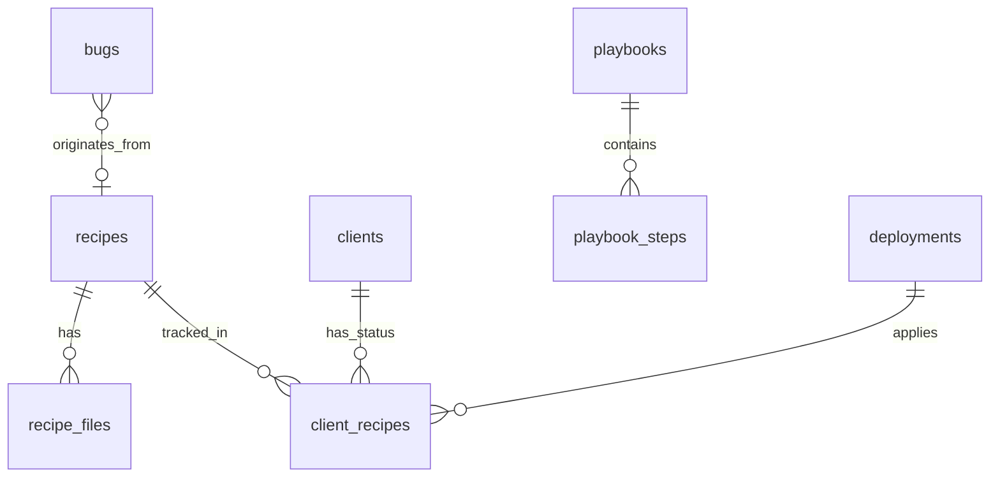

# 📐 IDP Data Model — Cortexo Platform (v4 Aligned)

> PostgreSQL with Drizzle ORM. RLS enforced on all tenant-scoped tables. Soft delete on all user-facing entities.

---

## Entity Relationship Overview

```mermaid
erDiagram
    tenants ||--o{ users : has
    tenants ||--o{ clients : owns
    tenants ||--o{ source_registry : connects
    tenants ||--o{ audit_events : generates
    tenants ||--o{ notification_rules : configures
    
    users ||--o{ user_roles : has
    users ||--o{ sessions : authenticates
    roles ||--o{ user_roles : assigned_to
    roles ||--o{ role_permissions : has
    permissions ||--o{ role_permissions : granted_to
    
    clients ||--o{ modules : contains
    clients ||--o{ servers : hosts
    clients ||--o{ environments : has
    clients ||--o{ pipelines : has
    clients ||--o{ deployments : has
    clients ||--o{ bugs : tracks
    clients ||--o{ deployment_windows : configures
    clients ||--o{ onboarding_states : tracks_setup
    
    servers ||--o{ server_mounts : defines
    servers ||--o{ server_heartbeats : reports
    
    modules ||--o{ deployments : deployed_via
    
    pipelines ||--o{ pipeline_runs : executes
    pipeline_runs ||--o{ pipeline_steps : contains
    pipeline_steps ||--o{ pipeline_test_artifacts : produces
    
    deployments ||--o{ deployment_snapshots : captures
    deployments ||--o{ changelogs : generates
    
    bugs ||--o{ bug_events : logs
    bugs ||--o{ rca_records : analyzed_by
    
    test_plans ||--o{ test_cases : contains
    test_plans ||--o{ test_runs : executes
    test_runs ||--o{ test_results : produces
    
    credentials ||--o{ db_connections : authenticates
    
    clients ||--o{ uptime_sla : tracks_sla
    clients ||--o{ cost_entries : incurs
    clients ||--o{ invoices : billed_to
    clients ||--o{ post_deploy_scripts : runs_after_deploy
    
    tenants ||--o{ sync_profiles : manages
    sync_profiles ||--o{ sync_profile_rules : contains
    
    db_connections ||--o{ schema_comparisons : compared_via
    clients ||--o{ client_migrations : tracks_migrations
    deployments ||--o{ client_migrations : reports_to
```



---

## Domain 1: Identity & Access Management

### `tenants`
```sql
CREATE TABLE tenants (
    id              UUID PRIMARY KEY DEFAULT gen_random_uuid(),
    name            VARCHAR(255) NOT NULL,
    slug            VARCHAR(100) NOT NULL UNIQUE,
    plan_tier       VARCHAR(50) NOT NULL DEFAULT 'standard',
    quota_config    JSONB NOT NULL DEFAULT '{}',
    status          VARCHAR(20) NOT NULL DEFAULT 'active',
    created_at      TIMESTAMPTZ NOT NULL DEFAULT now(),
    updated_at      TIMESTAMPTZ NOT NULL DEFAULT now(),
    deleted_at      TIMESTAMPTZ
);
-- quota_config: { max_concurrent_deploys, pipeline_runs_per_hour, query_calls_per_day, max_preview_envs }
```

### `users`
```sql
CREATE TABLE users (
    id              UUID PRIMARY KEY DEFAULT gen_random_uuid(),
    tenant_id       UUID NOT NULL REFERENCES tenants(id),
    email           VARCHAR(255) NOT NULL,
    password_hash   TEXT NOT NULL,
    name            VARCHAR(255) NOT NULL,
    avatar_url      TEXT,
    status          VARCHAR(20) NOT NULL DEFAULT 'active',
    last_login_at   TIMESTAMPTZ,
    created_at      TIMESTAMPTZ NOT NULL DEFAULT now(),
    updated_at      TIMESTAMPTZ NOT NULL DEFAULT now(),
    deleted_at      TIMESTAMPTZ,
    UNIQUE(tenant_id, email)
);
CREATE INDEX idx_users_tenant ON users(tenant_id);
CREATE INDEX idx_users_email ON users(email);
```

### `sessions`
```sql
CREATE TABLE sessions (
    id              UUID PRIMARY KEY DEFAULT gen_random_uuid(),
    user_id         UUID NOT NULL REFERENCES users(id) ON DELETE CASCADE,
    tenant_id       UUID NOT NULL REFERENCES tenants(id),
    refresh_token   TEXT NOT NULL UNIQUE,
    ip_address      INET,
    user_agent      TEXT,
    expires_at      TIMESTAMPTZ NOT NULL,
    revoked_at      TIMESTAMPTZ,
    created_at      TIMESTAMPTZ NOT NULL DEFAULT now()
);
CREATE INDEX idx_sessions_user ON sessions(user_id);
CREATE INDEX idx_sessions_token ON sessions(refresh_token);
-- Revoked on: role change, password change, explicit logout, admin force-logout
```

### `roles`, `permissions`, `user_roles`, `role_permissions`
```sql
CREATE TABLE roles (
    id              UUID PRIMARY KEY DEFAULT gen_random_uuid(),
    tenant_id       UUID REFERENCES tenants(id),
    name            VARCHAR(100) NOT NULL,
    description     TEXT,
    is_system       BOOLEAN NOT NULL DEFAULT false,
    created_at      TIMESTAMPTZ NOT NULL DEFAULT now()
);
-- Seeded system roles (is_system=true): Admin, Developer, Tester, Viewer
-- Tenant can add custom roles (is_system=false)

CREATE TABLE permissions (
    id              UUID PRIMARY KEY DEFAULT gen_random_uuid(),
    resource        VARCHAR(100) NOT NULL,
    action          VARCHAR(50) NOT NULL,
    UNIQUE(resource, action)
);

CREATE TABLE user_roles (
    user_id         UUID NOT NULL REFERENCES users(id) ON DELETE CASCADE,
    role_id         UUID NOT NULL REFERENCES roles(id) ON DELETE CASCADE,
    assigned_by     UUID REFERENCES users(id),
    assigned_at     TIMESTAMPTZ NOT NULL DEFAULT now(),
    PRIMARY KEY (user_id, role_id)
);

CREATE TABLE role_permissions (
    role_id         UUID NOT NULL REFERENCES roles(id) ON DELETE CASCADE,
    permission_id   UUID NOT NULL REFERENCES permissions(id) ON DELETE CASCADE,
    PRIMARY KEY (role_id, permission_id)
);
```

---

## Domain 2: Clients, Modules & Infrastructure

### `clients`
```sql
CREATE TABLE clients (
    id                  UUID PRIMARY KEY DEFAULT gen_random_uuid(),
    tenant_id           UUID NOT NULL REFERENCES tenants(id),
    name                VARCHAR(255) NOT NULL,
    slug                VARCHAR(100) NOT NULL,
    health_score        SMALLINT DEFAULT 100,
    region              VARCHAR(100),
    status              VARCHAR(20) NOT NULL DEFAULT 'active',
    onboarding_complete BOOLEAN NOT NULL DEFAULT false,
    created_at          TIMESTAMPTZ NOT NULL DEFAULT now(),
    updated_at          TIMESTAMPTZ NOT NULL DEFAULT now(),
    deleted_at          TIMESTAMPTZ,
    UNIQUE(tenant_id, slug)
);
CREATE INDEX idx_clients_tenant ON clients(tenant_id);
CREATE INDEX idx_clients_health ON clients(tenant_id, health_score);
```

### `modules`
```sql
CREATE TABLE modules (
    id                  UUID PRIMARY KEY DEFAULT gen_random_uuid(),
    tenant_id           UUID NOT NULL REFERENCES tenants(id),
    client_id           UUID NOT NULL REFERENCES clients(id) ON DELETE CASCADE,
    name                VARCHAR(255) NOT NULL,
    path                TEXT,
    type                VARCHAR(50) NOT NULL,
    source_registry_id  UUID REFERENCES source_registry(id),
    version             VARCHAR(100),
    created_at          TIMESTAMPTZ NOT NULL DEFAULT now(),
    deleted_at          TIMESTAMPTZ,
    UNIQUE(client_id, name)
);
CREATE INDEX idx_modules_client ON modules(tenant_id, client_id);
```

### `servers`
```sql
CREATE TABLE servers (
    id                  UUID PRIMARY KEY DEFAULT gen_random_uuid(),
    tenant_id           UUID NOT NULL REFERENCES tenants(id),
    client_id           UUID REFERENCES clients(id),
    host                VARCHAR(255) NOT NULL,
    port                INT DEFAULT 22,
    region              VARCHAR(100),
    status              VARCHAR(20) NOT NULL DEFAULT 'active',
    last_heartbeat_at   TIMESTAMPTZ,
    created_at          TIMESTAMPTZ NOT NULL DEFAULT now(),
    deleted_at          TIMESTAMPTZ
);
CREATE INDEX idx_servers_tenant ON servers(tenant_id);
CREATE INDEX idx_servers_heartbeat ON servers(last_heartbeat_at);
```

### `server_mounts`
```sql
CREATE TABLE server_mounts (
    id              UUID PRIMARY KEY DEFAULT gen_random_uuid(),
    server_id       UUID NOT NULL REFERENCES servers(id) ON DELETE CASCADE,
    path            TEXT NOT NULL,
    type            VARCHAR(50) NOT NULL,
    description     TEXT,
    created_at      TIMESTAMPTZ NOT NULL DEFAULT now()
);
```

### `source_registry`
```sql
CREATE TABLE source_registry (
    id                  UUID PRIMARY KEY DEFAULT gen_random_uuid(),
    tenant_id           UUID NOT NULL REFERENCES tenants(id),
    provider            VARCHAR(50) NOT NULL,
    repo_url            TEXT NOT NULL,
    default_branch      VARCHAR(100) NOT NULL DEFAULT 'main',
    webhook_secret_hash TEXT,
    connected_at        TIMESTAMPTZ NOT NULL DEFAULT now()
);
CREATE INDEX idx_source_registry_tenant ON source_registry(tenant_id);
```

### `environments`
```sql
CREATE TABLE environments (
    id              UUID PRIMARY KEY DEFAULT gen_random_uuid(),
    tenant_id       UUID NOT NULL REFERENCES tenants(id),
    client_id       UUID NOT NULL REFERENCES clients(id) ON DELETE CASCADE,
    name            VARCHAR(100) NOT NULL,
    type            VARCHAR(20) NOT NULL,
    promotion_order INT,
    config          JSONB DEFAULT '{}',
    created_at      TIMESTAMPTZ NOT NULL DEFAULT now()
);
CREATE INDEX idx_environments_client ON environments(client_id);
-- config: { require_test_run_pass, approval_rules, notification_overrides }
-- promotion_order: 1=dev, 2=staging, 3=uat, 4=prod
```

### `onboarding_states`
```sql
CREATE TABLE onboarding_states (
    id              UUID PRIMARY KEY DEFAULT gen_random_uuid(),
    tenant_id       UUID NOT NULL REFERENCES tenants(id),
    client_id       UUID REFERENCES clients(id),
    completed_steps JSONB NOT NULL DEFAULT '[]',
    current_step    VARCHAR(100),
    resume_token    UUID NOT NULL DEFAULT gen_random_uuid(),
    created_at      TIMESTAMPTZ NOT NULL DEFAULT now(),
    updated_at      TIMESTAMPTZ NOT NULL DEFAULT now()
);
CREATE UNIQUE INDEX idx_onboarding_resume ON onboarding_states(resume_token);
```

---

## Domain 3: Deployments & Pipelines

### `deployments`
```sql
CREATE TABLE deployments (
    id                  UUID PRIMARY KEY DEFAULT gen_random_uuid(),
    tenant_id           UUID NOT NULL REFERENCES tenants(id),
    client_id           UUID NOT NULL REFERENCES clients(id),
    environment_id      UUID NOT NULL REFERENCES environments(id),
    status              VARCHAR(20) NOT NULL DEFAULT 'pending',
    triggered_by        UUID REFERENCES users(id),
    trigger_type        VARCHAR(50) NOT NULL,
    idempotency_key     VARCHAR(255),
    health_before       SMALLINT,
    health_after        SMALLINT,
    started_at          TIMESTAMPTZ,
    completed_at        TIMESTAMPTZ,
    rollback_of         UUID REFERENCES deployments(id),
    promoted_from       UUID REFERENCES deployments(id),
    created_at          TIMESTAMPTZ NOT NULL DEFAULT now()
);
CREATE INDEX idx_deployments_tenant_client ON deployments(tenant_id, client_id);
CREATE INDEX idx_deployments_tenant_status ON deployments(tenant_id, status);
CREATE INDEX idx_deployments_created ON deployments(created_at DESC);
CREATE UNIQUE INDEX idx_deployments_idempotency ON deployments(idempotency_key) WHERE idempotency_key IS NOT NULL;
```

### `deployment_snapshots`
```sql
CREATE TABLE deployment_snapshots (
    id                  UUID PRIMARY KEY DEFAULT gen_random_uuid(),
    deployment_id       UUID NOT NULL REFERENCES deployments(id),
    git_commit          VARCHAR(40) NOT NULL,
    git_branch          VARCHAR(255),
    git_tag             VARCHAR(255),
    env_var_refs        JSONB NOT NULL DEFAULT '{}',
    db_version          VARCHAR(100),
    artifact_version    VARCHAR(255),
    module_versions     JSONB NOT NULL DEFAULT '{}',
    pipeline_config_hash VARCHAR(64),
    created_at          TIMESTAMPTZ NOT NULL DEFAULT now()
);
-- IMMUTABLE: no UPDATE allowed. Only INSERT.
CREATE INDEX idx_snapshots_deployment ON deployment_snapshots(deployment_id);
```

### `deployment_windows`
```sql
CREATE TABLE deployment_windows (
    id                      UUID PRIMARY KEY DEFAULT gen_random_uuid(),
    tenant_id               UUID NOT NULL REFERENCES tenants(id),
    client_id               UUID NOT NULL REFERENCES clients(id),
    environment_id          UUID REFERENCES environments(id),
    allowed_days            VARCHAR(20) NOT NULL,
    allowed_hours_start     TIME NOT NULL,
    allowed_hours_end       TIME NOT NULL,
    timezone                VARCHAR(50) NOT NULL DEFAULT 'UTC',
    active                  BOOLEAN NOT NULL DEFAULT true,
    created_at              TIMESTAMPTZ NOT NULL DEFAULT now()
);
```

### `pipelines`, `pipeline_runs`, `pipeline_steps`, `pipeline_test_artifacts`
```sql
CREATE TABLE pipelines (
    id              UUID PRIMARY KEY DEFAULT gen_random_uuid(),
    tenant_id       UUID NOT NULL REFERENCES tenants(id),
    client_id       UUID NOT NULL REFERENCES clients(id),
    name            VARCHAR(255) NOT NULL,
    definition      JSONB NOT NULL DEFAULT '{}',
    trigger_config  JSONB NOT NULL DEFAULT '{}',
    is_active       BOOLEAN NOT NULL DEFAULT true,
    created_at      TIMESTAMPTZ NOT NULL DEFAULT now(),
    updated_at      TIMESTAMPTZ NOT NULL DEFAULT now()
);
CREATE INDEX idx_pipelines_client ON pipelines(client_id);

CREATE TABLE pipeline_runs (
    id              UUID PRIMARY KEY DEFAULT gen_random_uuid(),
    pipeline_id     UUID NOT NULL REFERENCES pipelines(id),
    deployment_id   UUID REFERENCES deployments(id),
    tenant_id       UUID NOT NULL REFERENCES tenants(id),
    status          VARCHAR(20) NOT NULL DEFAULT 'pending',
    idempotency_key VARCHAR(255),
    started_at      TIMESTAMPTZ,
    completed_at    TIMESTAMPTZ,
    created_at      TIMESTAMPTZ NOT NULL DEFAULT now()
);
CREATE INDEX idx_pipelineruns_pipeline ON pipeline_runs(pipeline_id);
CREATE INDEX idx_pipelineruns_tenant_status ON pipeline_runs(tenant_id, status);
CREATE UNIQUE INDEX idx_pipelineruns_idempotency ON pipeline_runs(idempotency_key) WHERE idempotency_key IS NOT NULL;

CREATE TABLE pipeline_steps (
    id                  UUID PRIMARY KEY DEFAULT gen_random_uuid(),
    pipeline_run_id     UUID NOT NULL REFERENCES pipeline_runs(id) ON DELETE CASCADE,
    step_name           VARCHAR(255) NOT NULL,
    type                VARCHAR(50) NOT NULL,
    status              VARCHAR(20) NOT NULL DEFAULT 'pending',
    output              JSONB DEFAULT '{}',
    error_message       TEXT,
    started_at          TIMESTAMPTZ,
    completed_at        TIMESTAMPTZ
);
CREATE INDEX idx_steps_run ON pipeline_steps(pipeline_run_id);

CREATE TABLE pipeline_test_artifacts (
    id                  UUID PRIMARY KEY DEFAULT gen_random_uuid(),
    pipeline_step_id    UUID NOT NULL REFERENCES pipeline_steps(id) ON DELETE CASCADE,
    type                VARCHAR(50) NOT NULL,
    file_path           TEXT NOT NULL,
    coverage_pct        REAL,
    summary             JSONB DEFAULT '{}',
    created_at          TIMESTAMPTZ NOT NULL DEFAULT now()
);
CREATE INDEX idx_test_artifacts_step ON pipeline_test_artifacts(pipeline_step_id);
```

### `changelogs`
```sql
CREATE TABLE changelogs (
    id              UUID PRIMARY KEY DEFAULT gen_random_uuid(),
    deployment_id   UUID NOT NULL REFERENCES deployments(id),
    generated_at    TIMESTAMPTZ NOT NULL DEFAULT now(),
    features        JSONB DEFAULT '[]',
    fixes           JSONB DEFAULT '[]',
    infra_changes   JSONB DEFAULT '[]',
    raw_commits     JSONB DEFAULT '[]'
);
CREATE INDEX idx_changelogs_deployment ON changelogs(deployment_id);
```

---

## Domain 4: Bugs & RCA

### `bugs`, `bug_events`, `rca_records`
```sql
CREATE TABLE bugs (
    id                  UUID PRIMARY KEY DEFAULT gen_random_uuid(),
    tenant_id           UUID NOT NULL REFERENCES tenants(id),
    client_id           UUID NOT NULL REFERENCES clients(id),
    module_id           UUID REFERENCES modules(id),
    title               VARCHAR(500) NOT NULL,
    description         TEXT,
    priority            VARCHAR(20) NOT NULL DEFAULT 'medium',
    status              VARCHAR(20) NOT NULL DEFAULT 'open',
    version_introduced  VARCHAR(100),
    version_fixed       VARCHAR(100),
    assigned_to         UUID REFERENCES users(id),
    created_by          UUID REFERENCES users(id),
    source              VARCHAR(50) NOT NULL DEFAULT 'manual',  -- manual / deployment_failure / scanner / tom_ai
    fingerprint         VARCHAR(64),
    symptom_type        VARCHAR(50),           -- action_error / silent_failure / wrong_data / performance / etc. (maps to playbook)
    recipe_id           UUID,                  -- Link to recipe if pattern-based fix (FK added after recipes table exists)
    code_snippet        TEXT,                  -- The buggy code (for AI/Tom reference)
    fix_code            TEXT,                  -- The fix code (written by Tom)
    file_path           VARCHAR(500),          -- Affected file path
    line_number         INT,                   -- Affected line number
    resolved_at         TIMESTAMPTZ,
    created_at          TIMESTAMPTZ NOT NULL DEFAULT now(),
    updated_at          TIMESTAMPTZ NOT NULL DEFAULT now(),
    deleted_at          TIMESTAMPTZ
);
CREATE INDEX idx_bugs_tenant_client ON bugs(tenant_id, client_id);
CREATE INDEX idx_bugs_priority_status ON bugs(priority, status);
CREATE INDEX idx_bugs_fingerprint ON bugs(fingerprint);

CREATE TABLE bug_events (
    id              UUID NOT NULL DEFAULT gen_random_uuid(),
    bug_id          UUID NOT NULL,
    actor_id        UUID REFERENCES users(id),
    event_type      VARCHAR(50) NOT NULL,
    previous_value  TEXT,
    new_value       TEXT,
    metadata        JSONB DEFAULT '{}',
    created_at      TIMESTAMPTZ NOT NULL DEFAULT now(),
    PRIMARY KEY (id, created_at)
) PARTITION BY RANGE (created_at);
-- IMMUTABLE: no UPDATE/DELETE

CREATE TABLE rca_records (
    id                  UUID PRIMARY KEY DEFAULT gen_random_uuid(),
    bug_id              UUID NOT NULL REFERENCES bugs(id),
    tenant_id           UUID NOT NULL REFERENCES tenants(id),
    cause_type          VARCHAR(50) NOT NULL,
    affected_files      JSONB DEFAULT '[]',
    deployment_id       UUID REFERENCES deployments(id),
    ai_summary          TEXT,
    suggested_fix       TEXT,
    confidence_score    REAL,
    reviewed_by         UUID REFERENCES users(id),
    created_by          UUID REFERENCES users(id),
    created_at          TIMESTAMPTZ NOT NULL DEFAULT now()
);
CREATE INDEX idx_rca_bug ON rca_records(bug_id);
CREATE INDEX idx_rca_category ON rca_records(tenant_id, cause_type);
```

---

## Domain 4b: Recipe & Playbook System (from bug-recipes/)

> **Source**: Integrated from `/Devops/bug-recipes/` repository — 33 recipes, 30+ patterns, 17 playbooks.
> These tables power Module 37 (Recipe Engine), Module 38 (Playbook System), Module 39 (Client Recipe Tracker).

### `recipes`
```sql
CREATE TABLE recipes (
    id              UUID PRIMARY KEY DEFAULT gen_random_uuid(),
    tenant_id       UUID NOT NULL REFERENCES tenants(id),
    pattern_id      VARCHAR(50) NOT NULL,          -- PAT-CSRF-001, PAT-PAY-002, etc.
    title           VARCHAR(500) NOT NULL,
    severity        VARCHAR(10) NOT NULL,           -- CRITICAL / HIGH / MEDIUM / LOW
    category        VARCHAR(50) NOT NULL,           -- security / transaction / query_logic / variable / js / business_logic
    modules_affected TEXT[] DEFAULT '{}',            -- Array of affected module names
    auto_fixable    BOOLEAN DEFAULT FALSE,           -- Can string replacement fix this?
    
    -- Client scope
    applies_to      VARCHAR(20) DEFAULT 'ALL',      -- ALL or SPECIFIC
    specific_clients TEXT[],                         -- Client names if applies_to = SPECIFIC
    scope_reason    TEXT,                            -- Why not ALL (e.g., custom code)
    
    -- Detection
    detection_cmd   TEXT,                            -- grep/regex command to detect vulnerable code
    detection_match VARCHAR(500),                    -- Expected match string indicating vulnerability
    
    -- Bug info
    symptom         TEXT NOT NULL,                   -- What the user sees
    root_cause      TEXT NOT NULL,                   -- Technical explanation
    
    -- Fix
    fix_before      TEXT,                            -- Exact buggy code (copy from source)
    fix_after       TEXT,                            -- Exact replacement code
    fix_files       TEXT[] DEFAULT '{}',             -- Files that need modification
    
    -- Verification
    verify_steps    TEXT,                            -- Steps to verify fix works
    notes           TEXT,                            -- Additional context, caveats
    
    -- Provenance
    found_by        VARCHAR(50),                    -- Developer who found it
    found_in_client VARCHAR(100),                   -- Client where first discovered
    source_bug_id   VARCHAR(50),                    -- GitHub issue ID or N/A
    
    -- Versioning
    version         INT DEFAULT 1,
    is_published    BOOLEAN DEFAULT FALSE,
    
    created_at      TIMESTAMPTZ NOT NULL DEFAULT now(),
    updated_at      TIMESTAMPTZ NOT NULL DEFAULT now(),
    deleted_at      TIMESTAMPTZ
);
CREATE UNIQUE INDEX idx_recipes_pattern ON recipes(tenant_id, pattern_id) WHERE deleted_at IS NULL;
CREATE INDEX idx_recipes_severity ON recipes(tenant_id, severity);
CREATE INDEX idx_recipes_category ON recipes(tenant_id, category);
```

### `recipe_files`
```sql
-- Additional files associated with a recipe (rollback scripts, test files, etc.)
CREATE TABLE recipe_files (
    id              UUID PRIMARY KEY DEFAULT gen_random_uuid(),
    recipe_id       UUID NOT NULL REFERENCES recipes(id) ON DELETE CASCADE,
    file_type       VARCHAR(30) NOT NULL,           -- detection_script / fix_patch / rollback / test / documentation
    filename        VARCHAR(255) NOT NULL,
    content         TEXT NOT NULL,
    created_at      TIMESTAMPTZ NOT NULL DEFAULT now()
);
CREATE INDEX idx_recipe_files ON recipe_files(recipe_id);
```

### `playbooks`
```sql
CREATE TABLE playbooks (
    id              UUID PRIMARY KEY DEFAULT gen_random_uuid(),
    tenant_id       UUID NOT NULL REFERENCES tenants(id),
    symptom_type    VARCHAR(50) NOT NULL UNIQUE,     -- action_error, silent_failure, wrong_data, etc.
    title           VARCHAR(255) NOT NULL,           -- "Action Error Playbook"
    description     TEXT,                            -- When to use this playbook
    first_check     VARCHAR(255),                    -- Quick first thing to check
    
    -- Debugger methodology settings
    time_box_minutes INT DEFAULT 30,                 -- Max time before escalation
    binary_search   BOOLEAN DEFAULT TRUE,            -- Use binary search protocol?
    
    created_at      TIMESTAMPTZ NOT NULL DEFAULT now(),
    updated_at      TIMESTAMPTZ NOT NULL DEFAULT now()
);
CREATE UNIQUE INDEX idx_playbooks_symptom ON playbooks(tenant_id, symptom_type);
```

### `playbook_steps`
```sql
CREATE TABLE playbook_steps (
    id              UUID PRIMARY KEY DEFAULT gen_random_uuid(),
    playbook_id     UUID NOT NULL REFERENCES playbooks(id) ON DELETE CASCADE,
    step_number     INT NOT NULL,
    step_type       VARCHAR(20) NOT NULL,            -- check / command / decision / note
    title           VARCHAR(500) NOT NULL,           -- "Check PHP error log"
    description     TEXT,                            -- Detailed instructions
    command         TEXT,                            -- Shell command to run (for step_type = command)
    
    -- Decision branching (for step_type = decision)
    yes_goto_step   INT,                             -- Step number if YES
    no_goto_step    INT,                             -- Step number if NO
    
    sort_order      INT DEFAULT 0,
    created_at      TIMESTAMPTZ NOT NULL DEFAULT now()
);
CREATE INDEX idx_playbook_steps ON playbook_steps(playbook_id, sort_order);
```

### `client_recipes`
```sql
CREATE TABLE client_recipes (
    id              UUID PRIMARY KEY DEFAULT gen_random_uuid(),
    tenant_id       UUID NOT NULL REFERENCES tenants(id),
    client_id       UUID NOT NULL REFERENCES clients(id),
    recipe_id       UUID NOT NULL REFERENCES recipes(id),
    status          VARCHAR(20) NOT NULL DEFAULT 'vulnerable', -- vulnerable / applied / verified / not_applicable
    
    -- Application tracking
    applied_at      TIMESTAMPTZ,
    applied_by      VARCHAR(50),                    -- tom / jerry / system
    deployment_id   UUID REFERENCES deployments(id), -- Which deploy applied this
    commit_hash     VARCHAR(40),
    
    -- Verification
    verified_at     TIMESTAMPTZ,
    verified_by     VARCHAR(50),
    
    notes           TEXT,
    created_at      TIMESTAMPTZ NOT NULL DEFAULT now(),
    updated_at      TIMESTAMPTZ NOT NULL DEFAULT now(),
    
    CONSTRAINT uq_client_recipe UNIQUE (client_id, recipe_id)
);
CREATE INDEX idx_client_recipes_status ON client_recipes(tenant_id, status);
CREATE INDEX idx_client_recipes_client ON client_recipes(client_id);
CREATE INDEX idx_client_recipes_recipe ON client_recipes(recipe_id);
```

### ER Additions for Recipe System


---

## Domain 5: Testing

### `test_plans`, `test_cases`, `test_runs`, `test_results`, `flaky_tests`
```sql
CREATE TABLE test_plans (
    id          UUID PRIMARY KEY DEFAULT gen_random_uuid(),
    tenant_id   UUID NOT NULL REFERENCES tenants(id),
    client_id   UUID NOT NULL REFERENCES clients(id),
    name        VARCHAR(255) NOT NULL,
    description TEXT,
    status      VARCHAR(20) DEFAULT 'active',
    created_by  UUID REFERENCES users(id),
    created_at  TIMESTAMPTZ NOT NULL DEFAULT now(),
    deleted_at  TIMESTAMPTZ
);

CREATE TABLE test_cases (
    id              UUID PRIMARY KEY DEFAULT gen_random_uuid(),
    test_plan_id    UUID NOT NULL REFERENCES test_plans(id) ON DELETE CASCADE,
    title           VARCHAR(500) NOT NULL,
    steps           JSONB DEFAULT '[]',
    expected_result TEXT,
    priority        VARCHAR(20) DEFAULT 'medium',
    is_automated    BOOLEAN DEFAULT false,
    sort_order      INT DEFAULT 0,
    created_at      TIMESTAMPTZ NOT NULL DEFAULT now()
);

CREATE TABLE test_runs (
    id              UUID PRIMARY KEY DEFAULT gen_random_uuid(),
    test_plan_id    UUID NOT NULL REFERENCES test_plans(id),
    tenant_id       UUID NOT NULL REFERENCES tenants(id),
    pipeline_run_id UUID REFERENCES pipeline_runs(id),
    status          VARCHAR(20) NOT NULL DEFAULT 'pending',
    total_cases     INT DEFAULT 0,
    passed          INT DEFAULT 0,
    failed          INT DEFAULT 0,
    skipped         INT DEFAULT 0,
    coverage_pct    REAL,
    started_at      TIMESTAMPTZ,
    completed_at    TIMESTAMPTZ,
    created_at      TIMESTAMPTZ NOT NULL DEFAULT now()
);

CREATE TABLE test_results (
    id              UUID PRIMARY KEY DEFAULT gen_random_uuid(),
    test_run_id     UUID NOT NULL REFERENCES test_runs(id) ON DELETE CASCADE,
    test_case_id    UUID NOT NULL REFERENCES test_cases(id),
    status          VARCHAR(20) NOT NULL,
    error_message   TEXT,
    evidence_urls   TEXT[],
    duration_ms     INT,
    is_flaky        BOOLEAN DEFAULT false,
    created_at      TIMESTAMPTZ NOT NULL DEFAULT now()
);
CREATE INDEX idx_testresults_run ON test_results(test_run_id);
CREATE INDEX idx_testresults_flaky ON test_results(is_flaky) WHERE is_flaky = true;

-- Materialized view for flaky test analysis
CREATE TABLE flaky_tests (
    id              UUID PRIMARY KEY DEFAULT gen_random_uuid(),
    tenant_id       UUID NOT NULL REFERENCES tenants(id),
    client_id       UUID NOT NULL REFERENCES clients(id),
    test_identifier VARCHAR(500) NOT NULL,
    total_runs      INT NOT NULL DEFAULT 0,
    fail_count      INT NOT NULL DEFAULT 0,
    fail_rate       REAL NOT NULL DEFAULT 0,
    last_failed_at  TIMESTAMPTZ,
    trend           VARCHAR(20) DEFAULT 'stable',
    computed_at     TIMESTAMPTZ NOT NULL DEFAULT now(),
    UNIQUE(tenant_id, client_id, test_identifier)
);
```

---

## Domain 6: Observability, Credentials & Audit

### `credentials`
```sql
CREATE TABLE credentials (
    id              UUID PRIMARY KEY DEFAULT gen_random_uuid(),
    tenant_id       UUID NOT NULL REFERENCES tenants(id),
    client_id       UUID REFERENCES clients(id),
    name            VARCHAR(255) NOT NULL,
    type            VARCHAR(50) NOT NULL,
    vault_path      TEXT NOT NULL,
    last_accessed_at TIMESTAMPTZ,
    last_rotated_at TIMESTAMPTZ,
    created_at      TIMESTAMPTZ NOT NULL DEFAULT now(),
    deleted_at      TIMESTAMPTZ
);
CREATE INDEX idx_credentials_tenant ON credentials(tenant_id);
-- Raw secrets NEVER stored here. vault_path → Vault lookup at runtime.
```

### `db_connections`
```sql
CREATE TABLE db_connections (
    id              UUID PRIMARY KEY DEFAULT gen_random_uuid(),
    tenant_id       UUID NOT NULL REFERENCES tenants(id),
    client_id       UUID NOT NULL REFERENCES clients(id),
    credential_id   UUID REFERENCES credentials(id),
    host            VARCHAR(255) NOT NULL,
    port            INT NOT NULL DEFAULT 5432,
    db_name         VARCHAR(255) NOT NULL,
    db_type         VARCHAR(50) NOT NULL DEFAULT 'postgresql',
    status          VARCHAR(20) NOT NULL DEFAULT 'active',
    created_at      TIMESTAMPTZ NOT NULL DEFAULT now()
);
```

### `db_migrations`
```sql
CREATE TABLE db_migrations (
    id              UUID PRIMARY KEY DEFAULT gen_random_uuid(),
    db_connection_id UUID NOT NULL REFERENCES db_connections(id),
    version         VARCHAR(100) NOT NULL,
    checksum        VARCHAR(64),
    applied_by      UUID REFERENCES users(id),
    status          VARCHAR(20) NOT NULL DEFAULT 'pending',
    applied_at      TIMESTAMPTZ,
    created_at      TIMESTAMPTZ NOT NULL DEFAULT now()
);
```

### `db_backups`
```sql
CREATE TABLE db_backups (
    id              UUID PRIMARY KEY DEFAULT gen_random_uuid(),
    db_connection_id UUID NOT NULL REFERENCES db_connections(id),
    storage_path    TEXT NOT NULL,
    size_bytes      BIGINT,
    checksum        VARCHAR(64),
    encryption_key_ref TEXT,                          -- Vault path to encryption key
    status          VARCHAR(20) NOT NULL DEFAULT 'completed',  -- completed/failed/in_progress/verified
    created_at      TIMESTAMPTZ NOT NULL DEFAULT now(),
    expires_at      TIMESTAMPTZ,                      -- Retention-based expiry
    verified_at     TIMESTAMPTZ                       -- From restore-test job
);
CREATE INDEX idx_backups_conn ON db_backups(db_connection_id, created_at);
```

### `terminal_sessions`
```sql
CREATE TABLE terminal_sessions (
    id              UUID PRIMARY KEY DEFAULT gen_random_uuid(),
    tenant_id       UUID NOT NULL REFERENCES tenants(id),
    user_id         UUID NOT NULL REFERENCES users(id),
    server_id       UUID NOT NULL REFERENCES servers(id),
    ip_address      INET,
    session_log_ref TEXT,
    started_at      TIMESTAMPTZ NOT NULL DEFAULT now(),
    ended_at        TIMESTAMPTZ,
    closed_by       VARCHAR(20)
);
-- closed_by: 'user', 'timeout', 'admin', 'error'
```

### `notification_rules`
```sql
CREATE TABLE notification_rules (
    id              UUID PRIMARY KEY DEFAULT gen_random_uuid(),
    tenant_id       UUID NOT NULL REFERENCES tenants(id),
    client_id       UUID REFERENCES clients(id),
    event_type      VARCHAR(100) NOT NULL,
    channel         VARCHAR(50) NOT NULL,
    destination     TEXT NOT NULL,
    severity_filter VARCHAR(20)[],
    conditions      JSONB DEFAULT '{}',
    is_active       BOOLEAN NOT NULL DEFAULT true,
    created_at      TIMESTAMPTZ NOT NULL DEFAULT now()
);
CREATE INDEX idx_notification_rules_tenant ON notification_rules(tenant_id);
```

### `audit_events` (APPEND-ONLY, PARTITIONED)
```sql
CREATE TABLE audit_events (
    id              UUID NOT NULL DEFAULT gen_random_uuid(),
    tenant_id       UUID NOT NULL,
    actor_id        UUID,
    actor_role      VARCHAR(50),
    action_type     VARCHAR(100) NOT NULL,
    entity_type     VARCHAR(100) NOT NULL,
    entity_id       UUID,
    metadata        JSONB DEFAULT '{}',
    ip_address      INET,
    created_at      TIMESTAMPTZ NOT NULL DEFAULT now(),
    PRIMARY KEY (id, created_at)
) PARTITION BY RANGE (created_at);
-- IMMUTABLE: REVOKE UPDATE, DELETE. App role has INSERT only.
CREATE INDEX idx_audit_tenant_time ON audit_events(tenant_id, created_at DESC);
CREATE INDEX idx_audit_entity ON audit_events(entity_type, entity_id);
```

### `drift_reports`
```sql
CREATE TABLE drift_reports (
    id              UUID PRIMARY KEY DEFAULT gen_random_uuid(),
    tenant_id       UUID NOT NULL REFERENCES tenants(id),
    client_id       UUID NOT NULL REFERENCES clients(id),
    server_id       UUID REFERENCES servers(id),
    status          VARCHAR(20) NOT NULL,
    total_items     INT NOT NULL DEFAULT 0,
    drifted_items   INT NOT NULL DEFAULT 0,
    critical_count  INT NOT NULL DEFAULT 0,
    diff_summary    JSONB NOT NULL DEFAULT '{}',
    acknowledged_at TIMESTAMPTZ,
    acknowledged_by UUID REFERENCES users(id),
    scanned_at      TIMESTAMPTZ NOT NULL DEFAULT now()
);
CREATE INDEX idx_drift_tenant_client ON drift_reports(tenant_id, client_id, scanned_at DESC);
```

### `server_heartbeats` (PARTITIONED)
```sql
CREATE TABLE server_heartbeats (
    id              UUID NOT NULL DEFAULT gen_random_uuid(),
    server_id       UUID NOT NULL,
    tenant_id       UUID NOT NULL,
    cpu_usage       REAL,
    memory_usage    REAL,
    disk_usage      REAL,
    load_avg        REAL[],
    containers      JSONB DEFAULT '[]',
    created_at      TIMESTAMPTZ NOT NULL DEFAULT now(),
    PRIMARY KEY (id, created_at)
) PARTITION BY RANGE (created_at);
CREATE INDEX idx_heartbeats_server ON server_heartbeats(server_id, created_at DESC);
```

### `service_dependencies` (Phase 3)
```sql
CREATE TABLE service_dependencies (
    id              UUID PRIMARY KEY DEFAULT gen_random_uuid(),
    tenant_id       UUID NOT NULL REFERENCES tenants(id),
    source_client_id UUID NOT NULL REFERENCES clients(id),
    target_client_id UUID NOT NULL REFERENCES clients(id),
    dependency_type VARCHAR(50) NOT NULL,
    metadata        JSONB DEFAULT '{}',
    discovered_at   TIMESTAMPTZ NOT NULL DEFAULT now()
);
```

---

## Partitioning Strategy

| Table | Partition Key | Interval | Retention |
|---|---|---|---|
| `audit_events` | `created_at` | Monthly | **Permanent** (compliance) |
| `server_heartbeats` | `created_at` | Monthly | 90 days |
| `bug_events` | `created_at` | Monthly | 1 year |
| `pipeline_steps` | `completed_at` | Quarterly | 12 months |

## ClickHouse Log Table (OLAP — separate from Postgres)

```sql
CREATE TABLE logs (
    timestamp       DateTime64(3),
    tenant_id       UUID,
    client_id       UUID,
    server_id       UUID,
    environment     LowCardinality(String),
    level           LowCardinality(String),
    module          LowCardinality(String),
    log_source      LowCardinality(String),
    message         String,
    trace_id        Nullable(String),
    metadata        String
) ENGINE = MergeTree()
PARTITION BY (tenant_id, toYYYYMMDD(timestamp))
ORDER BY (tenant_id, client_id, timestamp)
TTL timestamp + INTERVAL 90 DAY DELETE;
-- TTL configurable per tenant via ClickHouse materialized TTL rules
```

## Row-Level Security (RLS)

```sql
ALTER TABLE clients ENABLE ROW LEVEL SECURITY;

CREATE POLICY tenant_isolation ON clients
    USING (tenant_id = current_setting('app.current_tenant')::uuid);

-- Drizzle middleware: SET LOCAL app.current_tenant = '<uuid>';
-- Runs inside each transaction. Zero cross-tenant leakage.
-- RLS enabled on ALL tenant-scoped tables.
```

## Soft Delete Pattern
```sql
-- All user-facing entities have deleted_at column
-- Application queries: WHERE deleted_at IS NULL (enforced in Drizzle base query)
-- Hard delete only via scheduled data purge (admin action, audited)
```

---

## Domain 7: Source Sync & Fleet Management

### `sync_configs`
```sql
CREATE TABLE sync_configs (
    id              UUID PRIMARY KEY DEFAULT gen_random_uuid(),
    tenant_id       UUID NOT NULL REFERENCES tenants(id),
    client_id       UUID NOT NULL REFERENCES clients(id),
    source_registry_id UUID NOT NULL REFERENCES source_registry(id),
    client_repo_url TEXT NOT NULL,
    target_branch   VARCHAR(100) NOT NULL DEFAULT 'STAGING',
    client_type     VARCHAR(50) DEFAULT 'retail',
    is_active       BOOLEAN NOT NULL DEFAULT true,
    created_at      TIMESTAMPTZ NOT NULL DEFAULT now(),
    UNIQUE(tenant_id, client_id, source_registry_id)
);
```

### `sync_history`
```sql
CREATE TABLE sync_history (
    id              UUID PRIMARY KEY DEFAULT gen_random_uuid(),
    tenant_id       UUID NOT NULL REFERENCES tenants(id),
    sync_config_id  UUID NOT NULL REFERENCES sync_configs(id),
    client_id       UUID NOT NULL,
    source_branch   VARCHAR(100) NOT NULL DEFAULT 'main',
    target_branch   VARCHAR(100) NOT NULL,
    status          VARCHAR(20) NOT NULL DEFAULT 'pending',
    commit_sha      VARCHAR(40),
    pr_number       INT,
    pr_url          TEXT,
    cherry_pick_sha VARCHAR(40),
    files           JSONB DEFAULT '[]',
    error_message   TEXT,
    triggered_by    UUID REFERENCES users(id),
    started_at      TIMESTAMPTZ,
    completed_at    TIMESTAMPTZ,
    created_at      TIMESTAMPTZ NOT NULL DEFAULT now()
);
CREATE INDEX idx_sync_history_tenant ON sync_history(tenant_id, created_at DESC);
CREATE INDEX idx_sync_history_status ON sync_history(status);
-- status: pending → syncing → success | failed | conflict
```

### `sync_exclude_rules`
```sql
CREATE TABLE sync_exclude_rules (
    id              UUID PRIMARY KEY DEFAULT gen_random_uuid(),
    tenant_id       UUID NOT NULL REFERENCES tenants(id),
    app_category    VARCHAR(50) NOT NULL DEFAULT 'all',
    layer           VARCHAR(20) NOT NULL DEFAULT 'all',
    pattern         TEXT NOT NULL,
    reason          TEXT,
    is_active       BOOLEAN NOT NULL DEFAULT true,
    created_by      UUID REFERENCES users(id),
    created_at      TIMESTAMPTZ NOT NULL DEFAULT now()
);
-- Patterns like: config/*.php, client_assets/*, custom_modules/*
```

### `divergence_reports`
```sql
CREATE TABLE divergence_reports (
    id              UUID PRIMARY KEY DEFAULT gen_random_uuid(),
    tenant_id       UUID NOT NULL REFERENCES tenants(id),
    client_id       UUID NOT NULL REFERENCES clients(id),
    source_registry_id UUID REFERENCES source_registry(id),
    divergence_score SMALLINT DEFAULT 0,
    files_added     INT DEFAULT 0,
    files_modified  INT DEFAULT 0,
    files_removed   INT DEFAULT 0,
    diff_summary    JSONB DEFAULT '{}',
    analyzed_at     TIMESTAMPTZ NOT NULL DEFAULT now()
);
CREATE INDEX idx_divergence_tenant ON divergence_reports(tenant_id, client_id, analyzed_at DESC);
```

---

## Domain 8: Config Management

### `config_templates`
```sql
CREATE TABLE config_templates (
    id              UUID PRIMARY KEY DEFAULT gen_random_uuid(),
    tenant_id       UUID NOT NULL REFERENCES tenants(id),
    source_registry_id UUID REFERENCES source_registry(id),
    name            VARCHAR(255) NOT NULL,
    template_content TEXT NOT NULL,
    token_syntax    VARCHAR(20) DEFAULT '{{}}',
    version         VARCHAR(50),
    created_at      TIMESTAMPTZ NOT NULL DEFAULT now(),
    updated_at      TIMESTAMPTZ NOT NULL DEFAULT now()
);
-- Token syntax: {{SECTION.KEY|default_value}}
```

### `client_configs`
```sql
CREATE TABLE client_configs (
    id              UUID PRIMARY KEY DEFAULT gen_random_uuid(),
    tenant_id       UUID NOT NULL REFERENCES tenants(id),
    client_id       UUID NOT NULL REFERENCES clients(id),
    domain          VARCHAR(255),
    config_data     JSONB NOT NULL DEFAULT '{}',
    health_score    SMALLINT DEFAULT 100,
    last_rendered_at TIMESTAMPTZ,
    created_at      TIMESTAMPTZ NOT NULL DEFAULT now(),
    updated_at      TIMESTAMPTZ NOT NULL DEFAULT now(),
    UNIQUE(tenant_id, client_id)
);
-- config_data sections: identity, urls, database, versions, flags,
-- rateFeed, socket, lightstreamer, broadcast, encryption,
-- notifications, whatsapp, mobileApps, email, hedge, display
```

### `config_history`
```sql
CREATE TABLE config_history (
    id              UUID PRIMARY KEY DEFAULT gen_random_uuid(),
    client_config_id UUID NOT NULL REFERENCES client_configs(id),
    changed_by      UUID REFERENCES users(id),
    change_type     VARCHAR(20) NOT NULL,
    section         VARCHAR(100),
    key             VARCHAR(255),
    old_value       TEXT,
    new_value       TEXT,
    created_at      TIMESTAMPTZ NOT NULL DEFAULT now()
);
CREATE INDEX idx_config_history_client ON config_history(client_config_id, created_at DESC);
-- change_type: 'update', 'add', 'delete', 'bulk_update'
```

---

## Domain 9: Code Quality & Deprecation

### `rca_patterns`
```sql
CREATE TABLE rca_patterns (
    id                  UUID PRIMARY KEY DEFAULT gen_random_uuid(),
    tenant_id           UUID NOT NULL REFERENCES tenants(id),
    error_fingerprint   VARCHAR(64) NOT NULL,
    error_message       TEXT NOT NULL,
    root_cause          TEXT NOT NULL,
    suggested_fix       TEXT,
    language            VARCHAR(50) NOT NULL,
    framework           VARCHAR(50),
    tags                TEXT[] DEFAULT '{}',
    confidence          SMALLINT NOT NULL DEFAULT 50,
    usage_count         INT NOT NULL DEFAULT 0,
    confirmed_by        UUID REFERENCES users(id),
    last_matched_at     TIMESTAMPTZ,
    created_at          TIMESTAMPTZ NOT NULL DEFAULT now()
);
CREATE INDEX idx_rca_patterns_fingerprint ON rca_patterns(error_fingerprint);
CREATE INDEX idx_rca_patterns_tenant ON rca_patterns(tenant_id, usage_count DESC);
```

### `schema_baselines`
```sql
CREATE TABLE schema_baselines (
    id              UUID PRIMARY KEY DEFAULT gen_random_uuid(),
    tenant_id       UUID NOT NULL REFERENCES tenants(id),
    source_registry_id UUID REFERENCES source_registry(id),
    db_name         VARCHAR(255) NOT NULL,
    schema_snapshot JSONB NOT NULL,
    captured_at     TIMESTAMPTZ NOT NULL DEFAULT now()
);
-- schema_snapshot: { tables: [{ name, columns: [{ name, type, nullable, key }] }] }
```

### `schema_validation_reports`
```sql
CREATE TABLE schema_validation_reports (
    id              UUID PRIMARY KEY DEFAULT gen_random_uuid(),
    tenant_id       UUID NOT NULL REFERENCES tenants(id),
    client_id       UUID NOT NULL REFERENCES clients(id),
    baseline_id     UUID REFERENCES schema_baselines(id),
    tables_golden   INT DEFAULT 0,
    tables_client   INT DEFAULT 0,
    matched         INT DEFAULT 0,
    missing         INT DEFAULT 0,
    extra           INT DEFAULT 0,
    differs         INT DEFAULT 0,
    diff_details    JSONB DEFAULT '[]',
    scanned_at      TIMESTAMPTZ NOT NULL DEFAULT now()
);
CREATE INDEX idx_schema_reports_client ON schema_validation_reports(tenant_id, client_id, scanned_at DESC);
```

### `deprecation_scans`
```sql
CREATE TABLE deprecation_scans (
    id              UUID PRIMARY KEY DEFAULT gen_random_uuid(),
    tenant_id       UUID NOT NULL REFERENCES tenants(id),
    client_id       UUID NOT NULL REFERENCES clients(id),
    scan_type       VARCHAR(50) NOT NULL,
    scanned_files   INT DEFAULT 0,
    total_findings  INT DEFAULT 0,
    critical_count  INT DEFAULT 0,
    high_count      INT DEFAULT 0,
    medium_count    INT DEFAULT 0,
    low_count       INT DEFAULT 0,
    estimated_hours REAL DEFAULT 0,
    scanned_at      TIMESTAMPTZ NOT NULL DEFAULT now()
);

CREATE TABLE deprecation_findings (
    id              UUID PRIMARY KEY DEFAULT gen_random_uuid(),
    scan_id         UUID NOT NULL REFERENCES deprecation_scans(id) ON DELETE CASCADE,
    file            TEXT NOT NULL,
    line            INT NOT NULL,
    pattern         TEXT NOT NULL,
    category        VARCHAR(50) NOT NULL,
    severity        VARCHAR(20) NOT NULL,
    old_api         TEXT NOT NULL,
    new_api         TEXT NOT NULL,
    migration_note  TEXT,
    auto_fixable    BOOLEAN DEFAULT false,
    dismissed       BOOLEAN DEFAULT false,
    created_at      TIMESTAMPTZ NOT NULL DEFAULT now()
);
CREATE INDEX idx_deprecation_findings_scan ON deprecation_findings(scan_id);
```

### `user_menu_permissions`
```sql
CREATE TABLE user_menu_permissions (
    id              UUID PRIMARY KEY DEFAULT gen_random_uuid(),
    tenant_id       UUID NOT NULL REFERENCES tenants(id),
    user_id         UUID NOT NULL REFERENCES users(id) ON DELETE CASCADE,
    menu_key        VARCHAR(100) NOT NULL,
    is_visible      BOOLEAN NOT NULL DEFAULT true,
    updated_by      UUID REFERENCES users(id),
    updated_at      TIMESTAMPTZ NOT NULL DEFAULT now(),
    UNIQUE(tenant_id, user_id, menu_key)
);
```

### `module_test_reports`
```sql
CREATE TABLE module_test_reports (
    id              UUID PRIMARY KEY DEFAULT gen_random_uuid(),
    tenant_id       UUID NOT NULL REFERENCES tenants(id),
    client_id       UUID NOT NULL REFERENCES clients(id),
    controller      VARCHAR(255) NOT NULL,
    layer           VARCHAR(20) NOT NULL,
    total_endpoints INT DEFAULT 0,
    pass_count      INT DEFAULT 0,
    auth_count      INT DEFAULT 0,
    error_count     INT DEFAULT 0,
    crash_count     INT DEFAULT 0,
    score           SMALLINT DEFAULT 0,
    results         JSONB DEFAULT '[]',
    duration_ms     INT,
    tested_at       TIMESTAMPTZ NOT NULL DEFAULT now()
);
CREATE INDEX idx_module_test_reports ON module_test_reports(tenant_id, client_id, tested_at DESC);
```

---

## Domain 6: Operations Intelligence (from Old_Tool)

### uptime_sla

> Module 21 — Monthly SLA tracking per client

```sql
CREATE TABLE uptime_sla (
    id              BIGINT GENERATED ALWAYS AS IDENTITY PRIMARY KEY,
    tenant_id       UUID NOT NULL REFERENCES tenants(id),
    client_id       UUID NOT NULL REFERENCES clients(id),
    month_year      VARCHAR(7) NOT NULL, -- YYYY-MM
    total_checks    INT DEFAULT 0,
    up_checks       INT DEFAULT 0,
    down_checks     INT DEFAULT 0,
    uptime_pct      DECIMAL(5,2) DEFAULT 100.00,
    avg_response_ms INT DEFAULT 0,
    calculated_at   TIMESTAMPTZ NOT NULL DEFAULT now()
);
CREATE UNIQUE INDEX idx_uptime_sla_unique ON uptime_sla(tenant_id, client_id, month_year);
CREATE INDEX idx_uptime_sla_month ON uptime_sla(tenant_id, month_year);
```

### cost_entries

> Module 22 — Per-client infrastructure cost tracking

```sql
CREATE TABLE cost_entries (
    id              BIGINT GENERATED ALWAYS AS IDENTITY PRIMARY KEY,
    tenant_id       UUID NOT NULL REFERENCES tenants(id),
    client_id       UUID REFERENCES clients(id),
    server_id       UUID REFERENCES servers(id),
    month_year      VARCHAR(7) NOT NULL, -- YYYY-MM
    cost_type       VARCHAR(50) NOT NULL DEFAULT 'hosting', -- hosting, storage, bandwidth, license, other
    amount          DECIMAL(12,2) NOT NULL DEFAULT 0.00,
    currency        VARCHAR(3) NOT NULL DEFAULT 'INR',
    notes           TEXT,
    created_by      UUID NOT NULL REFERENCES users(id),
    created_at      TIMESTAMPTZ NOT NULL DEFAULT now()
);
CREATE UNIQUE INDEX idx_cost_unique ON cost_entries(tenant_id, client_id, server_id, month_year, cost_type);
CREATE INDEX idx_cost_month ON cost_entries(tenant_id, month_year);
```

### invoices

> Module 22 — Auto-generated invoices from cost data

```sql
CREATE TABLE invoices (
    id              BIGINT GENERATED ALWAYS AS IDENTITY PRIMARY KEY,
    tenant_id       UUID NOT NULL REFERENCES tenants(id),
    client_id       UUID NOT NULL REFERENCES clients(id),
    invoice_no      VARCHAR(50) NOT NULL UNIQUE,
    client_name     VARCHAR(255),
    month_year      VARCHAR(7),
    items           JSONB NOT NULL DEFAULT '[]',
    subtotal        DECIMAL(12,2) NOT NULL DEFAULT 0.00,
    tax_pct         DECIMAL(5,2) NOT NULL DEFAULT 18.00,
    tax_amount      DECIMAL(12,2) NOT NULL DEFAULT 0.00,
    total           DECIMAL(12,2) NOT NULL DEFAULT 0.00,
    status          VARCHAR(20) NOT NULL DEFAULT 'draft', -- draft, sent, paid, cancelled
    created_at      TIMESTAMPTZ NOT NULL DEFAULT now(),
    updated_at      TIMESTAMPTZ NOT NULL DEFAULT now()
);
CREATE INDEX idx_invoices_client ON invoices(tenant_id, client_id);
CREATE INDEX idx_invoices_status ON invoices(tenant_id, status);
```

### post_deploy_scripts

> Module 23 — Scripts that auto-execute after deployment

```sql
CREATE TABLE post_deploy_scripts (
    id              BIGINT GENERATED ALWAYS AS IDENTITY PRIMARY KEY,
    tenant_id       UUID NOT NULL REFERENCES tenants(id),
    client_id       UUID REFERENCES clients(id), -- NULL = global (runs for all clients)
    script_name     VARCHAR(255) NOT NULL,
    command         TEXT NOT NULL,
    run_on          VARCHAR(20) NOT NULL DEFAULT 'remote', -- local, remote
    enabled         BOOLEAN NOT NULL DEFAULT true,
    execution_order INT NOT NULL DEFAULT 0,
    timeout_seconds INT NOT NULL DEFAULT 60,
    created_at      TIMESTAMPTZ NOT NULL DEFAULT now()
);
CREATE INDEX idx_postdeploy_client ON post_deploy_scripts(tenant_id, client_id);
```

### sync_profiles + sync_profile_rules

> Module 17 Extension — Named sync rule profiles

```sql
CREATE TABLE sync_profiles (
    id              BIGINT GENERATED ALWAYS AS IDENTITY PRIMARY KEY,
    tenant_id       UUID NOT NULL REFERENCES tenants(id),
    name            VARCHAR(100) NOT NULL,
    description     TEXT,
    extends_id      BIGINT REFERENCES sync_profiles(id), -- profile inheritance
    is_default      BOOLEAN NOT NULL DEFAULT false,
    created_at      TIMESTAMPTZ NOT NULL DEFAULT now()
);
CREATE UNIQUE INDEX idx_sync_profiles_name ON sync_profiles(tenant_id, name);

CREATE TABLE sync_profile_rules (
    id              BIGINT GENERATED ALWAYS AS IDENTITY PRIMARY KEY,
    profile_id      BIGINT NOT NULL REFERENCES sync_profiles(id) ON DELETE CASCADE,
    rule_type       VARCHAR(20) NOT NULL, -- never, exclude, include
    path_pattern    VARCHAR(500) NOT NULL,
    reason          VARCHAR(255),
    created_at      TIMESTAMPTZ NOT NULL DEFAULT now()
);
CREATE INDEX idx_sync_profile_rules ON sync_profile_rules(profile_id);
```

### schema_comparisons

> Module 7 Extension — Schema comparison results

```sql
CREATE TABLE schema_comparisons (
    id                BIGINT GENERATED ALWAYS AS IDENTITY PRIMARY KEY,
    tenant_id         UUID NOT NULL REFERENCES tenants(id),
    source_db_id      UUID REFERENCES db_connections(id),
    target_db_id      UUID REFERENCES db_connections(id),
    comparison_type   VARCHAR(30) NOT NULL, -- tables, columns, size, row_count, keys, indexes, checksum, duplicates
    results           JSONB NOT NULL DEFAULT '{}',
    alter_queries     JSONB DEFAULT '[]',
    total_differences INT DEFAULT 0,
    compared_at       TIMESTAMPTZ NOT NULL DEFAULT now(),
    compared_by       UUID NOT NULL REFERENCES users(id)
);
CREATE INDEX idx_schema_cmp ON schema_comparisons(tenant_id, compared_at DESC);
```

### log_sources

> Module 4 Extension — File-based log source registry

```sql
CREATE TABLE log_sources (
    id              BIGINT GENERATED ALWAYS AS IDENTITY PRIMARY KEY,
    tenant_id       UUID NOT NULL REFERENCES tenants(id),
    server_id       UUID REFERENCES servers(id),
    name            VARCHAR(100) NOT NULL,
    source_type     VARCHAR(20) NOT NULL DEFAULT 'file', -- file, folder
    file_path       VARCHAR(500) NOT NULL,
    description     VARCHAR(255),
    is_active       BOOLEAN NOT NULL DEFAULT true,
    created_at      TIMESTAMPTZ NOT NULL DEFAULT now()
);
CREATE INDEX idx_log_sources ON log_sources(tenant_id, server_id);
```

### client_migrations

> Module 28 — Per-client migration tracking linked to deployments

```sql
CREATE TABLE client_migrations (
    id                BIGINT GENERATED ALWAYS AS IDENTITY PRIMARY KEY,
    tenant_id         UUID NOT NULL REFERENCES tenants(id),
    client_id         UUID NOT NULL REFERENCES clients(id),
    environment       VARCHAR(30) NOT NULL,
    migration_name    VARCHAR(255) NOT NULL,
    status            VARCHAR(20) NOT NULL DEFAULT 'applied', -- applied, failed, skipped
    applied_by        VARCHAR(100) DEFAULT 'deploy-script',
    duration_ms       INT,
    error_message     TEXT,
    deployment_id     UUID REFERENCES deployments(id),
    applied_at        TIMESTAMPTZ NOT NULL DEFAULT now(),
    UNIQUE(tenant_id, client_id, environment, migration_name)
);
CREATE INDEX idx_client_mig ON client_migrations(tenant_id, client_id, environment);
CREATE INDEX idx_client_mig_deploy ON client_migrations(deployment_id);
```

### daily_stats

> Module 10 Extension — Aggregated daily deployment/sync metrics for dashboard sparklines

```sql
CREATE TABLE daily_stats (
    id                BIGINT GENERATED ALWAYS AS IDENTITY PRIMARY KEY,
    tenant_id         UUID NOT NULL REFERENCES tenants(id),
    date              DATE NOT NULL,
    deployments       INT NOT NULL DEFAULT 0,
    success_rate      INT NOT NULL DEFAULT 0, -- percentage 0-100
    avg_duration      INT NOT NULL DEFAULT 0, -- seconds
    syncs             INT NOT NULL DEFAULT 0,
    sync_success_rate INT NOT NULL DEFAULT 0, -- percentage 0-100
    created_at        TIMESTAMPTZ NOT NULL DEFAULT now(),
    UNIQUE(tenant_id, date)
);
CREATE INDEX idx_daily_stats ON daily_stats(tenant_id, date DESC);
```

### file_classifications

> Module 30 — Manual override table for file classifier engine

```sql
CREATE TABLE file_classifications (
    id                BIGINT GENERATED ALWAYS AS IDENTITY PRIMARY KEY,
    tenant_id         UUID NOT NULL REFERENCES tenants(id),
    file_path         VARCHAR(500) NOT NULL,
    classified_as     VARCHAR(30) NOT NULL, -- retail, crm_chit, shared, never, general
    auto_detected     BOOLEAN NOT NULL DEFAULT false,
    reason            VARCHAR(255),
    classified_by     UUID REFERENCES users(id),
    created_at        TIMESTAMPTZ NOT NULL DEFAULT now(),
    updated_at        TIMESTAMPTZ NOT NULL DEFAULT now(),
    UNIQUE(tenant_id, file_path)
);
CREATE INDEX idx_file_class ON file_classifications(tenant_id, classified_as);
```

### classification_rules

> Module 26 — Pattern library for auto-classification

```sql
CREATE TABLE classification_rules (
    id                BIGINT GENERATED ALWAYS AS IDENTITY PRIMARY KEY,
    tenant_id         UUID NOT NULL REFERENCES tenants(id),
    pattern           TEXT NOT NULL, -- regex pattern
    classified_as     VARCHAR(30) NOT NULL, -- retail, crm_chit, shared, never
    match_target      VARCHAR(20) NOT NULL DEFAULT 'path', -- path, filename
    reason            VARCHAR(255),
    priority          INT NOT NULL DEFAULT 0, -- higher = checked first
    is_active         BOOLEAN NOT NULL DEFAULT true,
    created_at        TIMESTAMPTZ NOT NULL DEFAULT now()
);
CREATE INDEX idx_class_rules ON classification_rules(tenant_id, is_active);
```

### provision_runs

> Module 24 — Client provisioning execution records

```sql
CREATE TABLE provision_runs (
    id                BIGINT GENERATED ALWAYS AS IDENTITY PRIMARY KEY,
    tenant_id         UUID NOT NULL REFERENCES tenants(id),
    client_slug       VARCHAR(100) NOT NULL,
    client_name       VARCHAR(200) NOT NULL,
    domain            VARCHAR(255) NOT NULL,
    server_ip         VARCHAR(100) NOT NULL,
    status            VARCHAR(20) NOT NULL DEFAULT 'running', -- running, success, failed, aborted
    config            JSONB NULL, -- full input config snapshot
    log_text          TEXT NULL, -- complete provision output log
    error_message     TEXT NULL,
    duration_ms       INT DEFAULT 0,
    triggered_by      UUID REFERENCES users(id),
    created_at        TIMESTAMPTZ NOT NULL DEFAULT now(),
    completed_at      TIMESTAMPTZ NULL
);
CREATE INDEX idx_provision_slug ON provision_runs(client_slug);
CREATE INDEX idx_provision_status ON provision_runs(status);
CREATE INDEX idx_provision_tenant ON provision_runs(tenant_id, created_at DESC);
```

### provision_step_logs

> Module 24 — Per-step audit trail for provisioning

```sql
CREATE TABLE provision_step_logs (
    id                BIGINT GENERATED ALWAYS AS IDENTITY PRIMARY KEY,
    provision_run_id  BIGINT NOT NULL REFERENCES provision_runs(id) ON DELETE CASCADE,
    step_id           VARCHAR(50) NOT NULL, -- e.g. 'git_clone', 'nginx_vhost', 'health_check'
    step_label        VARCHAR(200) NOT NULL,
    status            VARCHAR(20) NOT NULL DEFAULT 'pending', -- pending, running, done, failed, skipped
    output            TEXT, -- step-specific stdout/stderr
    error_message     TEXT,
    started_at        TIMESTAMPTZ,
    completed_at      TIMESTAMPTZ
);
CREATE INDEX idx_provision_steps ON provision_step_logs(provision_run_id);
```

### server_mount_sessions

> Module 25 — Active SSHFS mount session tracking

```sql
CREATE TABLE server_mount_sessions (
    id                BIGINT GENERATED ALWAYS AS IDENTITY PRIMARY KEY,
    tenant_id         UUID NOT NULL REFERENCES tenants(id),
    server_id         UUID NOT NULL REFERENCES servers(id),
    mount_path        TEXT NOT NULL,
    mount_mode        VARCHAR(10) NOT NULL DEFAULT 'ro', -- ro (read-only), rw (read-write)
    status            VARCHAR(20) NOT NULL DEFAULT 'mounted', -- mounted, unmounted, stale, error
    bastion_host      VARCHAR(255),
    mounted_by        UUID REFERENCES users(id),
    mounted_at        TIMESTAMPTZ NOT NULL DEFAULT now(),
    unmounted_at      TIMESTAMPTZ
);
CREATE INDEX idx_mount_sessions ON server_mount_sessions(tenant_id, server_id);
CREATE INDEX idx_mount_status ON server_mount_sessions(status);
```

### email_alert_config

> Module 27 — Per-alert-type email recipient configuration

```sql
CREATE TABLE email_alert_config (
    id                BIGINT GENERATED ALWAYS AS IDENTITY PRIMARY KEY,
    tenant_id         UUID NOT NULL REFERENCES tenants(id),
    alert_type        VARCHAR(50) NOT NULL, -- deploy_success, deploy_fail, site_down, provision, alert
    recipients        TEXT NOT NULL, -- comma-separated email addresses
    is_enabled        BOOLEAN NOT NULL DEFAULT true,
    created_at        TIMESTAMPTZ NOT NULL DEFAULT now(),
    updated_at        TIMESTAMPTZ NOT NULL DEFAULT now(),
    UNIQUE(tenant_id, alert_type)
);
CREATE INDEX idx_email_alert ON email_alert_config(tenant_id, alert_type);
```

### migration_runs

> Module 28 — Client migration script execution records

```sql
CREATE TABLE migration_runs (
    id                BIGINT GENERATED ALWAYS AS IDENTITY PRIMARY KEY,
    tenant_id         UUID NOT NULL REFERENCES tenants(id),
    client_slug       VARCHAR(100) NOT NULL,
    client_name       VARCHAR(200) NOT NULL,
    domain            VARCHAR(255),
    package_id        VARCHAR(100),
    script_path       TEXT NOT NULL,
    status            VARCHAR(20) NOT NULL DEFAULT 'running', -- running, success, failed, cancelled
    exit_code         INT,
    log_text          TEXT, -- stdout + stderr combined output
    triggered_by      UUID REFERENCES users(id),
    started_at        TIMESTAMPTZ NOT NULL DEFAULT now(),
    completed_at      TIMESTAMPTZ
);
CREATE INDEX idx_migration_runs ON migration_runs(tenant_id, started_at DESC);
CREATE INDEX idx_migration_status ON migration_runs(status);
```

### system_settings

> Module 14 Extension — Key-value platform settings store

```sql
CREATE TABLE system_settings (
    id                BIGINT GENERATED ALWAYS AS IDENTITY PRIMARY KEY,
    tenant_id         UUID NOT NULL REFERENCES tenants(id),
    setting_key       VARCHAR(100) NOT NULL,
    setting_value     JSONB NOT NULL DEFAULT '{}',
    updated_by        UUID REFERENCES users(id),
    created_at        TIMESTAMPTZ NOT NULL DEFAULT now(),
    updated_at        TIMESTAMPTZ NOT NULL DEFAULT now(),
    UNIQUE(tenant_id, setting_key)
);
CREATE INDEX idx_system_settings ON system_settings(tenant_id, setting_key);
-- Standard keys: 'theme', 'menu_config', 'branding', 'feature_flags'
```

### divergence_analyses

> Module 6 Extension — Deep divergence analysis results (from Divergence Analyzer)

```sql
CREATE TABLE divergence_analyses (
    id                  BIGINT GENERATED ALWAYS AS IDENTITY PRIMARY KEY,
    tenant_id           UUID NOT NULL REFERENCES tenants(id),
    client_id           UUID NOT NULL REFERENCES clients(id),
    client_name         VARCHAR(200),
    source_repo         VARCHAR(255) NOT NULL,
    source_branch       VARCHAR(100) NOT NULL,
    client_repo         VARCHAR(255) NOT NULL,
    client_branch       VARCHAR(100) NOT NULL,
    divergence_score    SMALLINT DEFAULT 0, -- 0-100
    total_files         INT DEFAULT 0,
    identical_count     INT DEFAULT 0,
    source_only_changed INT DEFAULT 0,
    client_only_changed INT DEFAULT 0,
    both_changed        INT DEFAULT 0,
    new_in_source       INT DEFAULT 0,
    new_in_client       INT DEFAULT 0,
    sync_mode           VARCHAR(20) DEFAULT 'notify_only', -- full_sync, safe_sync, cherry_pick, notify_only
    file_details        JSONB DEFAULT '{}', -- { safe:[], conflicts:[], clientOnly:[], excluded:[] }
    module_summary      JSONB DEFAULT '[]', -- per-module divergence stats
    source_commit_sha   VARCHAR(40),
    client_commit_sha   VARCHAR(40),
    analysis_duration_ms INT DEFAULT 0,
    analyzed_at         TIMESTAMPTZ NOT NULL DEFAULT now()
);
CREATE INDEX idx_divergence_analysis ON divergence_analyses(tenant_id, client_id, analyzed_at DESC);
CREATE INDEX idx_divergence_score ON divergence_analyses(tenant_id, divergence_score);
```

---

## Domain 9: Error Tracking & SDK Ingest (Module 24)

### `errors`

> Module 24 — Grouped error records (deduplicated by fingerprint)

```sql
CREATE TABLE errors (
    id                UUID PRIMARY KEY DEFAULT gen_random_uuid(),
    tenant_id         UUID NOT NULL REFERENCES tenants(id),
    project_id        UUID NOT NULL REFERENCES clients(id),
    fingerprint       VARCHAR(16) NOT NULL, -- SHA256(type:file:line)[:16]
    type              VARCHAR(500) NOT NULL, -- error class/type
    message           TEXT NOT NULL,
    file              VARCHAR(500),
    line              INT,
    severity          VARCHAR(20) NOT NULL DEFAULT 'error', -- critical, error, warning, info
    status            VARCHAR(20) NOT NULL DEFAULT 'unresolved', -- unresolved, resolved, ignored, muted
    event_count       INT NOT NULL DEFAULT 1,
    first_seen_at     TIMESTAMPTZ NOT NULL DEFAULT now(),
    last_seen_at      TIMESTAMPTZ NOT NULL DEFAULT now(),
    assigned_to       UUID REFERENCES users(id),
    assigned_to_name  VARCHAR(255),
    linked_deploy_id  UUID REFERENCES deployments(id),
    created_at        TIMESTAMPTZ NOT NULL DEFAULT now(),
    UNIQUE(tenant_id, project_id, fingerprint)
);
CREATE INDEX idx_errors_tenant ON errors(tenant_id);
CREATE INDEX idx_errors_project ON errors(project_id, last_seen_at DESC);
CREATE INDEX idx_errors_fingerprint ON errors(fingerprint);
CREATE INDEX idx_errors_severity ON errors(tenant_id, severity, status);
```

### `error_events`

> Module 24 — Individual error occurrences with full context

```sql
CREATE TABLE error_events (
    id                UUID PRIMARY KEY DEFAULT gen_random_uuid(),
    error_id          UUID NOT NULL REFERENCES errors(id) ON DELETE CASCADE,
    project_id        UUID NOT NULL REFERENCES clients(id),
    stack_trace       TEXT,
    context           JSONB, -- arbitrary key-value context
    breadcrumbs       JSONB, -- [{message, category, data, timestamp}]
    user_context      JSONB, -- {id, email, name}
    environment       VARCHAR(50),
    release           VARCHAR(100),
    server_name       VARCHAR(255),
    url               VARCHAR(2000),
    method            VARCHAR(10),
    ip_address        VARCHAR(50),
    user_agent        TEXT,
    sdk_version       VARCHAR(50),
    created_at        TIMESTAMPTZ NOT NULL DEFAULT now()
);
CREATE INDEX idx_error_events ON error_events(error_id, created_at DESC);
CREATE INDEX idx_error_events_project ON error_events(project_id, created_at DESC);
```

### `root_causes`

> Module 24 — AI/manual root cause analysis records

```sql
CREATE TABLE root_causes (
    id                UUID PRIMARY KEY DEFAULT gen_random_uuid(),
    tenant_id         UUID NOT NULL REFERENCES tenants(id),
    error_id          UUID NOT NULL REFERENCES errors(id),
    project_id        UUID NOT NULL REFERENCES clients(id),
    status            VARCHAR(20) NOT NULL DEFAULT 'pending', -- pending, analyzing, completed, failed
    cause_type        VARCHAR(50), -- config_error, code_bug, dependency, infra, unknown
    root_cause_summary TEXT,
    suggested_fix     TEXT,
    ai_summary        TEXT,
    confidence_score  NUMERIC(5,2) DEFAULT 0, -- 0-100
    reviewed_by       UUID REFERENCES users(id),
    affected_files    JSONB DEFAULT '[]',
    deployment_id     UUID REFERENCES deployments(id),
    created_at        TIMESTAMPTZ NOT NULL DEFAULT now(),
    updated_at        TIMESTAMPTZ NOT NULL DEFAULT now()
);
CREATE INDEX idx_root_causes ON root_causes(error_id, created_at DESC);
CREATE INDEX idx_root_causes_tenant ON root_causes(tenant_id);
```

---

## Domain 10: AI Quality Scoring (Module 25)

### `judge_scores`

> Module 25 — Quality scoring records for agent/AI outputs

```sql
CREATE TABLE judge_scores (
    id                UUID PRIMARY KEY DEFAULT gen_random_uuid(),
    tenant_id         UUID NOT NULL REFERENCES tenants(id),
    task_id           VARCHAR(100) NOT NULL,
    overall           SMALLINT NOT NULL, -- 0-100
    correctness       SMALLINT NOT NULL DEFAULT 0,
    completeness      SMALLINT NOT NULL DEFAULT 0,
    code_quality      SMALLINT NOT NULL DEFAULT 0,
    security          SMALLINT NOT NULL DEFAULT 0,
    actionability     SMALLINT NOT NULL DEFAULT 0,
    reasoning         TEXT,
    confidence        SMALLINT NOT NULL DEFAULT 0, -- 0-100
    model             VARCHAR(50) NOT NULL, -- gpt-4o-mini-judge, heuristic-v1
    scored_at         TIMESTAMPTZ NOT NULL DEFAULT now()
);
CREATE INDEX idx_judge_scores ON judge_scores(tenant_id, scored_at DESC);
CREATE INDEX idx_judge_task ON judge_scores(task_id);
```

### `root_cause_patterns`

> Module 25 — Confirmed root cause patterns for reuse

```sql
CREATE TABLE root_cause_patterns (
    id                UUID PRIMARY KEY DEFAULT gen_random_uuid(),
    tenant_id         UUID NOT NULL REFERENCES tenants(id),
    error_fingerprint VARCHAR(64) NOT NULL, -- SHA-256 fingerprint of error
    error_message     TEXT NOT NULL,
    root_cause        TEXT NOT NULL, -- confirmed root cause
    suggested_fix     TEXT NOT NULL,
    language          VARCHAR(30) NOT NULL, -- php, javascript, sql
    framework         VARCHAR(50), -- codeigniter3, next.js, laravel
    tags              TEXT[] DEFAULT '{}', -- {sql-injection, null-pointer, etc.}
    confidence        SMALLINT NOT NULL DEFAULT 50, -- 0-100, user feedback
    usage_count       INT NOT NULL DEFAULT 0,
    confirmed_by      UUID REFERENCES users(id),
    last_matched_at   TIMESTAMPTZ NOT NULL DEFAULT now(),
    created_at        TIMESTAMPTZ NOT NULL DEFAULT now()
);
CREATE INDEX idx_rca_patterns ON root_cause_patterns(tenant_id, error_fingerprint);
CREATE INDEX idx_rca_patterns_usage ON root_cause_patterns(usage_count DESC);
```

---

## Domain 11: Agent Orchestration (Module 26)

### `orchestration_sessions`

> Module 26 — Multi-agent coordination session records

```sql
CREATE TABLE orchestration_sessions (
    id                UUID PRIMARY KEY DEFAULT gen_random_uuid(),
    tenant_id         UUID NOT NULL REFERENCES tenants(id),
    parent_task_id    VARCHAR(100) NOT NULL,
    status            VARCHAR(20) NOT NULL DEFAULT 'active', -- active, completed, escalated, failed
    token_budget      INT NOT NULL DEFAULT 0, -- max token budget (15× base)
    tokens_used       INT NOT NULL DEFAULT 0,
    sub_agent_count   SMALLINT NOT NULL DEFAULT 0,
    max_sub_agents    SMALLINT NOT NULL DEFAULT 5,
    result            JSONB, -- final orchestration output
    escalation_reason TEXT,
    created_at        TIMESTAMPTZ NOT NULL DEFAULT now(),
    completed_at      TIMESTAMPTZ
);
CREATE INDEX idx_orch_sessions ON orchestration_sessions(tenant_id, status);
```

### `sub_agents`

> Module 26 — Sub-agent records within orchestration sessions

```sql
CREATE TABLE sub_agents (
    id                UUID PRIMARY KEY DEFAULT gen_random_uuid(),
    session_id        UUID NOT NULL REFERENCES orchestration_sessions(id) ON DELETE CASCADE,
    role              VARCHAR(50) NOT NULL, -- code_review, security, testing, deploy, custom
    status            VARCHAR(20) NOT NULL DEFAULT 'running', -- running, completed, failed, timeout
    tokens_used       INT NOT NULL DEFAULT 0,
    result            JSONB,
    error             TEXT,
    created_at        TIMESTAMPTZ NOT NULL DEFAULT now(),
    completed_at      TIMESTAMPTZ
);
CREATE INDEX idx_sub_agents ON sub_agents(session_id, status);
```

### `consensus_votes`

> Module 26 — Consensus protocol voting records

```sql
CREATE TABLE consensus_votes (
    id                UUID PRIMARY KEY DEFAULT gen_random_uuid(),
    session_id        UUID NOT NULL REFERENCES orchestration_sessions(id) ON DELETE CASCADE,
    agent_id          UUID NOT NULL REFERENCES sub_agents(id),
    vote              VARCHAR(20) NOT NULL, -- approve, reject, abstain
    reasoning         TEXT,
    created_at        TIMESTAMPTZ NOT NULL DEFAULT now()
);
CREATE INDEX idx_consensus_votes ON consensus_votes(session_id);
```

---

## Domain 12: Deploy Target Management (Module 29)

### `deploy_targets`

> Module 29 — SSH/SFTP deployment target credentials

```sql
CREATE TABLE deploy_targets (
    id                UUID PRIMARY KEY DEFAULT gen_random_uuid(),
    tenant_id         UUID NOT NULL REFERENCES tenants(id),
    name              VARCHAR(255) NOT NULL,
    type              VARCHAR(10) NOT NULL DEFAULT 'ssh', -- ssh, sftp
    host              VARCHAR(255) NOT NULL,
    port              INT NOT NULL DEFAULT 22,
    username          VARCHAR(100) NOT NULL,
    auth_method       VARCHAR(20) NOT NULL DEFAULT 'key', -- key, password
    private_key_enc   TEXT, -- AES-256-GCM encrypted
    password_enc      TEXT, -- AES-256-GCM encrypted
    is_active         BOOLEAN NOT NULL DEFAULT true,
    last_tested_at    TIMESTAMPTZ,
    created_at        TIMESTAMPTZ NOT NULL DEFAULT now(),
    updated_at        TIMESTAMPTZ NOT NULL DEFAULT now()
);
CREATE INDEX idx_deploy_targets ON deploy_targets(tenant_id, is_active);
```

### `deploy_configs`

> Module 29 — Per-project deployment source configurations

```sql
CREATE TABLE deploy_configs (
    id                UUID PRIMARY KEY DEFAULT gen_random_uuid(),
    tenant_id         UUID NOT NULL REFERENCES tenants(id),
    project_id        UUID NOT NULL REFERENCES clients(id),
    server_id         UUID REFERENCES servers(id),
    client_slug       VARCHAR(100),
    domain            VARCHAR(255),
    protocol          VARCHAR(10) DEFAULT 'https',
    deploy_path       VARCHAR(500),
    deploy_user       VARCHAR(100),
    db_host           VARCHAR(255),
    db_name           VARCHAR(100),
    db_user           VARCHAR(100),
    db_port           INT DEFAULT 3306,
    git_repo          VARCHAR(500),
    git_branch        VARCHAR(100) DEFAULT 'main',
    app_framework     VARCHAR(50), -- codeigniter3, laravel, next.js
    app_version       VARCHAR(50),
    socket_port       INT,
    ws_port           INT,
    rate_port          INT,
    notes             TEXT,
    created_at        TIMESTAMPTZ NOT NULL DEFAULT now(),
    updated_at        TIMESTAMPTZ NOT NULL DEFAULT now()
);
CREATE INDEX idx_deploy_configs ON deploy_configs(tenant_id, project_id);
```

---

## Domain 13: Notifications & Menu Permissions (Modules 28, 30)

### `notifications`

> Module 28 — In-app notification records

```sql
CREATE TABLE notifications (
    id                UUID PRIMARY KEY DEFAULT gen_random_uuid(),
    tenant_id         UUID NOT NULL REFERENCES tenants(id),
    user_id           UUID REFERENCES users(id), -- NULL = org-wide
    type              VARCHAR(50) NOT NULL, -- deploy_success, deploy_failed, drift_detected, error_spike, sla_breach, approval_required
    title             VARCHAR(500) NOT NULL,
    body              TEXT,
    metadata          JSONB DEFAULT '{}',
    read_at           TIMESTAMPTZ,
    created_at        TIMESTAMPTZ NOT NULL DEFAULT now()
);
CREATE INDEX idx_notifications ON notifications(tenant_id, user_id, created_at DESC);
CREATE INDEX idx_notifications_unread ON notifications(tenant_id, user_id) WHERE read_at IS NULL;
```

### `user_menu_permissions`

> Module 30 — Per-user sidebar menu visibility

```sql
CREATE TABLE user_menu_permissions (
    id                BIGINT GENERATED ALWAYS AS IDENTITY PRIMARY KEY,
    tenant_id         UUID NOT NULL REFERENCES tenants(id),
    user_id           UUID NOT NULL REFERENCES users(id),
    menu_key          VARCHAR(100) NOT NULL, -- e.g. '/deployments', '/pipelines'
    visible           BOOLEAN NOT NULL DEFAULT true,
    updated_at        TIMESTAMPTZ NOT NULL DEFAULT now(),
    UNIQUE(tenant_id, user_id, menu_key)
);
CREATE INDEX idx_menu_perms ON user_menu_permissions(tenant_id, user_id);
```

---

## Data Retention Policy

| Data | Retention |
|---|---|
| Deployment metadata | 24 months |
| Audit events | Permanent |
| Heartbeats | 90 days |
| ClickHouse logs | Configurable per-tenant (default 90 days) |
| Bug events | 1 year |
| Preview env data | Purged on teardown |
| Sync history | 12 months |
| Config history | 24 months |
| Schema validation reports | 6 months |
| Deprecation scans | 12 months |
| Divergence reports | 6 months |
| Module test reports | 6 months |
| RCA patterns | Permanent (curated knowledge) |
| Uptime SLA records | 36 months |
| Cost entries | 36 months |
| Invoices | Permanent (financial records) |
| Schema comparisons | 6 months |
| Post-deploy script logs | 12 months |
| Client migration records | 24 months |
| Daily stats | 36 months |
| File classifications | Permanent (operational config) |
| Provision runs | 24 months |
| Provision step logs | 12 months |
| Server mount sessions | 6 months |
| Email alert config | Permanent (operational config) |
| Migration runs | 12 months |
| System settings | Permanent (platform config) |
| Divergence analyses | 12 months |
| Classification rules | Permanent (operational config) |
| **Error groups** | **12 months** |
| **Error events** | **6 months** |
| **Root causes** | **Permanent (RCA knowledge)** |
| **Judge scores** | **6 months** |
| **Root cause patterns** | **Permanent (curated knowledge)** |
| **Orchestration sessions** | **6 months** |
| **Sub-agents/votes** | **6 months** |
| **Deploy targets** | **Permanent (infrastructure config)** |
| **Deploy configs** | **Permanent (project config)** |
| **Notifications** | **90 days** |
| **Menu permissions** | **Permanent (user preferences)** |


