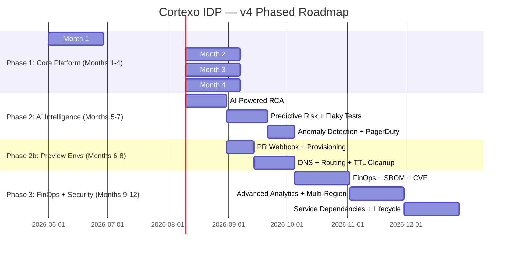
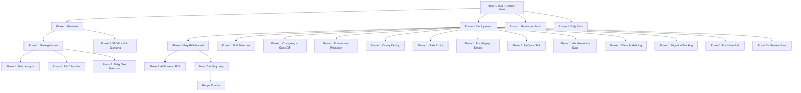

# 🗺️ Phased Roadmap — Cortexo IDP (v4 Aligned)

> Phase 1 must deliver WITHOUT any AI infrastructure dependency.
> Design all Phase 1 components for extension, not replacement.
>
> **Updated**: 2026-05-01 — Added Tom↔Tool workflow, unit testing strategy, and bug reporting flow.

---

## 🔄 Tom ↔ Cortexo Workflow (NEW)

> **This is the core operational loop that powers the entire platform.**

### The Cortexo Loop

```
Tom (AI, Free)          Cortexo (Tool)           Jerry (Human)
─────────────           ──────────────           ─────────────
Scan code        ──▶    Store bugs in DB    ──▶  Review in dashboard
                                                      │
Fix code         ◀──    Bug ID              ◀────────┘
   │
   ▼
Write unit test  ──▶    Run tests
                           │
                     ┌─────┴─────┐
                   PASS        FAIL
                     │           │
                  Deploy    Feedback to Tom ──▶ Re-fix
```

### Step-by-Step

| Step | Actor | Action | Output |
|:----:|-------|--------|--------|
| 1 | **Tom** | Reads project code, understands business logic | Knowledge in brain |
| 2 | **Tom** | Scans for bugs (patterns, security, logic errors) | Bug list |
| 3 | **Tom** | `POST /api/bugs` → stores each bug in Cortexo DB | Bugs in dashboard |
| 4 | **Jerry** | Opens Cortexo dashboard, reviews bugs | Picks bugs to fix |
| 5 | **Jerry** | Gives bug ID to Tom: "BUG-247 fix pannu" | Fix request |
| 6 | **Tom** | Writes code fix + unit test for that bug | Fixed code + test |
| 7 | **Tool** | Runs unit test suite | PASS / FAIL |
| 8a | ✅ PASS | Tool deploys to server | Live fix |
| 8b | ❌ FAIL | Jerry tells Tom what failed | Re-fix loop |
| 9 | **Tom** | Creates recipe from fix (for other clients) | Reusable recipe |
| 10 | **Tool** | Tracks which clients have this fix applied | Fleet status |

### Tom ↔ Tool API Interface

Tom uses `run_command` → `curl` to call Cortexo API (free, no AI API needed):

```bash
# Tom finds a bug → stores in Cortexo
curl -X POST http://localhost:3000/api/bugs \
  -H "Content-Type: application/json" \
  -d '{"title":"CSRF Race","severity":"P0","module":"admin_payment",...}'

# Tom creates fix → updates bug
curl -X PATCH http://localhost:3000/api/bugs/BUG-247 \
  -d '{"status":"fixed","fix_code":"...","fix_commit":"abc123"}'

# Tom creates test case for the bug
curl -X POST http://localhost:3000/api/test-cases \
  -d '{"bug_id":"uuid","title":"CSRF survives concurrent AJAX","test_code":"..."}'
```

### Cost: ₹0

| Component | Cost |
|-----------|------|
| Tom (Antigravity in editor) | **Free** |
| Cortexo tool (self-hosted) | **Free** |
| PostgreSQL (Docker) | **Free** |
| Next.js (local dev) | **Free** |

---

## 🧪 Unit Testing Strategy (NEW)

> **"Unit test kandipa venum. Konjam time eduthu panalam. Avasarapadaadha." — Jerry**

### Testing Stack

| Tool | Purpose |
|------|---------|
| **Vitest** | Unit test runner (fast, ESM native) |
| **Supertest** | API endpoint testing |
| **Prisma** | Test DB with reset between runs |

### What Gets Tested

| Layer | Tests | Example |
|-------|-------|---------|
| **API Routes** | Request/response validation | POST /api/bugs with invalid data → 400 |
| **Business Logic** | Core functions | Bug status transitions (open → in_progress → fixed) |
| **Database** | Queries + constraints | Unique constraint on client slug |
| **Auth** | Login/logout/permissions | Invalid token → 401 |

### Rules

1. Every bug fix → **minimum 1 test case** that proves it's fixed
2. Test BEFORE deploy — no exceptions
3. FAIL = cannot deploy, must fix first
4. Test output saved in `test_runs` table for audit
5. Take time, don't rush — quality over speed

---

## Phase Overview



---

## Phase 1 — Core Platform (Months 1–4)

> **Goal**: A fully operational IDP that manages deployments, pipelines, logs, RBAC, and drift for ALL 70+ clients. No AI, no ephemeral envs.

### Month 1 — Foundation

| # | Deliverable | Details | Exit Criteria |
|---|---|---|---|
| 1 | **Turborepo monorepo scaffold** | npm workspaces, shared packages, CI with build caching | `npm run build` succeeds across all packages |
| 2 | **PostgreSQL + Drizzle + RLS** | Schema for all Domain 1-2 tables, RLS policies, PgBouncer | Automated RLS test passes: zero cross-tenant leakage |
| 3 | **Auth + Sessions** | JWT (1h/7d), refresh rotation, `sessions` table, httpOnly cookies | Login/logout/refresh cycle works. Role change invalidates. |
| 4 | **RBAC system** | 4 roles, route-level middleware, permission matrix | Every API endpoint rejects unauthorized roles |
| 5 | **Redis + Event bus** | Redis Streams setup, core event emitters, consumer group skeleton | Events flow from producer to consumer with at-least-once |
| 6 | **Audit log** | `audit_events` table, monthly partition auto-creation, INSERT-only | Critical actions logged. No UPDATE/DELETE possible. |
| 7 | **Vault integration** | `credentials` table, Vault CRUD, circuit breaker | Secrets stored/retrieved via Vault. Circuit breaker opens on failure. |
| 8 | **Git source registry** | `source_registry` table, webhook endpoint, HMAC-SHA256 | Webhook received and verified from GitHub/GitLab/Bitbucket |

### Month 2 — Deployment + Pipeline Engine

| # | Deliverable | Details | Exit Criteria |
|---|---|---|---|
| 9 | **Server management** | `servers`, `server_mounts`, `server_heartbeats`, agent heartbeat | Heartbeat received every 60s. Alert on 2 missed. |
| 10 | **Pipeline engine** | DAG parser, step worker, parallel execution, retry policy | 5-step pipeline executes with parallel steps |
| 11 | **Deployment system** | Full lifecycle, snapshots, distributed locks, window policy | Deploy → snapshot → verify → succeed/rollback |
| 11b | **Canary deploy mode** | Deploy to canary client first → health check → fleet rollout or abort | Canary failure prevents fleet deployment |
| 11c | **Stale deploy auto-expiry** | Auto-expire pending_approval > 24h, auto-fail running > 1h, cron hourly | Zombie deployments cleaned up automatically |
| 12 | **Approval matrix** | Quorum-based approval, timeout, escalation | Production deploy blocked until 2/3 approvals |
| 13 | **Rollback system** | Snapshot-based, DB migration awareness, RTO <5min | Rollback completes from snapshot in < 5 minutes |
| 14 | **Changelog worker** | Auto-generate from commits on `deployment.completed` | Changelog generated for every successful deploy |
| 14b | **Post-deploy scripts** | Per-client + global script registry, auto-execute after success | Scripts run post-deploy. Script failure = warning only. |
| 14c | **Workflow auto-sync** | Auto-reprovision GitHub Actions YAML when client deploy config changes + batch reprovision | Config change → workflow YAML updated. Batch reprovision works. |
| 14d | **Deploy target management** | SSH/SFTP target CRUD, AES-256-GCM credential encryption, connection testing, deploy config per-project | Deploy targets created. SSH test passes. Credentials never exposed in API responses. |
| 15 | **Environment promotion** | Promotion chain validation, same-artifact, test gate | Staging → UAT → prod promotion without rebuild |
| 15b | **Source Sync Engine** | Hub→client repo sync, exclude rules, cherry-pick, divergence analysis, **sync profiles**, **file classifier** | Sync triggers PR on client repo. Profiles simplify rule mgmt. File classifier filters per-client type. |

### Month 3 — Observability + Bug Tracking

| # | Deliverable | Details | Exit Criteria |
|---|---|---|---|
| 16 | **Fluent Bit → ClickHouse** | Agent setup, log shipping, ClickHouse DDL, TLS | Logs appear in ClickHouse < 30s after event |
| 17 | **Log viewer UI** | Query interface, real-time WebSocket streaming, export | User can search, stream, and export logs |
| 18 | **Bug tracking** | Full lifecycle, auto-bug from deploy failures, fingerprint dedup | Deploy failure creates bug with linked deployment |
| 19 | **Manual RCA** | cause_type, affected_files, deployment link | RCA record created and linked to bug |
| 20 | **Drift detection** | Scheduled scan + on-deploy, severity classification | Drift detected and surfaced in UI within 6h |
| 21 | **Code diff engine** | Module-level diffs, pre-deploy preview, client comparison | Pre-deploy diff displayed before approval |
| 22 | **DB management** | `db_connections`, `db_migrations`, `db_backups`, migration worker | Migration runs with snapshot. Backup manifest tracks status. |
| 22b | **Config management** | Template rendering, per-client config JSONB, change history, bulk update | Config renders without unresolved tokens. Change history logged. |
| 22c | **DB Schema Validator** | Golden schema baseline, SSH validation, diff report | Schema drift detected per-client with missing/extra/mismatched columns |
| 22d | **Schema Comparison Engine** | 12-mode DB comparison (tables/columns/size/keys/indexes/checksum/duplicates), auto-generate ALTER queries | Schema comparison runs between any 2 DBs. ALTER queries exportable. |
| 22e | **Error Tracking & SDK Ingest** | SDK error ingest, fingerprint deduplication, error→deploy auto-correlation, cross-client intelligence, Slack/email alerting | SDK errors ingested. Fingerprint dedup works. Cross-client analysis shows fleet-wide bugs. |

### Month 4 — Testing, Analytics & Polish

| # | Deliverable | Details | Exit Criteria |
|---|---|---|---|
| 23 | **Testing module** | CI artifacts, QA workflows, flaky test detection | Flaky tests flagged. Test plans executable. |
| 23b | **Module fleet testing** | HTTP endpoint discovery, live testing against client URLs, per-module scoring | Fleet test runs. Worst modules surfaced. Regressions flagged. |
| 23c | **Static analysis gate** | PHP lint, debug stmt detection, configurable per-language lint rules | Lint errors block pipeline. Debug stmts = warning. |
| 24 | **Notification engine** | `notification_rules`, Slack + email, severity routing | Critical events reach Slack within 30s |
| 24b | **In-app notification CRUD** | Org-scoped notifications, mark-read, mark-all-read, createNotification() helper | Notifications listed. Mark-as-read works. System events create notifications. |
| 25 | **Analytics dashboard** | Health score (0-100), deploy metrics, bug metrics | Health scores computed hourly for all clients |
| 25b | **RCA Pattern DB** | Confirmed root cause patterns, fingerprint + fuzzy matching, AI bypass on high-confidence match | Pattern matched. AI call skipped when confidence > 80%. |
| 25c | **Uptime SLA tracker** | Monthly SLA % per client, avg response time, threshold alerts | SLA calculated monthly. Alerts on < 99.5%. |
| 25d | **Cost tracking (FinOps)** | Per-client/server cost entries, monthly aggregation, budget alerts, invoice generation | Costs tracked. Budget alerts fire. Invoices generated. |
| 26 | **Web terminal** | SSH via WebSocket, role-gated, session logging | Terminal connects. Commands logged to ClickHouse. |
| 26b | **Live log viewer** | File-based log source registry, real-time tail, search, level detection | Log files tailable via UI. Level auto-detected. |
| 27 | **Onboarding wizard** | Multi-step flow, auto-save, resume token | New tenant onboarded end-to-end via wizard |
| 27b | **Menu permissions** | Per-user menu visibility, role base + user override, admin toggle grid | Menu items hidden per user. Admin UI works. |
| 28 | **CLI tools** | deploy, rollback, logs tail, status | CLI deploys successfully via API |
| 28b | **Migration tracking dashboard** | Per-client migration status, deployment linkage, fleet overview, summary stats | Migration status visible per-client. Failed migrations flagged. |
| 28c | **Server permission audit** | Weekly cron + on-demand SSH permission scan, drift detection, production gate | Permission drift detected. Fixes require confirmation for prod. |
| 28d | **Daily stats aggregation** | Midnight cron rollup, sparkline API, weekly trends, hourly heatmap | Sparkline charts render. Week-over-week comparison works. |
| 29 | **System Command Center** | Global health view, all core UI pages | All 70+ clients visible with health indicators |
| 29b | **Client scaffolding** | Auto-create config + override dirs + PR + auto-merge via GitHub API on client create | New client scaffolded in hub repo. PR auto-merged. |
| 30 | **Hardening** | Load testing, security audit, RLS test suite, DLQ review UI | 99.9% API availability under load test |

### Phase 1 Entry → Exit Criteria

**Entry**: Turborepo scaffold ready, PostgreSQL + Redis provisioned, Vault accessible, ClickHouse cluster operational.

**Exit**: ALL 70+ client environments managed. Pipeline → deploy → rollback cycle works. Logs queryable. Bugs tracked. Drift detected. Zero cross-tenant data leakage confirmed by automated test suite.

### Phase 1 Success Metrics
- [ ] ALL 70+ client environments managed through the platform
- [ ] Pipeline executes build → test → deploy end-to-end
- [ ] Rollback completes in < 5 minutes
- [ ] Zero cross-tenant data leakage (automated RLS test suite)
- [ ] Audit log captures 100% of critical mutations
- [ ] Log delivery lag < 30 seconds
- [ ] Heartbeat detection < 90 seconds
- [ ] API availability 99.9%
- [ ] Source sync triggers PRs on client repos successfully
- [ ] Config rendering resolves all tokens without errors
- [ ] Module fleet test runs against all active clients
- [ ] DB schema validation detects drift from golden baseline
- [ ] Canary deploy prevents bad deploys from reaching fleet
- [ ] Stale deployments auto-expire without manual intervention
- [ ] Post-deploy scripts execute and log output
- [ ] Workflow YAML auto-reprovisioned on config change
- [ ] SLA calculated monthly for all active clients
- [ ] Cost tracking entries logged per client/server
- [ ] Schema comparison generates valid ALTER queries
- [ ] Static analysis blocks PHP lint errors in pipeline
- [ ] Client scaffolding auto-creates config + override dirs + PR in hub repo
- [ ] Migration tracking shows per-client status linked to deployments
- [ ] Permission audit detects drift from expected server permissions
- [ ] Daily stats sparklines render on dashboard
- [ ] File classifier correctly filters sync files per client type
- [ ] SDK error ingest works via X-Api-Key header with fingerprint deduplication
- [ ] Cross-client error intelligence identifies fleet-wide bugs (≥3 clients)
- [ ] Deploy targets store encrypted credentials, SSH test passes
- [ ] In-app notifications list/mark-read/mark-all-read functional
- [ ] Error → deployment auto-correlation links errors to recent deploys
- [ ] **Tom can POST bugs via curl API** (NEW)
- [ ] **Unit tests pass before every deploy** (NEW)
- [ ] **Bug → Fix → Test → Deploy loop works end-to-end** (NEW)
- [ ] **Recipe tracker shows per-client fix matrix** (NEW)

---

## Phase 2 — AI Intelligence (Months 5–7)

> **Goal**: AI augments human decision-making. **Never auto-acts.** All AI outputs include confidence scores and human review gates.

**Entry criteria**: Phase 1 exit criteria met. RCA data from manual Phase 1 available for training/validation.

| # | Deliverable | Details |
|---|---|---|
| 1 | **AI-powered RCA** | Log + diff → structured summary + suggested fix. Confidence score. `reviewed_by` gate. |
| 2 | **Predictive deployment risk** | Pattern matching on historical failures + current diff scope |
| 3 | **Flaky test detection (ML)** | Statistical model over `pipeline_test_artifacts` + `flaky_tests` table |
| 4 | **Anomaly detection** | Error rate + performance metric regression post-deploy |
| 5 | **PagerDuty integration** | Critical alert routing for production incidents |
| 6 | **Agent Orchestration System** | Multi-sub-agent coordination (max 5), token budget management (15×), forward messaging, consensus voting, auto-escalation to human |
| 7 | **LLM-as-a-Judge scoring** | 5-dimension quality scoring (correctness/completeness/code quality/security/actionability), GPT + heuristic dual mode, score history |
| 8 | **Deprecation Scanner** | CI3→CI4 + PHP 7.4→8.2 deprecated pattern scanning, auto-fixable detection, migration hour estimation |
| 9 | **Degradation Detector** | Quality drift, repetition increase, hallucination markers, context overflow, latency spike tracking |

### Phase 2 Success Metrics
- [ ] AI RCA produces structured summary with > 60% accuracy
- [ ] Confidence scores displayed on all AI outputs
- [ ] Human review gate prevents any auto-action
- [ ] Predictive risk alerts issued before production deploys
- [ ] Agent orchestration spawns sub-agents within budget. Consensus works.
- [ ] LLM Judge scores match human assessment within ±15 points
- [ ] Deprecation scanner identifies CI3 patterns with 95%+ accuracy
- [ ] Degradation detection alerts before quality drops below threshold

---

## Phase 2b — Ephemeral Preview Environments (Months 6–8)

> **Goal**: PR-based preview environments with automatic lifecycle management.

**Entry criteria**: Deployment system stable. Webhook ingestion tested. Managed provider account configured.

| # | Deliverable | Details |
|---|---|---|
| 1 | **PR webhook provisioning** | PR open → preview env via managed provider (Railway/Fly.io) |
| 2 | **Dynamic DNS + routing** | Reverse proxy routing per preview env. PR comment with URL. |
| 3 | **PR lifecycle binding** | Env tied to PR: open/close/merge triggers create/teardown |
| 4 | **TTL cleanup scheduler** | Max 72h TTL, configurable per tenant |
| 5 | **Cost cap** | Max active preview envs per tenant. Cost alert on orphaned envs. |

### Phase 2b Success Metrics
- [ ] Preview env spins up within 3 minutes of PR open
- [ ] Auto-teardown on PR close/merge
- [ ] TTL cleanup prevents orphaned environments
- [ ] Cost cap enforced per tenant

---

## Phase 3 — Security, Compliance & Advanced Ops (Months 9–12)

> **Goal**: Enterprise compliance, advanced analytics, and multi-region support. FinOps already delivered in Phase 1.

**Entry criteria**: Phase 2 AI features stable. Phase 2b preview envs operational. ClickHouse data volume sufficient for advanced analytics.

| # | Deliverable | Details |
|---|---|---|
| 1 | **SBOM generation** | Software bill of materials per deployment, linked to deployment record |
| 2 | **Vulnerability scanning** | SBOM → CVE lookup, severity-gated pipeline step |
| 3 | **Advanced ClickHouse analytics** | Retention heatmaps, deploy velocity trends, error regression |
| 4 | **External integrations** | Pub/Sub system for webhooks out, JIRA sync |
| 5 | **Multi-region deployment** | Region-aware deploy target selection |
| 6 | **Service dependency graph** | Runtime map from `service_dependencies` table |
| 7 | **Data lifecycle** | Configurable retention, offboarding export, purge scheduler |
| 8 | **Deprecation scanner** | CI3→CI4, PHP version upgrade detection, estimated migration hours, trend tracking |
| 9 | **Client provisioning wizard** | Automated GitHub repo creation, DB bootstrap, server provisioning, template-based |

### Phase 3 Success Metrics
- [ ] SBOM generated for every production deployment
- [ ] CVE scanning integrated as pipeline gate
- [ ] Data lifecycle policies enforced with audit trail
- [ ] Deprecation scan runs per client with migration effort estimated
- [ ] Client provisioning fully automated from wizard to first deploy

---

## Team Structure (Recommended)

| Role | Count | Responsibility |
|---|---|---|
| **Platform Lead** | 1 | Architecture, trade-offs, cross-module alignment |
| **Backend Engineers** | 2-3 | Fastify API, BullMQ workers, DB schema, ClickHouse |
| **Frontend Engineer** | 1-2 | Next.js dashboard, pipeline visualizer, log viewer |
| **DevOps/SRE** | 1 | Infrastructure, Fluent Bit setup, ClickHouse ops, Vault |
| **QA Engineer** | 1 (Phase 2+) | Testing module, integration tests, RLS security tests |

> [!TIP]
> **Solo developer strategy**: Prioritize in order: IAM → Deployments → Pipelines → Logging → Everything else. The deployment system provides the most immediate value.
> **Tom (AI) handles**: Bug scanning, code fixes, unit test writing, recipe creation — all free via editor integration.

---

## Key Dependencies Between Phases



---

## Evolution Path

| Stage | Platform Is... | Value Delivered |
|---|---|---|
| **Phase 1** | Fully operational IDP | Manages all 70+ clients: deploy, monitor, drift, test, audit, **FinOps, SLA, canary deploy, scaffolding, migration tracking, permission audit, stats aggregation, file classification, Tom↔Tool bug loop, recipe tracking, unit test gating** |
| **Phase 2** | Intelligence layer | AI-assisted RCA, risk prediction, anomaly detection — human-gated |
| **Phase 2b** | Developer experience | PR-based preview environments with lifecycle management |
| **Phase 3** | Enterprise platform | Compliance (SBOM/CVE), advanced analytics, data governance, auto-provisioning |
