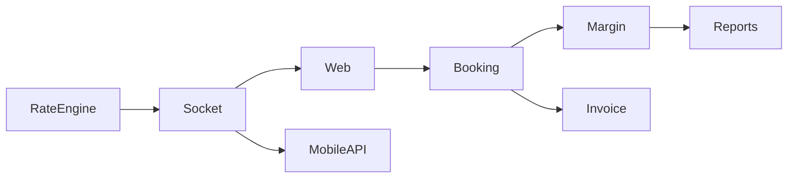

# /build-system-brain Workflow

> Build the cross-module System Brain for Winbull.
> Purpose: Maps shared tables, module dependencies, and integration risk across ALL modules.
> Prerequisite: At least 3 module brains built via /build-module-brain

## Usage
Say: `/build-system-brain`

---

## When to Run

| Trigger | Mode | Time |
|---------|------|------|
| 3+ module brains exist, system brain doesn't | **Initial Build** | ~30 min |
| New module brain just built | **Incremental Add** | ~5 min |
| Quarterly or after major refactor | **Full Refresh** | ~15 min |

---

## Output Structure

```
brain/winbull/_SYSTEM/
├── SHARED_TABLES.md       ← Tables used by 2+ modules (top cross-module risk)
├── MODULE_DEPENDENCIES.md ← Which modules call each other
├── SHARED_MODELS.md       ← Shared models (booking_model, settings_model) — who calls what
├── CROSS_MODULE_BUGS.md   ← Bugs that span multiple modules (history + active)
├── SYSTEM_COVERAGE.md     ← How many modules have brains
├── DATA_FLOW_CHAINS.md    ← End-to-end flows (Rate→Socket→Booking→Margin→Invoice)
├── VALIDATION_GAPS.md     ← Server-trusts-client gaps, injection risks
├── CLEANUP_GAPS.md        ← Missing cascades on cancel/delete (BR-CX001 violations)
├── DANGER_ZONES.md        ← NEVER rules — hard stops for catastrophic mistakes
├── DIAGNOSTIC_PLAYBOOK.md ← Symptom→Suspect rules ("when X, check Y first")
└── HANDOFF_AUDIT.md       ← Cross-module contract verification
```

---

## Step 0: Pre-Check

1. List all built module brains:
```bash
ls brain/winbull/modules/
```
2. Verify each has `MODULE_BRAIN.md`
3. If < 3 brains → STOP: "Build at least 3 module brains first via /build-module-brain"
4. Check if `_SYSTEM/` already exists → Incremental Add or Full Refresh?

---

## Step 1: Read All CROSS_MODULE_MAP.md Files

For each module brain, extract:
- External models loaded
- External tables READ
- External tables WRITTEN
- Cross-module AJAX calls

Build master list: `{table_name} → [{module_1, method_1}, ...]`

---

## Step 2: Read All METHOD_INDEX.md Files

For each module brain, extract the **Table → Methods Reverse Map**.
This reveals which tables are touched by multiple modules — the core cross-module risk.

---

## Step 3: Generate SHARED_TABLES.md

```markdown
# Shared Tables — Cross-Module Risk Map
> Last updated: {DATE}

## Risk Levels
- 🔴 HIGH: Table written by 2+ modules (data corruption risk)
- 🟡 MEDIUM: Table read by 2+ modules, written by 1 (stale read risk)
- 🟢 LOW: Lookup/config — read-only by all

## Shared Table Matrix
| Table | Owner Module | Read By | Written By | Risk | Key Columns |
|---|---|---|---|---|---|
| dt_booking | Booking | Margin, Invoice, Admin | Booking | 🟡 | id, status, book_type |
| dt_margin | Margin | Booking, Reports | Margin, Booking(cancel) | 🔴 | id, margin_amount |

## Impact Lookup
When changing a table, check:
| If you change... | Check these modules... |
```

---

## Step 4: Generate MODULE_DEPENDENCIES.md

```markdown
# Module Dependencies Map
> Last updated: {DATE}

## Dependency Matrix
| Module | Depends On | Depended On By |
|---|---|---|
| Booking | Rate Engine, Margin, Admin | Reports, Invoice |
| Margin | Booking | Reports, Admin |
| MobileAPI | Booking, Rate Engine | — (consumer only) |

## Dependency Graph


## Cross-Module AJAX Calls
| Source | Target Controller | Endpoint | What Data | Risk |
```

---

## Step 5: Generate SHARED_MODELS.md

```markdown
# Shared Models
> Changing a method here affects ALL loading modules.

## Booking Model (shared across admin + web)
| Method | Called By | Tables Touched | Risk if Changed |
|---|---|---|---|
| get_booking() | Web, Admin, MobileAPI | dt_booking | 🔴 Universal |

## Settings Model (global_configs.php)
| Key | Used By | Risk |
|---|---|---|
| MCX_API_URL | Rate Engine | 🔴 All rates fail |
```

---

## Step 6: Generate CROSS_MODULE_BUGS.md

```markdown
# Cross-Module Bug History
> Last updated: {DATE}

## Active Cross-Module Bugs
| Bug ID | Modules Affected | Description | Status |

## Resolved Cross-Module Bugs
| Bug ID | Modules Affected | Root Cause | Fix | Date |
```

---

## Step 7: Generate DANGER_ZONES.md [CRITICAL]

This is the most important file for a solo DevOps engineer.

```markdown
# DANGER ZONES — Hard Stops

> These are NEVER rules. Breaking them has caused production incidents.
> Read this before touching ANY of the listed files or operations.

## NEVER Rules

| ID | Rule | Why | Last Violated |
|---|---|---|---|
| DZ-001 | NEVER modify global_configs.php without reading 1_architecture.md first | All 5 modules depend on it — wrong URL = full outage | — |
| DZ-002 | NEVER change dt_booking schema without checking Booking + MobileAPI + Reports | 3 modules write to this table | — |
| DZ-003 | NEVER cancel a booking without reversing dt_margin (BR-CX001) | Orphaned margin = inflated client liability | — |
| DZ-004 | NEVER push rate formula changes without testing Print vs Save parity (BR-PR001) | Invoice shows wrong amount to client | — |
| DZ-005 | NEVER use == for OTP comparison (SYS-008) | Type juggling bypass — security hole | — |
| DZ-006 | NEVER run git add . with SSHFS mounted (Project/) | Hangs indefinitely — kills terminal | Fixed in .gitignore |
| DZ-007 | NEVER disable WhiteListDomainMiddleware | 86 mobile endpoints become unauthenticated | Currently disabled — SYS-005 |

## Dangerous Files (Require Explicit Approval)
- `global_configs.php` — all config
- `application/models/Booking_model.php` — core booking logic
- `lmxtrade/winbullliteapi/rate_helper.php` — rate calculation
- `client/WinbullstagingNativeSocket.js` — socket events
- `mobileapi/application/controllers/` — all 86 unauthenticated endpoints
```

---

## Step 8: Generate DIAGNOSTIC_PLAYBOOK.md

```markdown
# Diagnostic Playbook — Symptom → Suspect Rules

> When you see symptom X, suspect Y FIRST.
> These rules are learned from real Winbull bugs.

## Rules

### RULE-DX-001: Wrong value displays on invoice/print
**SUSPECT FIRST**: BR-PR001 violation — print template uses different formula than save
**CHECK**: Compare print query formula vs save logic formula (are they identical?)
**NEVER DO**: Assume it's a JS bug before checking PHP print template
**Ripple check**: Web display → Admin display → Invoice print → PDF export

### RULE-DX-002: Margin shows wrong after booking cancel
**SUSPECT FIRST**: BR-CX001 violation — cancel didn't restore dt_margin
**CHECK**: cancel() method — does it reverse ALL tables from save()?
**NEVER DO**: Fix dt_booking status without checking dt_margin

### RULE-DX-003: OTP fails intermittently
**SUSPECT FIRST**: SYS-008 — `==` comparison with type juggling on numeric OTP
**CHECK**: grep for `== $otp` in verification code
**FIX**: Change to `===` strict comparison

### RULE-DX-004: Mobile API returns wrong data for one client, correct for others
**SUSPECT FIRST**: Missing WHERE clause for branch/company filter
**CHECK**: Model query — does it scope by `company_id` or `branch_id`?
**NEVER DO**: Assume client data issue before checking query scope

### RULE-DX-005: Rate not updating on web frontend
**SUSPECT FIRST**: Socket.IO event not subscribed correctly
**CHECK**: 6_socket_layer.md — event name, subscription code
**SECOND**: Check if socket server is running (`pm2 status`)
```

---

## Step 9: Generate HANDOFF_AUDIT.md

```markdown
# Handoff Audit — Cross-Module Contract Verification
> Last updated: {DATE}

## Contract Match Matrix
| Module A (Outbound) | Guarantee | Module B (Inbound) | Expectation | Match? | Risk |
|---|---|---|---|---|---|
| Booking | dt_booking status=active | Margin | Checks booking active before margin deduct | ✅/❌ | |
| Margin | margin restored on cancel | Booking | Cancel restores all | ✅/❌ | |

## Reversal Gap Summary (BR-CX001 Audit)
| Module | Operation | Tables NOT Restored | Severity |
|---|---|---|---|

## State Machine Conflicts
| Entity.Field | Value | Set By Module A | Set By Module B | Conflict? |
```

---

## Incremental Add (After New Module Brain)

When a new module brain is built:
1. Read ONLY new module's `CROSS_MODULE_MAP.md` and `METHOD_INDEX.md`
2. Add new module entries to `SHARED_TABLES.md` and `MODULE_DEPENDENCIES.md`
3. Update `SYSTEM_COVERAGE.md`
4. Update `DANGER_ZONES.md` if new dangerous patterns found
5. Add new symptom→suspect rules to `DIAGNOSTIC_PLAYBOOK.md`
6. Update Mermaid dependency graph

---

## Completion Report

```
✅ System Brain — {MODE} complete

   Modules scanned: {N}
   ├── SHARED_TABLES.md:      {N} tables mapped ({N} high-risk 🔴)
   ├── MODULE_DEPENDENCIES.md: {N} dependency links
   ├── DANGER_ZONES.md:       {N} NEVER rules
   ├── DIAGNOSTIC_PLAYBOOK.md: {N} symptom→suspect rules
   ├── HANDOFF_AUDIT.md:      {N} contracts, {N} gaps
   └── CLEANUP_GAPS.md:       {N} missing cancel-reversals

   Brain location: brain/winbull/_SYSTEM/
   Next refresh: {date + 90 days}
```
