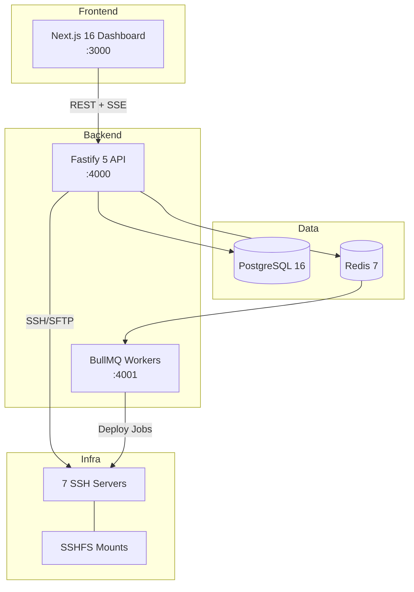

# 🧠 Cortexo — The Brain for Your Code

[](https://github.com/elavarasan-lmx/cortexo/actions)


> **AI-powered DevOps intelligence platform** for small teams managing 70+ client deployments.
> Deploy. Detect. Debug. All in one platform.

---

## ✨ Features

- 🚀 **One-Click Deployments** — SSH-based deploy with live terminal, rollback, and canary support
- 🐛 **Error Tracking** — Fingerprint-based deduplication with SDK ingestion (JS, Node, PHP)
- 🤖 **AI Root Cause Analysis** — LLM-powered error analysis with deploy diff correlation
- 📊 **Real-Time Metrics** — SSE-based live dashboard with server health monitoring
- 🔄 **Source Sync** — Drift detection and config management across 70+ clients
- 🔐 **Multi-Tenant Auth** — JWT + OAuth (GitHub) with per-route rate limiting
- 📋 **Audit Trail** — Complete action logging with structured error codes

---

## 🏗️ Architecture



---

## 🚀 Quick Start

### Prerequisites

- **Node.js** ≥ 20.0.0
- **Docker** & Docker Compose (for PostgreSQL + Redis)

### Setup

```bash
# 1. Clone the repo
git clone https://github.com/elavarasan-lmx/cortexo.git
cd cortexo

# 2. Install dependencies
npm install

# 3. Start PostgreSQL + Redis
docker compose up -d

# 4. Configure environment
cp .env.example .env
# Edit .env with your database credentials and secrets

# 5. Push database schemas
npm run db:push

# 6. Seed demo data (optional)
npm run seed

# 7. Start development servers
npm run dev
# → Dashboard: http://localhost:3000
# → API:       http://localhost:4000
# → Swagger:   http://localhost:4000/docs
```

### Individual Services

```bash
npm run dev:web       # Next.js Dashboard only
npm run dev:api       # Fastify API only
npm run test          # Run all tests
npm run test:coverage # Tests with coverage report
npm run db:studio     # Open Drizzle Studio (DB browser)
```

---

## 🏗️ Tech Stack

| Layer | Technology | Purpose |
|---|---|---|
| Frontend | Next.js 16 + React 19 | Dashboard UI (37 pages) |
| Backend | Fastify 5 + Zod + JWT | REST API (90+ endpoints) |
| Database | PostgreSQL 16 | Data persistence (RLS multi-tenant) |
| ORM | Drizzle ORM | Type-safe queries + migrations |
| Auth | JWT + OAuth (GitHub) | Scrypt hashing, refresh tokens |
| Cache | Redis 7 + BullMQ | Job queues + caching |
| Real-time | WebSocket + SSE | Live logs + metrics streaming |
| Testing | Vitest | Integration + unit tests |
| CI/CD | GitHub Actions | Lint → Build → Test pipeline |
| Monorepo | Turborepo + npm workspaces | Build orchestration |
| Containers | Docker Compose | PostgreSQL 16 + Redis 7 |

---

## 📁 Project Structure

```
cortexo/
├── .github/workflows/       CI/CD pipeline (GitHub Actions)
├── apps/
│   ├── web/                  Next.js 16 Dashboard (:3000)
│   │   ├── app/              App Router (37 pages)
│   │   ├── components/       UI components (deploy/, layout/)
│   │   └── lib/              API client + types
│   └── api/                  Fastify 5 Backend (:4000)
│       └── src/
│           ├── routes/       32 route modules (90+ endpoints)
│           ├── lib/          DB, Redis, AI, email, env validation
│           ├── middleware/   Auth + request validation
│           ├── worker/       BullMQ pipeline worker
│           └── __tests__/    Integration tests (Vitest)
├── packages/
│   ├── db/                   Drizzle ORM schemas (18 tables)
│   └── config/               Shared TypeScript config
├── docker-compose.yml        PostgreSQL 16 + Redis 7
├── Dockerfile                Multi-stage production build
└── .env.example              Environment variable template
```

---

## 📊 API Endpoints (90+)

**Base URL:** `http://localhost:4000/v1` | **Swagger Docs:** [`/docs`](http://localhost:4000/docs)

| Category | Routes | Key Endpoints |
|---|:---:|---|
| Health | 2 | `/health`, `/health/ready` |
| Auth | 8 | Register, Login, OAuth, Refresh, Reset |
| Projects | 5 | CRUD + SDK key regeneration |
| Pipelines | 7 | CRUD, trigger runs, retry/cancel |
| Deployments | 10 | Deploy, rollback, canary, live logs |
| Errors | 6 | Tracking, fingerprinting, assignment |
| Infrastructure | 15 | Servers, SSHFS mounts, file browsing |
| Source Registry | 12 | Sources, client configs, drift detection |
| Sync | 10 | Source sync, divergence analysis |
| Logs | 7 | Log sources, tail, search, browse |
| Cron Jobs | 6 | CRUD, manual execution, history |
| Analytics | 6 | Summary, trends, health score |
| Alerts | 7 | Channels, rules, dispatch history |
| Deprecation | 5 | Scan, suppress, results |
| AI Judge | 5 | Quality scoring, evaluations |
| Metrics | 2 | SSE real-time streaming |

---

## 🔐 Security

- **Auth:** Scrypt password hashing, JWT access/refresh tokens, GitHub OAuth
- **Rate Limiting:** Global 100 req/min + strict 5 req/min on auth endpoints
- **Headers:** Helmet (CSP, X-Frame-Options, HSTS)
- **Env Validation:** Fails fast on missing `DATABASE_URL`, `JWT_SECRET`, `REDIS_URL`
- **Production Guard:** Server crashes if `UNSAFE_DEV_AUTH=true` in production
- **Structured Errors:** Machine-readable error codes for all API responses

---

## ⚙️ Background Workers

| Worker | Purpose | Health Check |
|---|---|---|
| Pipeline Worker | BullMQ job execution with retry | `:4001/` |
| RCA Worker | AI-powered root cause analysis | — |
| Sync Worker | Source code sync execution | — |
| Alert Worker | Notification dispatch (email, Slack) | — |

---

## 📦 SDKs

| Package | Language | Purpose |
|---|---|---|
| `sdk-js` | JavaScript (Browser) | Client-side error tracking |
| `sdk-node` | Node.js (Server) | Server-side error + performance |
| `sdk-php` | PHP | PHP application monitoring |

---

## 📈 Status

- [x] Phase 1: Foundation (monorepo, auth, design system)
- [x] Phase 2: CI/CD Engine (pipelines, deployments, canary)
- [x] Phase 3: Bug Detection (error tracking, fingerprinting)
- [x] Phase 4: AI Root Cause Analysis
- [x] Phase 5: Agent Intelligence
- [x] Phase 6-9: Operations, Sync, Infrastructure
- [x] Phase 10-13: Permissions, Audit, Profiles, Sources
- [x] Phase 14-16: Automation, Alerts, Testing
- [ ] Phase 17: Production hardening + performance optimization

---

## 📄 License

MIT © [Elavarasan](https://github.com/elavarasan-lmx)
