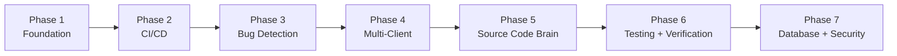
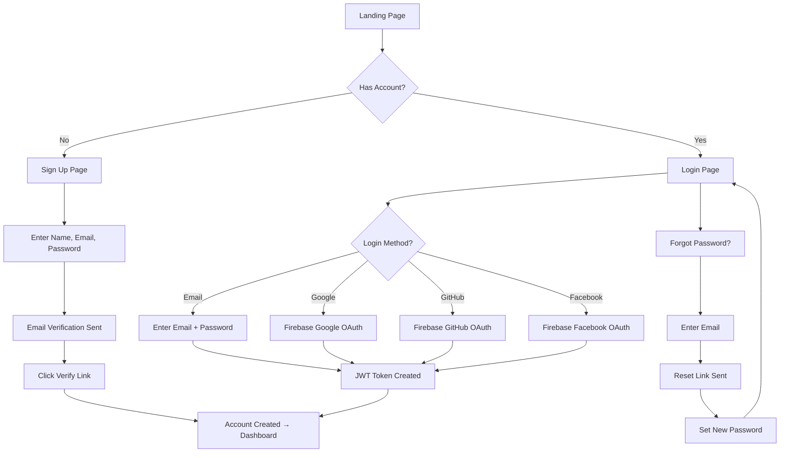

# Cortexo — Product Requirements Document (v4.0)

> **"The brain for your code"**  
> **Date:** April 22, 2026 | **Status:** Audited & Lean ✅ (v4.0 — reduced from 134 → 111 features)

---

## Confirmed Decisions

| Decision | Your Answer |
|---|---|
| **Product Name** | **Cortexo** ✅ — "The brain for your code" |
| **Target Customer** | Small teams |
| **Market** | India first → Global later |
| **Tech Stack** | Next.js 14 + Node.js (Option A) |
| **Hosting** | Free tier: Vercel + Railway + Supabase + Upstash + R2 |
| **Source Code Brain** | Private per project (Option A) |
| **Testing** | All types — page load, form entry, visual, functional |
| **Pricing** | Removed for now, add later |
| **Payment Gateway** | Removed for now, add later |
| **Theme** | Dark + Light mode |
| **Team** | You have a team |

---

## Final Feature List (111 Features across 21 Categories)

### Category 1: CI/CD Pipeline
| # | Feature | Description |
|---|---|---|
| F1 | **Pipeline Builder** | Visual + YAML pipeline config with reusable GitHub Actions templates. Pre-built matrix workflows for PHP/Node/Python/React. Includes standardized deploy pipelines, pre-deploy linting gates, and GitOps auto-sync to detect server drift from repo state. |
| F2 | **Multi-Target Deploy** | **Primary: SSH/SFTP** (current infra). Future: Docker, Kubernetes, AWS, Vercel, Netlify, Custom webhook — deferred until first customer request. |
| F3 | **Rollback System** | One-click rollback, auto-rollback on error spike |
| F4 | **Deploy Strategies** | **Direct and Rolling** (fits single-server SSH/SFTP). Blue-green and canary deferred — require multi-server or container orchestration not in current infra. |

### Category 2: Bug Detection & Analysis
| # | Feature | Description |
|---|---|---|
| F5 | **Runtime Error Monitoring** | SDK captures errors from PHP/JS/Node/Python apps in real-time |
| F6 | **Code Review Engine** | Unified rule-based + AI-powered code review. **Rule mode** (fast, deterministic): enforces `isset()` before array access, PDO prepared statements, input sanitization (XSS), session validation, PSR-12 standards, flags hardcoded credentials. **AI mode** (deeper): SOLID principles, Clean Code standards, type hints, error handling, flags 800+ line controllers for splitting. Produces actionable findings ranked by severity (Critical → Info). Runs on every PR/commit pre-deploy. *(Merged: former F6 Static Scanner + F33 AI Code Review)* |
| ~~F7~~ | ~~Business Rule Validator~~ | *Merged into F10 (Pattern Enforcement) — business rule validation is a pattern type.* |
| F8 | **AI Root Cause Analysis** | Error → Deploy correlation → AI explains WHY + suggests fix. Includes root cause UI view: each bug shows root cause summary, affected deploy, suggested fix, and similar past bugs. *(Absorbed former F73 Bug Root Cause View)* |

### Category 3: Source Code Brain (⭐ Unique Feature)
| # | Feature | Description |
|---|---|---|
| F9 | **Project Intelligence** | AI scans entire codebase, learns: design patterns, naming conventions, alert styles, toaster styles, folder structure, coding standards. Becomes the "brain" of your project |
| F10 | **Pattern Enforcement** | When new code violates learned patterns, flag it. "Your project uses SweetAlert everywhere, but this file uses native alert()." **Includes business rule validation** — detects wrong calculations, logic errors, formula violations (e.g., rate formula deviations, GST/TCS misapplication). *(Absorbed former F7 Business Rule Validator)* |
| F11 | **Code Documentation Generator** | AI reads code → auto-generates documentation for functions, APIs, modules |

### Category 4: Automated Testing (Full QA)
| # | Feature | Description |
|---|---|---|
| F12 | **Page Load Testing** | Playwright-powered browser testing — check all pages load correctly (HTTP 200, no JS errors, no console warnings). Cross-browser support (Chrome, Firefox, Safari, Mobile). |
| F13 | **Form Testing** | Playwright auto-fill forms, submit, verify response — like a real QA tester. Tests login → view rates → place trade → verify flows per client. |
| F14 | **Functional Testing** | Playwright end-to-end user flow testing. Click buttons, navigate menus, test complete user journeys. Generates reusable test scripts per client that run before every deploy. |
| F15 | **Visual Regression** | Screenshot before vs after deploy, highlight visual differences |
| F16 | **Performance Testing** | Page load time, API response time, Core Web Vitals. Includes k6-powered load testing — simulate concurrent users per client server to verify capacity before deploys. Generates performance baseline per client. |

### Category 5: DevOps Tools
| # | Feature | Description |
|---|---|---|
| F17 | **MySQL Migration Tool** | Compare DB schemas, generate migration scripts, track schema changes. Supports zero-downtime schema changes via `pt-online-schema-change` (Percona). Live ALTER TABLE on production without locking. Rollback-safe with automatic backup before migration. |
| F18 | **File Difference Checker** | Compare two files or two versions, visual diff (like GitHub diff) |
| F19 | **Environment Comparison** | Compare staging vs production (files, config, DB schema) |
| F20 | **WebSocket Monitor** | Track WS connections, load, memory, which files are heavy, optimization tips |
| F104 | **Webhook Manager** | Manage incoming/outgoing webhooks per project — Slack, Discord, custom HTTP endpoints, delivery logs, retry on failure |

### Category 6: Project Management
| # | Feature | Description |
|---|---|---|
| F21 | **Project Details Dashboard** | Domain name, app version, tech stack detected, file count, folder structure, dependencies list, team members, last activity, server info |
| F22 | **Team Activity Feed** | Who deployed what, who fixed which bug, timeline of all actions |
| F23 | **Changelog Generator** | Auto-generate changelog from git commits for each release |

### Category 7: Security & Optimization
| # | Feature | Description |
|---|---|---|
| F24 | **Dependency Scanner** | Check npm/composer packages for known vulnerabilities. Also scans Docker images for CVEs via container security scanning (Docker Scout/Trivy). Flags outdated PHP extensions and MySQL client libraries. |
| F25 | **Secret Scanner** | Find hardcoded passwords, API keys, tokens in code |
| F26 | **Dead Code Detector** | Find unused functions, files, CSS that can be removed |
| F27 | **Performance Profiler** | Find slow PHP functions, slow SQL queries, memory hogs |
| F28 | **API Health Monitor** | Ping APIs every 5 min, alert if down, track response time trends |

### Category 8: Multi-Client Management (⭐ Unique Feature)
| # | Feature | Description |
|---|---|---|
| F29 | **Multi-Client Bug Propagation** | Fix a bug in one client → select which other clients need the same fix → deploy to all selected in one click |
| F30 | **Reusable Fix Library** | Every bug fix is saved as a reusable "recipe". When same bug appears in another client, apply the saved fix instantly |
| F31 | **Client Fleet Dashboard** | See all 70+ clients in one view — health status, version, last deploy, pending fixes |
| F32 | **Fix Rollout Tracker** | Track which clients have received a fix and which are still pending (like BUG-001: "Maharaj ✅, AJ ⬜ Pending") |
| F103 | **Feature Flags** | Toggle features on/off per client without redeploying — "Enable new reports for Client A, disable for Client B" with percentage rollout |

### Category 9: AI & Advanced (Cortexo Suggestions)
| # | Feature | Description |
|---|---|---|
| ~~F33~~ | ~~AI Code Review~~ | *Merged into F6 (Code Review Engine) — now a unified rule-based + AI-powered feature.* |
| F34 | **Smart Conflict Detector** | When deploying to multiple clients, detect if a fix conflicts with client-specific customizations |
| F35 | **Client Comparison Matrix** | Compare any 2 clients side-by-side — files, config, DB schema, versions, features enabled |
| F36 | **Scheduled Reports** | Weekly email to team: "This week — 5 deploys, 3 bugs fixed, 2 pending across 70 clients" |
| ~~F37~~ | ~~Downtime Predictor~~ | *⏳ DEFERRED to post-PMF. Requires months of historical data across many clients for meaningful predictions. Use F28 (API Health Monitor) threshold alerting instead.* |
| F38 | **Auto-Test After Fix** | After applying a fix, automatically run page load + form tests on that client to verify the fix works. *(Also covers former F41 Post-Fix Verification)* |
| F39 | **Client Health Score** | Each client gets 0-100 health score based on: errors, uptime, outdated dependencies, pending fixes |
| F40 | **Knowledge Base** | Auto-build searchable knowledge base from all past bugs, fixes, and root causes. Team can search "NaN error" and find every related fix ever applied. **Includes Agent Learning Memory** — agents contribute execution results (success/failure scoring, LLM-as-a-Judge evaluations, pairwise fix comparisons) to this knowledge base. *(Absorbed former F110 Agent Learning Memory)* |

### Category 10: Verification & Database Intelligence
| # | Feature | Description |
|---|---|---|
| ~~F41~~ | ~~Post-Fix Verification~~ | *Removed — duplicate of F38 (Auto-Test After Fix). Same functionality described twice.* |
| F42 | **Regression Detector** | After a fix, auto-test ALL other pages to ensure the fix didn't break anything else |
| F43 | **Database Optimizer** | Deep MySQL intelligence: auto-index advisor via `sys.schema_unused_indexes` + slow query log analysis, N+1 query detection in CodeIgniter models, `EXPLAIN FORMAT=JSON` query plan visualization, InnoDB buffer pool tuning, table fragmentation cleanup via `OPTIMIZE TABLE`, and ProxySQL connection pool monitoring. |
| F44 | **SQL Error Monitor** | Capture all SQL errors in real-time via MySQL `performance_schema.events_statements_summary_by_digest`. Tracks failed queries, deadlocks, connection timeouts, N+1 patterns, and long-running transactions. Auto-correlates slow queries with specific PHP controller methods. |
| F45 | **Impact Analysis** | Before applying a fix, AI analyzes: "This file is used by 12 other files — here's what could break" |
| ~~F46~~ | ~~Auto-Healing (Unapproved)~~ | *Removed — dangerous for production. Auto-applying code to 70+ live trading panels without approval contradicts guardrails F111/F120/F122. Use F109 (approval-gated Auto-Remediation) instead.* |

### Category 11: AI Project Consultant (⭐ Unique Feature)
| # | Feature | Description |
|---|---|---|
| ~~F47~~ | ~~Module Suggestions~~ | *Removed — product consulting, not DevOps. AI guessing business features is unreliable. Domain experts already know what clients need.* |
| F48 | **Improvement Recommendations** | AI finds weak spots and suggests improvements: "Your login has no rate limiting — add brute force protection." **Includes architecture review** — suggests splitting large controllers, moving repeated code to helpers, structural improvements. *(Absorbed former F51 Architecture Review)* |
| F49 | **Tech Debt Score** | Calculate technical debt: outdated dependencies, legacy patterns, hardcoded values, missing error handling — scored 0-100 |
| F50 | **Upgrade Advisor** | Automated migration planning: PHP 7.4 → 8.2 (scans for deprecated functions, missing type hints, named arguments, match expressions), MySQL 5.7 → 8.0 (detects reserved keyword conflicts, JSON column migration, CTE support), Bootstrap 3 → 5, jQuery → vanilla JS, CodeIgniter 3 → 4. Generates file-by-file migration checklists per client. |
| ~~F51~~ | ~~Architecture Review~~ | *Merged into F48 (Improvement Recommendations) — architecture suggestions are one type of improvement.* |
| ~~F52~~ | ~~Competitive Feature Gap~~ | *Removed — too vague and subjective. No structured "industry standards" data exists for bullion trading panels.* |

### Category 12: Auth & Notifications
| # | Feature | Description |
|---|---|---|
| F53 | **Email/Password Login** | Standard email + password registration and login |
| F54 | **Firebase Auth** | Google, GitHub, Facebook login via Firebase Authentication |
| F55 | **Forgot Password** | Email-based password reset with secure token |
| F56 | **User Registration** | Sign up with name, email, password, email verification |
| F57 | **Role-Based Access** | Owner, Admin, Member, Viewer — each with different permissions |
| F58 | **Push Notifications** | Firebase Cloud Messaging — real-time push to browser/mobile |
| F59 | **Email Notifications** | Deploy alerts, error spikes, weekly reports via email |
| F60 | **In-App Notifications** | Bell icon with unread count, notification center |
| F61 | **Notification Preferences** | Per-user: choose what alerts you want, which channel (push/email/slack/in-app) |

### Category 13: Customization Engine (Dynamic Platform)
| # | Feature | Description |
|---|---|---|
| F62 | **Dynamic Logo** | Upload custom logo for your organization — shown in sidebar, emails, reports |
| ~~F63~~ | ~~Dynamic App Title~~ | *⏳ DEFERRED to post-PMF. This is white-labeling, which is a business model decision, not a feature. Only build if white-labeling becomes a pricing strategy.* |
| F64 | **Theme Customization** | Pick primary/secondary/accent colors — entire UI updates dynamically |
| F65 | **Font Family** | Choose from 10+ Google Fonts (Inter, Roboto, Poppins, Outfit, etc.) |
| F66 | **Font Size** | Small / Medium / Large / Extra Large text size preference |
| F67 | **Layout Customization** | Sidebar position (left/right), compact/wide mode, dashboard card arrangement |
| F68 | **Menu Customization** | Show/hide sidebar menu items, reorder menus, custom menu groups |

### Category 14: Bug Intelligence Dashboard
| # | Feature | Description |
|---|---|---|
| F69 | **Pattern-Based Bug Grouping** | Group bugs by pattern: "All NaN errors", "All session bugs", "All SQL errors" — not just individual errors |
| F70 | **Cross-Client Bug Tracker** | For each bug: see which clients have it, which are fixed, which are pending |
| F71 | **Bug Categories** | Auto-categorize: Security, Performance, UI, Logic, Database, Network, Auth |
| F72 | **Bug Priority** | Auto-assign: Critical, High, Medium, Low — based on occurrence count + user impact |
| ~~F73~~ | ~~Bug Root Cause View~~ | *Removed — absorbed into F8 (AI Root Cause Analysis). F73 was just the UI view of F8's output, not a separate feature.* |
| F74 | **AI Bug Suggestions** | "This bug appears in 12 clients. 8 are the same code — apply FIX-003. 4 have custom code — review manually" |

### Category 15: Sync & Deployment Intelligence
| # | Feature | Description |
|---|---|---|
| F75 | **Divergence Score** | Compare source repo vs client repo file-by-file, calculate % divergence (0-100%). Shows identical, modified, new, missing files per client |
| F76 | **Sync Mode Recommendation** | Based on divergence score, auto-suggest: Full Sync (<10%), Safe Sync (10-40%), Cherry-pick (40-70%), Manual Only (>70%) |
| F77 | **Cherry-Pick Commits** | Select specific git commits to sync to clients — not all-or-nothing. View commit files, check dependencies between commits |
| F78 | **Exclude Rules** | Configurable patterns for files that should NEVER sync: config/database.php, .env, logo files, vendor folders — per client or global |
| F79 | **Sync Profiles** | Per-client-type sync templates: "Retail" profile syncs billing+reports, "Wholesale" profile skips retail-only modules |
| ~~F80~~ | ~~File Module Classifier~~ | *⏳ DEFERRED to post-PMF. AI classification is imprecise. Use existing CodeIgniter folder-path conventions (controllers/, models/, views/) to determine module membership instead.* |
| F81 | **Client Onboarding Wizard** | Step-by-step wizard: create repo, provision secrets, set up workflows, configure sync profile, run first sync — all automated |
| F82 | **Deploy Approvals** | Before deploying, require approval from admin/lead. Approval queue with accept/reject/comment |

### Category 16: Code Intelligence Tools
| # | Feature | Description |
|---|---|---|
| F83 | **Code Explorer** | Browse project file tree in browser — read any file with syntax highlighting, file size, line count |
| F84 | **Code Search (Grep)** | Search/grep across entire codebase from browser — filter by file type (.php, .js), see matching lines |
| ~~F85~~ | ~~Module Dependency Map~~ | *⏳ DEFERRED to post-PMF. Nice visualization but complex to build for PHP (weak module system). F45 (Impact Analysis) already shows affected files. Use PHPStan/Deptrac if needed.* |
| F86 | **Unified Search** | Search across everything: brain docs, bugs, fix recipes, changelog, code — single search box, categorized results |
| F87 | **Brain Health Score** | Track freshness of brain knowledge docs: fresh (<7 days), aging (14+ days), stale (30+ days) — scored 0-100 |

### Category 17: Server & Infrastructure
| # | Feature | Description |
|---|---|---|
| F88 | **Server Management** | Add/manage servers — SSH connections, health status, disk usage, memory, CPU monitoring |
| F89 | **Web Terminal** | Execute whitelisted commands (git status, npm outdated, php -l) from browser — quick-action presets |
| F90 | **Credential Vault** | Encrypted storage for SSH keys, API tokens, DB passwords — per-project, role-restricted access |
| F91 | **Public Status Page** | Auto-generated uptime status page for clients — shows green/red per service, incident history |
| ~~F92~~ | ~~Topology Map~~ | *Removed — each client is a single server with SSH/SFTP. No complex network topology exists to map. F88 (Server Management) already shows server details.* |
| F93 | **Log Viewer** | View server error logs, PHP logs, access logs from browser — real-time tail, filter, search |

### Category 18: Team & Operations
| # | Feature | Description |
|---|---|---|
| F94 | **Scheduled Deploys** | Schedule deployments for future time — "Deploy at 2 AM Sunday" with auto-trigger |
| F95 | **Version Manager** | Track app versions (web, mobile, API) per client — bulk version bump across all clients |
| F96 | **Config Snapshots** | Snapshot client config before changes — rollback to any previous config version |
| F97 | **Workflow Runner** | Trigger GitHub Actions workflows from dashboard — select workflow, set inputs, monitor status |
| ~~F98~~ | ~~Cost Tracker~~ | *⏳ DEFERRED to post-PMF. SSH/SFTP to fixed-cost VPS servers has no dynamic cost to track. A spreadsheet suffices for 70 servers. Only relevant if you move to cloud-native infra later.* |
| F99 | **SLA Dashboard** | Track uptime SLA per client — 99.9% target, breach alerts, monthly reports |
| ~~F100~~ | ~~Daily Work Sheet~~ | *Removed — HR/timesheet tool, not DevOps. Use Jira, Toggl, Notion, or Google Sheets. Integrate via F134 if needed.* |
| ~~F101~~ | ~~Guides Hub~~ | *Removed — internal documentation belongs in Confluence/Notion/GitBook. F40 (Knowledge Base) already covers searchable bug/fix docs.* |
| ~~F102~~ | ~~Links Manager~~ | *Removed — bookmark manager, not DevOps. F21 (Project Dashboard) already shows domain/server info. Use browser bookmarks or Notion.* |
| F105 | **Incident Management** | Track incidents end-to-end: detect → assign → resolve → postmortem. Timeline, severity levels, RCA reports, prevent recurrence |

### Category 19: Autonomous DevOps Agents (⭐ Pro Tool Feature)
| # | Feature | Description |
|---|---|---|
| F106 | **Goal-Driven Autonomous Agents** | Assign a high-level DevOps goal (e.g., "Find and fix SQL injection vulnerabilities in Client X"). The AI autonomously breaks it down into actionable tasks and executes them. |
| F107 | **AI Sandboxed Workspaces** | Agents get a safe, isolated container environment to clone code, draft fixes, run tests, and verify solutions before proposing a final Pull Request. |
| F108 | **Autonomous Execution Engine** | The AI agent can autonomously use Cortexo's internal tools (Code Explorer, Terminal, Search) to gather context and apply changes to reach its goal. |
| F109 | **Auto-Remediation (Self-Healing)** | When a known critical bug pattern is detected in production, the AI automatically drafts the fix, tests it, and queues it in the Deploy Approvals list. |
| ~~F110~~ | ~~Agent Learning Memory~~ | *Merged into F40 (Knowledge Base) — agent execution results (success/failure scoring, LLM-as-a-Judge, pairwise comparisons) feed into the centralized knowledge base. Not a standalone feature.* |

### Category 20: AI Agent Workflows & Guardrails (⭐ Pro Tool Feature)
| # | Feature | Description |
|---|---|---|
| F111 | **Structured Agent Workflows** | Agents are bound by strict guardrails: Brainstorm → Plan → Approval → Execute → Verify. They never execute without a planned, admin-approved roadmap. |
| F112 | **Parallel Task Execution** | If an approved DevOps plan has independent steps (e.g., updating 3 different client config files), the AI spawns sub-agents to execute them in parallel, drastically reducing deploy times. |
| F113 | **Slash Commands (ChatOps)** | Trigger and control DevOps AI agents via chat using slash commands (e.g., `/plan-migration`, `/execute-parallel`, `/debug-slowdown`, `/reload-brain`). |
| F114 | **Test-Driven AI Execution (TDD)** | The AI agent is forced to write verification scripts or tests before deploying a fix, ensuring the fix actually works before considering the task complete. |
| F115 | **Execution Artifacts & Audit Logs** | Every autonomous action produces transparent markdown artifacts (`plan.md`, `execution.md`, `finish.md`) so admins can audit exactly what the AI did, step-by-step. |
| F116 | **Watchdog & Hang Detection** | Real-time AI hang detection. If an agent gets stuck in a loop while executing tasks, the watchdog kills it, records the failure, and self-heals by trying an alternate approach. |
| F117 | **Fractal Skill Library** | Instead of monolithic prompts, AI agents are equipped with hundreds of reusable micro-skills (e.g., "Analyze SQL Plan", "Check Memory Leak") that they chain together dynamically. |
| F118 | **Dual-Scope Context Isolation** | Agents use global company-wide rules, but each client project has an isolated `.agent/` workspace containing localized intelligence and history specific to that client's architecture. |
| F119 | **SDLC Agent Lifecycle Commands** | Trigger specific software development lifecycle (SDLC) workflows instantly using chat commands: `/spec`, `/plan`, `/build`, `/test`, `/review`, `/ship`. |
| F120 | **Anti-Rationalization Guardrails** | AI Agents are programmed with strict counter-arguments for common shortcuts. They will aggressively refuse to skip tests, security checks, or architectural reviews. |
| F121 | **Specialist Agent Personas** | Deploy pre-configured expert agents (e.g., Senior Staff Reviewer, QA Specialist, Security Auditor) to audit code from specific professional perspectives. |
| F122 | **Non-Negotiable Verification** | Agents cannot mark a task as "Complete" without providing hard execution evidence (e.g., passing test output, terminal logs, or Chrome DevTools network traces). |
| F127 | **AI Context Engineering** | Agents follow a strict 5-level context hierarchy: (1) Global Rules → (2) Client Spec/Architecture → (3) Relevant Source Files → (4) Error Output → (5) Conversation History. Prevents hallucination by loading only task-relevant context. Enforces the **2-Action Rule**: after every 2 external data operations (API calls, web scrapes, DB queries), the agent MUST persist findings to disk before continuing — prevents volatile context loss during multi-step research. |
| F128 | **Deprecation & Migration Engine** | Formal lifecycle for removing old code/APIs: Announce → Build Replacement → Migrate Incrementally (Strangler Pattern) → Verify Zero Usage → Remove. Includes Zombie Code detection and automated migration tooling for multi-client rollouts. |
| F129 | **Agent Orchestration Rulebook** | Formal orchestration patterns for multi-agent coordination: Direct invocation, Parallel fan-out with merge, User-driven sequential pipelines, Research isolation. Explicitly bans recursive agent calls, deep agent trees, and meta-orchestrator anti-patterns. |
| F130 | **Skill Risk Classification** | Every AI agent skill/action is tagged with a risk level: `safe` (read-only), `moderate` (write to staging), `critical` (write to production), `destructive` (delete/drop). Critical/destructive actions require additional human approval gates. |
| ~~F131~~ | ~~Accessibility Compliance Engine~~ | *⏳ DEFERRED to post-PMF. Bullion trading panels in India don't require WCAG compliance currently. Use Lighthouse/axe-core if needed. Don't build a custom engine.* |
| ~~F132~~ | ~~AI Postmortem Generator~~ | *⏳ DEFERRED — requires mature incident management process (F105) running for months first. Start with manual postmortem templates.* |
| ~~F133~~ | ~~Skill Marketplace & Bundles~~ | *⏳ DEFERRED indefinitely. A marketplace needs 1,000+ orgs creating/consuming skills. Start with hardcoded skill library (F117). Build marketplace at scale.* |
| F134 | **Native DevOps Integrations** | Pre-built connectors: **Jira** (auto-create tickets from bugs), **Slack/Discord/Teams** (rich deploy notifications with rollback buttons), **GitHub/GitLab** (auto-create PRs from AI fixes). Deep, bidirectional integration beyond generic webhooks. |

### Category 21: AI Gateway & Load Balancing (⭐ Pro Tool Feature)
| # | Feature | Description |
|---|---|---|
| F123 | **Smart AI Account Dashboard** | Global real-time monitoring of all underlying AI API keys (OpenAI, Gemini, Anthropic), tracking quota usage, costs, and rate limits across the platform. |
| F124 | **Multi-Protocol API Proxy** | A unified internal gateway that standardizes all LLM requests. Allows Cortexo to seamlessly switch between OpenAI, Anthropic, and Gemini models without changing any internal code. |
| F125 | **Intelligent Model Router** | Automatically redirects requests if a model fails or is rate-limited. E.g., if Claude Opus hits a 429 error, it transparently falls back to Gemini 3.1 Pro. |
| F126 | **Gateway Retry & Failover** | Automatic retry with exponential backoff and API key rotation when a provider hits token exhaustion or 403 Forbidden errors. *(Simplified from former "millisecond-level self-healing" — basic retry + failover is sufficient for early-stage platform.)* |

---

## Feature Priority Matrix (Build Order)



| Phase | Features | Weeks |
|---|---|---|
| **Phase 1: Foundation** | Auth, Dashboard, Project Setup (F21, F31) | Week 1-3 |
| **Phase 2: CI/CD** | F1, F2 (SSH/SFTP only), F3, F4 (Direct+Rolling) | Week 4-7 |
| **Phase 3: Bug Detection** | F5, F6 (Code Review Engine), F8, F44 | Week 8-12 |
| **Phase 4: Multi-Client** | F29, F30, F32, F34, F35 | Week 13-16 |
| **Phase 5: Code Brain** | F9, F10 (incl. business rules), F11, F40 (incl. agent memory), F45 | Week 17-21 |
| **Phase 6: Testing + Verify** | F12–F20, F22, F23, F38 (incl. post-fix verify), F42 | Week 22-28 |
| **Phase 7: DB + Security** | F24–F28, F36, F39, F43 | Week 29-34 |
| **Phase 8: AI Consultant** | F48 (incl. architecture), F49, F50 | Week 35-38 |

---

## Post-Fix Verification & Regression — Deep Design

This answers: **"How do you know the fix actually worked and didn't break anything else?"**

### Verification Flow (What Happens After Every Fix)

```
🐛 Bug Fixed (e.g., NaN in booking page)
     │
     ▼
┌─────────────────────────────────────────────────────┐
│  STEP 1: VERIFY THE FIX                             │
│                                                      │
│  Test the EXACT page/feature that was broken:        │
│  ├── Open /booking page                         ✅  │
│  ├── Fill commodity = "Gold 999"                ✅  │
│  ├── Fill quantity = "10"                       ✅  │
│  ├── Click "Book Now"                           ✅  │
│  ├── Check result shows valid number (not NaN)  ✅  │
│  └── VERDICT: Bug is FIXED ✅                       │
└─────────────────────────┬───────────────────────────┘
                          │
                          ▼
┌─────────────────────────────────────────────────────┐
│  STEP 2: REGRESSION CHECK (Did we break anything?)  │
│                                                      │
│  Test ALL other pages in the application:            │
│  ├── /                     → 200 OK ✅              │
│  ├── /login                → 200 OK ✅              │
│  ├── /dashboard            → 200 OK ✅              │
│  ├── /booking              → 200 OK ✅ (just fixed) │
│  ├── /rates                → 200 OK ✅              │
│  ├── /admin                → 200 OK ✅              │
│  ├── /admin/commodity      → 200 OK ✅              │
│  ├── /api/v1/rates         → 200 OK ✅              │
│  ├── /api/v1/bookings      → 500 ERROR ❌ ← NEW!   │
│  └── /contact              → 200 OK ✅              │
│                                                      │
│  ⚠️ REGRESSION DETECTED!                            │
│  /api/v1/bookings broke after applying the fix!     │
│  The fix changed line 147 which is also called by   │
│  the bookings API endpoint.                         │
│                                                      │
│  [View Impact] [Rollback Fix] [Fix Regression Too]  │
└─────────────────────────────────────────────────────┘
                          │
                          ▼
┌─────────────────────────────────────────────────────┐
│  STEP 3: DATABASE CHECK                              │
│                                                      │
│  After fix, check database operations:               │
│  ├── No new SQL errors ✅                           │
│  ├── No slow queries introduced ✅                  │
│  ├── All tables accessible ✅                       │
│  ├── No orphaned records ✅                         │
│  └── VERDICT: Database OK ✅                        │
└─────────────────────────────────────────────────────┘
                          │
                          ▼
┌─────────────────────────────────────────────────────┐
│  FINAL REPORT                                        │
│                                                      │
│  ✅ Bug Fix Verified: NaN in booking — FIXED        │
│  ⚠️ Regression Found: /api/v1/bookings — NEW BUG   │
│  ✅ Database: No issues                             │
│  ✅ Performance: No degradation                     │
│                                                      │
│  Recommendation: Fix the regression before           │
│  deploying to other clients.                         │
└─────────────────────────────────────────────────────┘
```

### Impact Analysis (F45) — BEFORE Applying a Fix

```
🔍 IMPACT ANALYSIS — Before applying fix to booking.php:147

This file is referenced by:
├── booking.php         (THIS FILE — being fixed)
├── booking_api.php     (imports processBooking function) ⚠️
├── booking_report.php  (calls getBookingData) ⚠️
├── admin/bookings.php  (admin view of bookings) ⚠️
└── cron/daily_report.php (uses booking totals)

Functions affected by line 147 change:
├── processBooking()    — called by 3 files
├── validateBooking()   — called by 2 files
└── calculateTotal()    — called by 5 files

⚠️ WARNING: Changing line 147 could affect 5 other files.
   Cortexo will auto-test ALL affected files after the fix.

[Proceed with Fix] [Cancel]
```

---

## Database Intelligence — Deep Design

### Database Optimizer (F43)

```
┌──────────────────────────────────────────────────────────┐
│  🗄️ Database Optimizer — MNT Traders                     │
│                                                           │
│  HEALTH SCORE: 72/100 🟡                                  │
│                                                           │
│  🔴 CRITICAL ISSUES (2)                                   │
│  ┌────────────────────────────────────────────────────┐  │
│  │ 1. Missing Index on dt_bookings.user_id            │  │
│  │    Impact: Full table scan on 500K rows            │  │
│  │    Query time: 3.2s → estimated 0.02s with index   │  │
│  │    [Apply Fix: CREATE INDEX idx_user_id ON...]     │  │
│  │                                                    │  │
│  │ 2. Table dt_rate_history needs optimization        │  │
│  │    Size: 2.1GB, 45M rows, 38% fragmented           │  │
│  │    [Optimize Table] [Archive Old Data]              │  │
│  └────────────────────────────────────────────────────┘  │
│                                                           │
│  🟡 WARNINGS (4)                                          │
│  ┌────────────────────────────────────────────────────┐  │
│  │ 3. Slow query: SELECT * FROM dt_commodities        │  │
│  │    WHERE com_name LIKE '%gold%'                     │  │
│  │    Avg time: 850ms (should be <100ms)               │  │
│  │    Fix: Add FULLTEXT index or use = instead of LIKE │  │
│  │                                                    │  │
│  │ 4. N+1 Query detected in booking_list.php          │  │
│  │    Loop runs 50 individual SELECT queries           │  │
│  │    Fix: Use JOIN or batch query instead             │  │
│  │                                                    │  │
│  │ 5. Unused columns: dt_users.temp_field1,           │  │
│  │    dt_users.old_status (no query references them)   │  │
│  │                                                    │  │
│  │ 6. No foreign keys on dt_bookings.commodity_id     │  │
│  │    Risk: Orphaned bookings if commodity deleted     │  │
│  └────────────────────────────────────────────────────┘  │
│                                                           │
│  ✅ HEALTHY (8 checks passed)                             │
│  Connection pool, charset, collation, backup status...    │
│                                                           │
│  [Run Full Scan] [Auto-Fix All Safe Issues] [Export]      │
└──────────────────────────────────────────────────────────┘
```

### SQL Error Monitor (F44)

```
┌──────────────────────────────────────────────────────────┐
│  🔍 SQL Error Monitor — Real-time                         │
│                                                           │
│  Last 24 Hours: 7 errors across 3 clients                 │
│                                                           │
│  ┌────────────────────────────────────────────────────┐  │
│  │ 🔴 12:45 PM │ MNT Traders                          │  │
│  │ ERROR 1062: Duplicate entry '45' for key 'PRIMARY' │  │
│  │ Query: INSERT INTO dt_bookings (id, user_id...)     │  │
│  │ File: models/M_booking.php:89                       │  │
│  │ Root Cause: Auto-increment gap after table repair   │  │
│  │ [View Details] [Suggested Fix]                      │  │
│  │                                                    │  │
│  │ 🟡 11:30 AM │ Maharaj                              │  │
│  │ SLOW QUERY: 4.2s                                    │  │
│  │ Query: SELECT * FROM dt_rate_history WHERE          │  │
│  │        created_at > '2026-01-01' ORDER BY id DESC   │  │
│  │ Fix: Add index on (created_at, id)                  │  │
│  │ [View Details] [Create Index]                       │  │
│  │                                                    │  │
│  │ 🔴 10:15 AM │ Ruby Silver                          │  │
│  │ ERROR 1045: Access denied for user 'trade'          │  │
│  │ Root Cause: Password changed on RDS, not in config  │  │
│  │ [View Details] [Update Config]                      │  │
│  └────────────────────────────────────────────────────┘  │
│                                                           │
│  SQL Error Trends (7 days):                               │
│  ▁▂▁▁▃▁█  ← spike 2 days ago (after schema migration)   │
│                                                           │
│  Top Error Types:                                         │
│  1. Duplicate entry (34%) — 5 occurrences                 │
│  2. Slow query >1s (28%) — 4 occurrences                  │
│  3. Deadlock (14%) — 2 occurrences                        │
│  4. Connection timeout (14%) — 2 occurrences              │
│  5. Access denied (10%) — 1 occurrence                    │
└──────────────────────────────────────────────────────────┘
```

---

## Auth & Login System — Deep Design

### Login Page
```
┌──────────────────────────────────────────────────┐
│                                                   │
│            🧠 Cortexo                             │
│         "The brain for your code"                 │
│                                                   │
│  ┌──────────────────────────────────────────┐    │
│  │  Email                                    │    │
│  │  ┌────────────────────────────────────┐  │    │
│  │  │ user@email.com                     │  │    │
│  │  └────────────────────────────────────┘  │    │
│  │  Password                                │    │
│  │  ┌────────────────────────────────────┐  │    │
│  │  │ ••••••••              👁           │  │    │
│  │  └────────────────────────────────────┘  │    │
│  │                                          │    │
│  │  [    🔵 Sign In    ]                    │    │
│  │                                          │    │
│  │  [Forgot Password?]                      │    │
│  │                                          │    │
│  │  ─── OR ───                              │    │
│  │                                          │    │
│  │  [🔶 Continue with Google  ]             │    │
│  │  [⬛ Continue with GitHub  ]             │    │
│  │  [🔵 Continue with Facebook]             │    │
│  │                                          │    │
│  │  Don't have an account? [Sign Up]        │    │
│  └──────────────────────────────────────────┘    │
└──────────────────────────────────────────────────┘
```

### Auth Flow


### Notification System
```
┌──────────────────────────────────────────────────────┐
│  🔔 Notifications (7 unread)              [Mark All] │
│                                                       │
│  ┌─ NEW ──────────────────────────────────────────┐  │
│  │ 🚀 Deploy #84 succeeded — MNT Traders          │  │
│  │    2 minutes ago                                │  │
│  │                                                 │  │
│  │ 🔴 Error spike detected — Maharaj (23 errors)  │  │
│  │    5 minutes ago                                │  │
│  │                                                 │  │
│  │ 🧠 AI Root Cause ready — TypeError booking.php │  │
│  │    12 minutes ago                               │  │
│  │                                                 │  │
│  │ ✅ FIX-003 applied to 40/70 clients             │  │
│  │    1 hour ago                                   │  │
│  │                                                 │  │
│  │ 📊 Weekly Report: 12 deploys, 5 bugs fixed     │  │
│  │    Yesterday                                    │  │
│  └─────────────────────────────────────────────────┘  │
│                                                       │
│  Notification Preferences:                            │
│  ┌─────────────────────────────────────────────┐     │
│  │ Event              │ Push │ Email │ In-App  │     │
│  │ Deploy success     │  ☐   │  ☐    │  ✅     │     │
│  │ Deploy failed      │  ✅  │  ✅   │  ✅     │     │
│  │ Error spike        │  ✅  │  ✅   │  ✅     │     │
│  │ Root cause ready   │  ☐   │  ✅   │  ✅     │     │
│  │ Fix rollout update │  ☐   │  ☐    │  ✅     │     │
│  │ Weekly report      │  ☐   │  ✅   │  ☐      │     │
│  └─────────────────────────────────────────────┘     │
└──────────────────────────────────────────────────────┘
```

---

## Customization Engine — Deep Design

Everything in Cortexo is dynamic. Each organization can customize the entire look & feel.

### Settings → Appearance Page
```
┌──────────────────────────────────────────────────────────┐
│  ⚙️ Settings → Appearance                                │
│                                                           │
│  BRANDING                                                 │
│  ┌──────────────────────────────────────────────────┐    │
│  │ Logo:  [📷 Upload Logo]  Current: 🧠 (default)   │    │
│  │ Title: [Cortexo          ]  ← change to your name│    │
│  │ Favicon: [📷 Upload]                              │    │
│  └──────────────────────────────────────────────────┘    │
│                                                           │
│  THEME                                                    │
│  ┌──────────────────────────────────────────────────┐    │
│  │ Mode:  [☀️ Light] [🌙 Dark] [💻 System Auto]      │    │
│  │                                                    │    │
│  │ Primary Color:   [🔵 #4F46E5] ← click to change  │    │
│  │ Secondary Color: [🟢 #10B981] ← click to change  │    │
│  │ Accent Color:    [🟡 #F59E0B] ← click to change  │    │
│  │                                                    │    │
│  │ Presets: [🔵 Indigo] [🟣 Purple] [🔴 Red]         │    │
│  │          [🟢 Green] [🟠 Orange] [⚫ Midnight]     │    │
│  └──────────────────────────────────────────────────┘    │
│                                                           │
│  TYPOGRAPHY                                               │
│  ┌──────────────────────────────────────────────────┐    │
│  │ Font Family: [Inter           ▼]                  │    │
│  │   Options: Inter, Roboto, Poppins, Outfit,        │    │
│  │            Nunito, Open Sans, Lato, Montserrat,   │    │
│  │            Source Sans Pro, Fira Sans             │    │
│  │                                                    │    │
│  │ Font Size:  [🔘 Small] [🔘 Medium ✓] [🔘 Large]  │    │
│  │             [🔘 Extra Large]                       │    │
│  │                                                    │    │
│  │ Code Font:  [JetBrains Mono   ▼]                  │    │
│  └──────────────────────────────────────────────────┘    │
│                                                           │
│  LAYOUT                                                   │
│  ┌──────────────────────────────────────────────────┐    │
│  │ Sidebar:    [📌 Left ✓] [📌 Right]               │    │
│  │ Sidebar Mode: [📐 Full] [📐 Compact ✓] [📐 Mini] │    │
│  │ Content Width: [□ Standard ✓] [□ Wide] [□ Full]   │    │
│  │ Dashboard Cards: [⬛ Grid ✓] [≡ List]             │    │
│  └──────────────────────────────────────────────────┘    │
│                                                           │
│  MENU CUSTOMIZATION                                       │
│  ┌──────────────────────────────────────────────────┐    │
│  │ Drag to reorder, toggle to show/hide:            │    │
│  │                                                    │    │
│  │ ☰ ✅ Dashboard                                    │    │
│  │ ☰ ✅ Projects                                     │    │
│  │ ☰ ✅ Client Fleet                                 │    │
│  │ ☰ ✅ Pipelines                                    │    │
│  │ ☰ ✅ Deployments                                  │    │
│  │ ☰ ✅ Bug Intelligence                             │    │
│  │ ☰ ✅ Fix Library                                  │    │
│  │ ☰ ☐  Root Causes  (hidden)                       │    │
│  │ ☰ ✅ Testing                                      │    │
│  │ ☰ ✅ Database                                     │    │
│  │ ☰ ☐  Analytics  (hidden)                         │    │
│  │ ☰ ✅ AI Consultant                                │    │
│  │ ☰ ✅ Knowledge Base                               │    │
│  │ ☰ ✅ Settings                                     │    │
│  │                                                    │    │
│  │ [+ Add Custom Menu Link]                          │    │
│  └──────────────────────────────────────────────────┘    │
│                                                           │
│  [Preview Changes]  [Save]  [Reset to Default]            │
└──────────────────────────────────────────────────────────┘
```

### How Dynamic Theming Works
```
User changes primary color to #DC2626 (Red)
     │
     ▼
CSS Variables update in real-time:
     --primary: #DC2626
     --primary-hover: #B91C1C
     --primary-light: #FEE2E2
     │
     ▼
ALL buttons, links, active states, headers
update INSTANTLY — no page reload needed
```

---

## Bug Intelligence Dashboard — Deep Design

### Pattern-Based Bug Grouping (F69)
Instead of seeing 500 individual errors, see them grouped by PATTERN:

```
┌──────────────────────────────────────────────────────────────┐
│  🐛 Bug Intelligence                        [Filter] [Export]│
│                                                               │
│  View: [📊 By Pattern ✓] [📋 By Client] [🏷️ By Category]    │
│                                                               │
│  ┌─ PATTERN: NaN Calculation Errors ─────────────────────┐  │
│  │ 🔴 Critical │ Category: Logic │ 156 occurrences        │  │
│  │                                                        │  │
│  │ Clients: 23/70 affected                                │  │
│  │ ├── ✅ Fixed (15): MNT, Maharaj, Ruby, KMS, Ambadi...  │  │
│  │ ├── ⏳ Pending (5): Daksh, Vijay, KJPL, Ganesh, VB     │  │
│  │ └── ❌ Not Fixed (3): AJ, Lotusbull, Navnath           │  │
│  │                                                        │  │
│  │ Root Cause: Missing parseFloat() before calculation    │  │
│  │ Fix: FIX-002 (applied to 15/23 clients)                │  │
│  │                                                        │  │
│  │ [View Details] [Apply Fix to Remaining] [AI Analysis]  │  │
│  └────────────────────────────────────────────────────────┘  │
│                                                               │
│  ┌─ PATTERN: Session Timeout Errors ─────────────────────┐  │
│  │ 🟡 High │ Category: Auth │ 89 occurrences              │  │
│  │                                                        │  │
│  │ Clients: 45/70 affected                                │  │
│  │ ├── ✅ Fixed (40): Most clients                         │  │
│  │ ├── ⏳ Pending (5): Recent additions                    │  │
│  │                                                        │  │
│  │ Root Cause: CI session expiry too short (2 hours)      │  │
│  │ Fix: FIX-008 (config change)                           │  │
│  │                                                        │  │
│  │ [View Details] [Apply Fix to Remaining]                │  │
│  └────────────────────────────────────────────────────────┘  │
│                                                               │
│  ┌─ PATTERN: SQL Duplicate Entry ────────────────────────┐  │
│  │ 🟡 Medium │ Category: Database │ 34 occurrences        │  │
│  │ Clients: 8/70 affected │ Fixed: 6 │ Pending: 2        │  │
│  │ Root Cause: Auto-increment gap after table repair      │  │
│  │ [View Details] [Apply Fix]                             │  │
│  └────────────────────────────────────────────────────────┘  │
└──────────────────────────────────────────────────────────────┘
```

### Single Bug Detail View (part of F8 — AI Root Cause Analysis)
```
┌──────────────────────────────────────────────────────────────┐
│  🐛 BUG: NaN in Booking Calculation                         │
│                                                               │
│  OVERVIEW                                                     │
│  ┌────────────────────────────────────────────────────────┐  │
│  │ Category:     Logic / Calculation                       │  │
│  │ Priority:     🔴 Critical (auto-assigned)               │  │
│  │ Status:       Partially Fixed (15/23 clients)           │  │
│  │ First Seen:   April 15, 2026 (7 days ago)               │  │
│  │ Occurrences:  156 total across 23 clients               │  │
│  │ Users Affected: 89                                      │  │
│  └────────────────────────────────────────────────────────┘  │
│                                                               │
│  ROOT CAUSE                                                   │
│  ┌────────────────────────────────────────────────────────┐  │
│  │ 🧠 AI Analysis (96% confidence):                       │  │
│  │                                                         │  │
│  │ The booking.js file calculates total as:                │  │
│  │   total = rate * quantity                               │  │
│  │                                                         │  │
│  │ But 'rate' comes from WebSocket as a STRING ("151200")  │  │
│  │ and sometimes has a trailing dot ("151200.").            │  │
│  │ String * Number = NaN in JavaScript.                    │  │
│  │                                                         │  │
│  │ Fix: parseFloat(rate) with NaN fallback                 │  │
│  └────────────────────────────────────────────────────────┘  │
│                                                               │
│  CLIENT STATUS                                                │
│  ┌──────────────┬──────────┬───────────┬─────────────────┐  │
│  │ Client       │ Status   │ Fixed On  │ Action          │  │
│  ├──────────────┼──────────┼───────────┼─────────────────┤  │
│  │ MNT Traders  │ ✅ Fixed │ Apr 16    │ [View Fix]      │  │
│  │ Maharaj      │ ✅ Fixed │ Apr 17    │ [View Fix]      │  │
│  │ Daksh Gold   │ ⏳ Pending│          │ [Apply Fix]     │  │
│  │ AJ Bullion   │ ❌ Custom│          │ [Review Code]   │  │
│  │ ... 19 more  │          │           │                 │  │
│  └──────────────┴──────────┴───────────┴─────────────────┘  │
│                                                               │
│  AI SUGGESTION                                                │
│  ┌────────────────────────────────────────────────────────┐  │
│  │ 💡 "This bug appears in 23 clients:                     │  │
│  │     • 15 already fixed with FIX-002                     │  │
│  │     • 5 have identical code — safe to apply FIX-002     │  │
│  │     • 3 have custom booking.js — need manual review"    │  │
│  │                                                         │  │
│  │ [Apply to 5 Safe Clients] [Review 3 Custom Clients]     │  │
│  └────────────────────────────────────────────────────────┘  │
│                                                               │
│  SIMILAR BUGS                                                 │
│  • BUG-089: parseFloat error in rate display (92% similar)   │
│  • BUG-142: NaN in premium calculation (88% similar)         │
└──────────────────────────────────────────────────────────────┘
```

---

## AI Project Consultant — Deep Design

Cortexo acts like a **senior developer reviewing your entire project** and telling you what to improve.

### ~~Module Suggestions (F47)~~ — *REMOVED (product consulting, not DevOps)*

```
🧠 CORTEXO AI CONSULTANT — MNT Traders
━━━━━━━━━━━━━━━━━━━━━━━━━━━━━━━━━━━━━━━━━━━━━━━━━━━━━━

📦 SUGGESTED MODULES (Based on your codebase analysis)

1. 📊 BOOKING HISTORY PAGE
   Why: You have a booking system (C_booking.php) but no
        page for users to view their past bookings.
   Impact: High — Users currently have no way to review orders
   Effort: Medium (2-3 days)
   Files needed:
   ├── application/controllers/C_booking_history.php
   ├── application/models/M_booking_history.php
   ├── application/views/booking_history.php
   └── assets/js/custom/booking_history.js
   [Generate Starter Code]

2. 🔔 RATE ALERT SYSTEM
   Why: Your app streams live rates but has no alert
        when gold/silver crosses a user-set threshold.
   Impact: High — Competitors have this feature
   Effort: Medium (3-4 days)
   [Generate Starter Code]

3. 📱 PWA SUPPORT
   Why: Your web app is not installable on mobile.
        Adding a manifest.json + service worker = offline support.
   Impact: Medium — Better mobile experience
   Effort: Low (1 day)
   [Generate Starter Code]

4. 📈 ANALYTICS DASHBOARD
   Why: You track bookings but have no visual analytics.
        Charts showing daily/weekly/monthly booking trends.
   Impact: Medium — Better business insights
   Effort: Medium (3-4 days)
   [Generate Starter Code]

5. 🔐 TWO-FACTOR AUTH (2FA)
   Why: Admin panel uses only password. 85% of similar
        trading platforms have 2FA.
   Impact: Critical — Security requirement
   Effort: Low (2 days)
   [Generate Starter Code]
```

### Improvement Recommendations (F48)

```
🔧 IMPROVEMENT REPORT — MNT Traders
━━━━━━━━━━━━━━━━━━━━━━━━━━━━━━━━━━━━━━━━━━━━━━━━━━━━━━

🔴 CRITICAL IMPROVEMENTS (Fix these first)

1. SQL INJECTION RISK — 3 files
   ├── admin/controllers/C_report.php:67
   │   $query = "SELECT * FROM dt_users WHERE id=" . $_GET['id']
   │   Fix: Use $this->db->where('id', $this->input->get('id'))
   ├── models/M_search.php:34
   └── controllers/C_api.php:112
   [Auto-Fix All 3]

2. NO RATE LIMITING ON LOGIN
   File: controllers/C_main.php
   Risk: Brute force attack possible
   Fix: Add login attempt counter + lockout after 5 failures
   [Generate Fix Code]

3. HARDCODED CREDENTIALS — 2 files
   ├── config/database.php (DB password in plain text)
   └── helpers/email_helper.php (SMTP password)
   Fix: Move to .env file
   [Generate .env Setup]

🟡 MODERATE IMPROVEMENTS

4. MISSING INPUT VALIDATION — 8 forms
   Forms that accept user input without server-side validation:
   ├── booking_form (validates client-side only)
   ├── user_registration (no email format check)
   └── 6 more...
   [Show All] [Generate Validation Code]

5. NO CSRF PROTECTION — 12 forms
   Fix: Enable CI's CSRF protection in config.php
   [Auto-Fix]

6. LARGE CONTROLLER FILES
   ├── C_booking.php — 1,247 lines (should be <300)
   │   Suggestion: Split into C_booking, C_booking_api, C_booking_report
   ├── C_admin.php — 892 lines
   └── C_client.php — 756 lines
   [Generate Split Plan]

🟢 NICE-TO-HAVE IMPROVEMENTS

7. ADD CACHING — 4 API endpoints
   These endpoints return same data for 5+ minutes:
   ├── /api/commodities (changes every 15 min)
   ├── /api/settings (changes rarely)
   Fix: Add Redis cache with 5-min TTL
   [Generate Cache Code]

8. COMPRESS IMAGES — 23 files (saving 4.2MB)
   assets/images/ contains unoptimized PNGs
   [Auto-Compress All]
```

### Tech Debt Score (F49)

```
📊 TECH DEBT SCORE — MNT Traders
━━━━━━━━━━━━━━━━━━━━━━━━━━━━━━━━━━━━━━━━━━━━━━━━━━━━━━

   OVERALL SCORE: 62/100 🟡 (Moderate debt)

   ┌─────────────────────────────────────────┐
   │ Category          │ Score │ Issues      │
   ├───────────────────┼───────┼─────────────┤
   │ Security          │ 45 🔴 │ 8 issues    │
   │ Code Quality      │ 68 🟡 │ 12 issues   │
   │ Dependencies      │ 55 🟡 │ 6 outdated  │
   │ Architecture      │ 70 🟡 │ 4 issues    │
   │ Performance       │ 75 🟢 │ 3 issues    │
   │ Documentation     │ 40 🔴 │ Low coverage│
   │ Test Coverage     │ 20 🔴 │ No tests    │
   │ Error Handling    │ 65 🟡 │ 7 gaps      │
   └───────────────────┴───────┴─────────────┘

   Trend: 62 → 58 → 55 (getting worse each month)
   
   Top 3 Actions to Improve Score:
   1. Add CSRF protection (+8 points)
   2. Fix SQL injection risks (+6 points)
   3. Update Bootstrap 3→5 (+4 points)
   
   [View Full Report] [Generate Action Plan]
```

### Upgrade Advisor (F50)

```
🔄 UPGRADE ADVISOR — MNT Traders
━━━━━━━━━━━━━━━━━━━━━━━━━━━━━━━━━━━━━━━━━━━━━━━━━━━━━━

1. Bootstrap 3.3.1 → Bootstrap 5.3
   Current version is 8 years old (EOL)
   Breaking changes: 47 files affected
   ├── jQuery dependency removed in BS5
   ├── class changes: panel→card, well→removed
   ├── JavaScript plugins: jQuery→vanilla JS
   └── Grid: mostly compatible, minor changes
   Estimated effort: 5-7 days
   [Generate Migration Guide] [Show File-by-File Changes]

2. PHP 7.4 → PHP 8.2
   Deprecated functions found: 12
   ├── each() — 3 uses (removed in 8.0)
   ├── create_function() — 1 use (removed in 8.0)
   └── implode() argument order — 8 uses
   Estimated effort: 2-3 days
   [Auto-Fix Compatible Changes]

3. Font Awesome 4.7 → Font Awesome 6.5
   Icon class changes: 34 files, 89 icons
   ├── fa → fas/far/fab prefix
   ├── fa-xxx → fa-xxx (mostly same names)
   └── 12 removed icons need replacement
   Estimated effort: 1-2 days
   [Generate Icon Migration Map]

4. jQuery 3.6 → Consider dropping jQuery
   Current jQuery usage: 847 calls across 42 files
   Modern alternatives:
   ├── $.ajax → fetch()
   ├── $(el).click → el.addEventListener
   ├── $(el).html → el.innerHTML
   └── Effort: High (8-12 days) — Not recommended now
   [Keep jQuery ✅] [Start Gradual Migration]
```

---

## Source Code Brain — Deep Design

This is your **most unique feature**. No competitor has this.

### What It Does
When user connects a project, the AI scans the ENTIRE codebase and builds a "brain":

```
📂 Project: my-webapp
🧠 Brain Analysis Complete

PATTERNS DETECTED:
├── 🎨 UI Framework: Bootstrap 3 + jQuery
├── 🔔 Alert System: SweetAlert2 (used in 34 files)
├── 📢 Toaster: Toastr.js (used in 12 files)
├── 📝 Form Validation: Custom jQuery validation
├── 🎯 Naming: snake_case for PHP, camelCase for JS
├── 📁 Architecture: CodeIgniter 3 MVC
├── 🗄️ Database: MySQL via CI Active Record
├── 🔐 Auth: Session-based (CI sessions)
├── 📡 Real-time: Socket.IO + Native WebSocket
├── 💰 Calculations: Premium + Tax + Weight formulas
├── 🧮 Business Rules:
│   ├── Rate = (BaseRate * Weight / 31.1035) + Premium
│   ├── GST applied conditionally (is_gst flag)
│   ├── TCS applied conditionally (is_tcs flag)
│   └── Round-off: configurable per commodity
└── 📊 Data Flow: Lightstreamer → API → WebSocket → Frontend
```

### How It Works
1. **Scan** — Clone repo, parse all files (PHP, JS, CSS, SQL)
2. **Analyze** — AI reads code structure, finds patterns
3. **Index** — Store patterns in project brain database
4. **Enforce** — On every new commit, check against brain rules
5. **Alert** — "This code uses `alert()` but your project standard is SweetAlert2"

### Brain Rules (Auto-Detected)
| Rule Type | Example |
|---|---|
| **UI Component** | "Use SweetAlert2, not browser alert()" |
| **Naming** | "PHP functions use snake_case" |
| **Error Handling** | "Always wrap DB calls in try-catch" |
| **Validation** | "All forms must validate before submit" |
| **Security** | "Never use raw $_POST in SQL queries" |
| **Calculation** | "Rate formula: (base * weight / 31.1035) + premium" |
| **Architecture** | "Models go in application/models/, views in application/views/" |

### UI Pattern Detection (Deep)

Cortexo scans all HTML/JS/CSS files and learns your **exact UI standards**:

```
🎨 UI PATTERNS DETECTED — MNT Traders
━━━━━━━━━━━━━━━━━━━━━━━━━━━━━━━━━━━━━━━━━━━━━━━━━━━━━━

🔔 ALERT SYSTEM
   Pattern: SweetAlert2 (swal.fire)
   Found in: 34 files
   Standard usage:
   ├── Success: swal.fire({icon:'success', title:'Done!'})
   ├── Error:   swal.fire({icon:'error', title:'Error!'})
   ├── Confirm: swal.fire({showCancelButton:true, ...})
   └── Timer:   swal.fire({timer:2000, showConfirmButton:false})
   ⚠️ VIOLATION: booking.php uses native alert() on line 245

📢 TOASTER / NOTIFICATION
   Pattern: Toastr.js
   Found in: 12 files
   Standard usage:
   ├── Success: toastr.success('Record saved')
   ├── Error:   toastr.error('Something went wrong')
   ├── Info:    toastr.info('Processing...')
   └── Position: top-right, 3 second timeout
   ⚠️ VIOLATION: user_entry.php uses console.log instead of toastr

🪟 MODAL / POPUP
   Pattern: Bootstrap Modal
   Found in: 18 files
   Standard usage:
   ├── Open:  $('#myModal').modal('show')
   ├── Close: $('#myModal').modal('hide')
   ├── Size:  modal-lg (large) used for forms
   └── Style: modal-header with bg-primary
   ⚠️ VIOLATION: report.php uses custom popup div instead of Bootstrap modal

🔘 BUTTON STYLE
   Pattern: Bootstrap buttons with Font Awesome icons
   Found in: 42 files
   Standard usage:
   ├── Primary: <button class="btn btn-primary"><i class="fa fa-save"></i> Save</button>
   ├── Danger:  <button class="btn btn-danger"><i class="fa fa-trash"></i> Delete</button>
   ├── Size:    btn-sm in tables, btn-md in forms
   └── Loading: $(btn).prop('disabled',true).html('<i class="fa fa-spinner fa-spin"></i>')
   ⚠️ VIOLATION: new_page.php uses <input type="submit"> instead of <button class="btn">

📋 FORM PATTERN
   Pattern: Bootstrap form-group with labels
   Found in: 28 files
   Standard usage:
   ├── Layout:  <div class="form-group"><label>Name</label><input class="form-control">
   ├── Validation: jQuery validate plugin
   ├── Submit:  AJAX ($.ajax), never native form submit
   └── Feedback: .has-error class + help-block span
   ⚠️ VIOLATION: settings.php uses native form submit instead of AJAX

📊 TABLE PATTERN
   Pattern: Bootstrap table + DataTables
   Found in: 15 files
   Standard usage:
   ├── Class:   table table-bordered table-striped
   ├── Plugin:  DataTables with pagination + search
   ├── Actions: Edit/Delete buttons in last column
   └── Empty:   "No records found" message

⏳ LOADING STATE
   Pattern: Custom loader overlay
   Found in: 22 files
   Standard usage:
   ├── Show: $('#loader').show() or showLoader()
   ├── Hide: $('#loader').hide() or hideLoader()
   └── Style: Full-page overlay with spinner

🚫 ERROR PAGE
   Pattern: Custom 404/500 pages
   Standard: application/views/errors/

🎨 COLOR SCHEME
   Primary: #000066 (Navy)
   Secondary: #E9CC92 (Gold)
   Danger: #dc3545
   Success: #28a745
```

### Code Writing Pattern Detection (Deep)

Cortexo scans all source code and learns your **exact coding standards**:

```
💻 CODE PATTERNS DETECTED — MNT Traders
━━━━━━━━━━━━━━━━━━━━━━━━━━━━━━━━━━━━━━━━━━━━━━━━━━━━━━

📝 NAMING CONVENTIONS
   PHP:
   ├── Classes:     PascalCase (C_booking, M_client)
   ├── Functions:   snake_case (get_booking_data, update_rate)
   ├── Variables:   snake_case ($user_data, $com_id)
   ├── Constants:   UPPER_SNAKE (DB_HOST, API_KEY)
   └── Controllers: C_ prefix (C_main, C_booking, C_client)
   
   JavaScript:
   ├── Functions:   camelCase (loadRates, updateBooking)
   ├── Variables:   camelCase (comId, userData)
   ├── jQuery:      $element prefix ($bookingForm, $rateTable)
   └── Events:      on prefix (onClick, onSubmit)
   
   Database:
   ├── Tables:      dt_ prefix (dt_bookings, dt_users, dt_commodities)
   ├── Columns:     snake_case (user_id, created_at, com_name)
   └── Foreign Keys: {table}_id format (user_id, commodity_id)

🗄️ DATABASE QUERY PATTERN
   ORM: CodeIgniter Active Record
   Standard usage:
   ├── Select:  $this->db->select('*')->from('dt_users')->where('id', $id)->get()
   ├── Insert:  $this->db->insert('dt_bookings', $data)
   ├── Update:  $this->db->where('id', $id)->update('dt_bookings', $data)
   ├── Delete:  $this->db->where('id', $id)->delete('dt_bookings')
   └── Join:    $this->db->join('dt_commodities', 'dt_commodities.id = dt_bookings.com_id')
   ⚠️ VIOLATION: report_model.php uses raw SQL query on line 67

🛡️ ERROR HANDLING PATTERN
   PHP:
   ├── Try-catch around DB operations
   ├── $this->session->set_flashdata('error', $msg) for user errors
   ├── log_message('error', $msg) for server logs
   └── redirect() after error flashdata
   
   JavaScript:
   ├── try-catch in AJAX callbacks
   ├── .fail() handler on all $.ajax calls
   ├── toastr.error() for user-facing errors
   └── console.error() for debug logging

📡 API / AJAX CALL PATTERN
   Standard usage:
   ├── Method:  $.ajax({ type: 'POST', url: base_url + 'controller/method' })
   ├── Data:    FormData or serialized form
   ├── Headers: X-Requested-With: XMLHttpRequest
   ├── Success: Parse JSON, update UI, show toastr.success
   ├── Error:   Show toastr.error, re-enable button
   └── Loading: Disable button + show spinner during request
   ⚠️ VIOLATION: new_feature.js uses fetch() instead of $.ajax

📁 FILE & FOLDER STRUCTURE
   Controllers: application/controllers/C_{name}.php
   Models:      application/models/M_{name}.php
   Views:       application/views/{feature_name}.php
   JS:          assets/js/custom/{feature_name}.js
   CSS:         assets/css/custom/{feature_name}.css
   API:         lmxtrade/winbullliteapi/app/Http/Controllers/

💬 COMMENT STYLE
   PHP:  // Single line, /** PHPDoc for functions */
   JS:   // Single line, no JSDoc detected
   CSS:  /* Section headers */

🔐 AUTH & SESSION PATTERN
   ├── Login:   $this->session->set_userdata('user_data', $user)
   ├── Check:   $this->session->userdata('user_data')
   ├── Logout:  $this->session->sess_destroy()
   └── Guard:   Constructor checks session, redirects to login

📡 WEBSOCKET PATTERN
   ├── Connection: new WebSocket('ws://domain/ws')
   ├── Reconnect:  Auto-reconnect on close with exponential backoff
   ├── Parse:      Pipe-delimited (type|sym|bid|ask|high|low)
   ├── Visibility: Pause on tab hidden, resume on visible
   └── Offline:    Listen for online/offline events

⚙️ CONFIG MANAGEMENT
   ├── Central file: global_configs.php (Globals class)
   ├── Static properties: Globals::$web_base_url
   ├── All URLs, DB creds, socket events, API keys in one file
   └── Per-client: Only this file changes between clients
```

### Pattern Enforcement Rules

When new code is committed, Cortexo checks against ALL detected patterns:

```
🔍 PATTERN CHECK — New commit by @developer
   File: application/views/new_page.php

   ❌ RULE VIOLATION (3 found):
   
   1. Line 45: alert('Saved successfully')
      Rule: Use SweetAlert2, not native alert()
      Fix:  swal.fire({icon:'success', title:'Saved successfully'})
   
   2. Line 78: <input type="submit" value="Save">
      Rule: Use Bootstrap button with FA icon
      Fix:  <button class="btn btn-primary"><i class="fa fa-save"></i> Save</button>
   
   3. Line 112: $query = "SELECT * FROM users WHERE id=" . $_POST['id']
      Rule: Use CI Active Record, never raw SQL with $_POST
      Fix:  $this->db->where('id', $this->input->post('id'))->get('dt_users')

   ✅ PASSED (28 rules):
      Naming ✅ | File location ✅ | Form layout ✅ | AJAX pattern ✅ ...
   
   [Auto-Fix All] [Show Details] [Ignore]
```

### Framework-Specific Bug Detection Brain

Cortexo has **deep knowledge** of your exact tech stack. It knows the common bugs in each framework:

#### 🔶 CodeIgniter 3 — Bug Brain

```
CI3 BUG PATTERNS CORTEXO DETECTS:
━━━━━━━━━━━━━━━━━━━━━━━━━━━━━━━━━━━━━━━━━━━━━━━━━━━━━━

1. 🔴 RAW SQL INJECTION
   Pattern: $this->db->query("SELECT * FROM dt_users WHERE id=" . $_POST['id'])
   Fix: $this->db->where('id', $this->input->post('id'))->get('dt_users')

2. 🔴 MISSING CSRF TOKEN
   Pattern: <form> without $this->security->get_csrf_token_name()
   Fix: Add hidden CSRF field or enable in config.php

3. 🟡 SESSION DATA NOT CHECKED
   Pattern: $this->session->userdata('user') used without null check
   Fix: if($this->session->userdata('user')) { ... }

4. 🟡 UNDEFINED INDEX IN $_POST
   Pattern: $_POST['field'] without isset() or $this->input->post()
   Fix: $this->input->post('field') ?? default_value

5. 🔴 MODEL RETURNS FALSE BUT VIEW EXPECTS ARRAY
   Pattern: $data = $this->M_booking->get_data(); foreach($data as $row)
   Fix: if($data) { foreach... } — handle empty result

6. 🟡 FLASHDATA LOST ON REDIRECT
   Pattern: set_flashdata() then double redirect loses the message
   Fix: Use keep_flashdata() or single redirect

7. 🟡 ACTIVE RECORD CHAINING BUG
   Pattern: $this->db->where() called but no ->get() — query never executes
   Fix: Always end chain with ->get(), ->insert(), ->update()

8. 🔴 FILE UPLOAD WITHOUT VALIDATION
   Pattern: $this->upload->do_upload() without allowed_types config
   Fix: Set allowed_types, max_size, max_width in config

9. 🟡 AUTOLOAD MISSING
   Pattern: $this->load->library('session') in every controller
   Fix: Add to application/config/autoload.php

10. 🔴 XSS IN VIEW
    Pattern: <?= $user_input ?> without xss_clean or htmlspecialchars
    Fix: <?= htmlspecialchars($user_input, ENT_QUOTES) ?>
```

#### 🔷 Laravel / Lumen — Bug Brain

```
LARAVEL BUG PATTERNS CORTEXO DETECTS:
━━━━━━━━━━━━━━━━━━━━━━━━━━━━━━━━━━━━━━━━━━━━━━━━━━━━━━

1. 🔴 N+1 QUERY PROBLEM
   Pattern: @foreach($users as $user) {{ $user->posts->count() }}
   Fix: User::with('posts')->get() — eager load relationships

2. 🔴 MASS ASSIGNMENT VULNERABILITY
   Pattern: User::create($request->all())
   Fix: User::create($request->only(['name', 'email']))
   Or: Define $fillable in Model

3. 🟡 MISSING VALIDATION RULES
   Pattern: $request->input('email') used without $request->validate()
   Fix: $request->validate(['email' => 'required|email'])

4. 🔴 ENV FILE IN GIT
   Pattern: .env committed to repository
   Fix: Add .env to .gitignore, use .env.example

5. 🟡 ROUTE MODEL BINDING TYPE ERROR
   Pattern: Route expects {user} but controller receives string ID
   Fix: Use Route Model Binding or explicit findOrFail()

6. 🟡 MISSING FOREIGN KEY CONSTRAINT
   Pattern: Schema::create without ->foreign() or ->constrained()
   Fix: $table->foreignId('user_id')->constrained()

7. 🔴 UNHANDLED QUERY EXCEPTION
   Pattern: DB::table()->where()->get() without try-catch
   Fix: Wrap in try-catch, handle QueryException

8. 🟡 WRONG HTTP METHOD
   Pattern: Route::get for form submission (should be POST)
   Fix: Route::post() for data mutations

9. 🔴 API RETURNS HTML ERROR (not JSON)
   Pattern: API route throws exception → returns HTML error page
   Fix: Add Accept: application/json header handling

10. 🟡 SCHEDULER NOT REGISTERED
    Pattern: Command class exists but not in Kernel.php schedule()
    Fix: Add $schedule->command('...')->daily() to Kernel
```

#### 💙 Flutter / Dart — Bug Brain

```
FLUTTER BUG PATTERNS CORTEXO DETECTS:
━━━━━━━━━━━━━━━━━━━━━━━━━━━━━━━━━━━━━━━━━━━━━━━━━━━━━━

1. 🔴 SETSTATE AFTER DISPOSE
   Pattern: setState() called after widget disposed (async callback)
   Fix: if(mounted) setState(() { ... })

2. 🔴 NULL SAFETY VIOLATION
   Pattern: widget.data!.name — force unwrap on nullable
   Fix: widget.data?.name ?? 'Default'

3. 🟡 MISSING AWAIT
   Pattern: Future function called without await
   Fix: await fetchData() or handle Future properly

4. 🔴 SOCKET RECONNECTION FAILURE
   Pattern: WebSocket disconnects but no auto-reconnect logic
   Fix: Add reconnect with exponential backoff (your pattern)

5. 🟡 DECIMAL PARSING ERROR
   Pattern: double.parse("151200.") — trailing dot crashes
   Fix: Sanitize input: value.endsWith('.') ? value + '0' : value

6. 🔴 LISTVIEW WITHOUT KEY
   Pattern: ListView.builder without key — wrong item updates
   Fix: Add key: ValueKey(item.id) to each item

7. 🟡 BUILDCONTEXT USED AFTER ASYNC GAP
   Pattern: await api(); Navigator.push(context, ...)
   Fix: if(!mounted) return; Navigator.push(context, ...)

8. 🔴 IMAGE/NETWORK ERROR UNHANDLED
   Pattern: Image.network(url) without errorBuilder
   Fix: Image.network(url, errorBuilder: (_, __, ___) => Icon(Icons.error))

9. 🟡 PROVIDER NOT FOUND
   Pattern: Provider.of<T>(context) outside provider scope
   Fix: Ensure provider is above the widget in tree

10. 🔴 PLATFORM-SPECIFIC CRASH
    Pattern: Platform.isAndroid used without try-catch on web
    Fix: Use kIsWeb check or defaultTargetPlatform

11. 🟡 TOSTRINGSASFIXED WITHOUT ROUNDOFF CONFIG
    Pattern: rate.toStringAsFixed(2) — hardcoded instead of using com_roundoff
    Fix: rate.toStringAsFixed(commodity.roundoff ?? 2)

12. 🔴 OFFLINE → ONLINE DATA LOSS
    Pattern: App goes offline, comes back, but doesn't re-fetch commodity details
    Fix: Listen to connectivity changes, re-fetch on restore (your exact bug!)
```

#### 📱 Ionic 3 — Bug Brain

```
IONIC 3 BUG PATTERNS CORTEXO DETECTS:
━━━━━━━━━━━━━━━━━━━━━━━━━━━━━━━━━━━━━━━━━━━━━━━━━━━━━━

1. 🔴 SASS MULTI-LINE STRING ERROR
   Pattern: Legacy ionic.functions.scss breaks with Dart Sass
   Fix: Replace multi-line strings with single-line concatenation

2. 🔴 CORDOVA PLUGIN VERSION MISMATCH
   Pattern: Plugin requires Cordova 12 but project uses Cordova 13
   Fix: Update plugin or pin cordova version

3. 🟡 JAVA VERSION MISMATCH (Android build)
   Pattern: "Unsupported class file major version 69" — Java 25 used
   Fix: Set JAVA_HOME to JDK 17 for Gradle compatibility

4. 🔴 OBSERVABLE SUBSCRIBE MEMORY LEAK
   Pattern: this.api.getData().subscribe() without unsubscribe
   Fix: Store subscription, unsubscribe in ionViewWillLeave

5. 🟡 NAVCONTROLLER DEPRECATED PATTERN
   Pattern: this.navCtrl.push(page) — deprecated navigation
   Fix: Use Angular Router or NavController.navigateForward()

6. 🔴 CORS ERROR ON API CALL
   Pattern: HTTP call to API fails on device but works in browser
   Fix: Use Native HTTP plugin or configure CORS on server

7. 🟡 KEYBOARD COVERS INPUT
   Pattern: Input field hidden behind keyboard on mobile
   Fix: Use ion-content scrollEvents + keyboard plugin

8. 🔴 PLATFORM.READY NOT AWAITED
   Pattern: Cordova plugin called before platform.ready()
   Fix: await this.platform.ready() before plugin calls

9. 🟡 BASEURL HARDCODED
   Pattern: API URL hardcoded in service files
   Fix: Use environment.ts or config service

10. 🔴 AOT COMPILATION ERROR
    Pattern: Dynamic component creation breaks AOT
    Fix: Use entryComponents or ComponentFactoryResolver
```

#### 🔌 WebSocket / Socket.IO — Bug Brain

```
SOCKET BUG PATTERNS CORTEXO DETECTS:
━━━━━━━━━━━━━━━━━━━━━━━━━━━━━━━━━━━━━━━━━━━━━━━━━━━━━━

1. 🔴 NO RECONNECT ON DISCONNECT
   Pattern: socket.on('disconnect') but no reconnect logic
   Fix: Auto-reconnect with exponential backoff (1s → 2s → 4s → max 30s)

2. 🔴 COMMODITY NAME SHOWS ID AFTER RECONNECT
   Pattern: Socket reconnects but commodityDetails not re-fetched
   Fix: Re-fetch commodity metadata immediately on reconnect
   (This is YOUR exact bug — Cortexo would have caught it!)

3. 🟡 MESSAGE PARSING WITHOUT VALIDATION
   Pattern: data.split('|') without checking array length
   Fix: if(parts.length >= 6) { ... } else { log warning }

4. 🔴 MEMORY LEAK — EVENT LISTENERS STACKING
   Pattern: socket.on('message') added on every reconnect
   Fix: socket.off('message') before socket.on('message')

5. 🟡 NO HEARTBEAT / PING-PONG
   Pattern: Connection goes stale without keepalive
   Fix: Implement ping/pong interval (every 30s)

6. 🔴 TAB VISIBILITY NOT HANDLED
   Pattern: Socket stays active when tab is hidden (wastes resources)
   Fix: Pause on document.hidden, resume on visible

7. 🟡 RATE DATA NOT BUFFERED
   Pattern: Every socket message triggers DOM update (performance)
   Fix: Buffer messages, update DOM max 2-4 times per second

8. 🔴 SSL MIXED CONTENT
   Pattern: wss:// connection from https:// page but ws:// configured
   Fix: Use wss:// when page is https://

9. 🟡 CONCURRENT CONNECTION LIMIT
   Pattern: Multiple tabs open multiple socket connections
   Fix: Use SharedWorker or BroadcastChannel for single connection

10. 🔴 OFFLINE → ONLINE NOT DETECTED
    Pattern: No navigator.onLine listener
    Fix: window.addEventListener('online', reconnect)

11. 🟡 SOCKET DATA TYPE MISMATCH
    Pattern: Rate received as string "151200" but used as number
    Fix: parseFloat() with NaN check before calculations

12. 🔴 LIGHTSTREAMER → SOCKET LATENCY GAP
    Pattern: Server receives rate from Lightstreamer but socket
             broadcast delayed by 2+ seconds
    Fix: Optimize server-side: reduce processing, direct relay
```

---

## Multi-Client Bug Fix System — Deep Design

This solves your #1 daily pain: "I fixed a bug in mnttraders, now I need to fix it in 69 other clients."

### How It Works

```
🐛 BUG FIXED in Client: MNT Traders
   File: admin/application/views/login.php (line 54)
   Fix: Added flashdata error display block

   ┌─────────────────────────────────────────────────┐
   │  🔄 PROPAGATE FIX TO OTHER CLIENTS              │
   │                                                  │
   │  Select clients to apply this fix:               │
   │                                                  │
   │  ☑️ Select All (69 clients)                      │
   │  ──────────────────────────────────              │
   │  ☑️ Maharaj Goldsmith     (same file exists ✅)  │
   │  ☑️ Ruby Silver           (same file exists ✅)  │
   │  ☑️ Daksh Gold            (same file exists ✅)  │
   │  ☐  Vijay Bullion         (file modified ⚠️)     │
   │  ☑️ KMS Bullion           (same file exists ✅)  │
   │  ☐  AJ Bullion            (file missing ❌)      │
   │  ... 63 more                                     │
   │                                                  │
   │  ✅ = Safe to apply (identical file structure)    │
   │  ⚠️ = File has local changes (review needed)     │
   │  ❌ = File doesn't exist (skip)                  │
   │                                                  │
   │  [Preview Diff]  [Apply to Selected (67)]        │
   └─────────────────────────────────────────────────┘
```

### Smart Conflict Detection (F34)
Before applying a fix to another client, Cortexo checks:
1. **Does the file exist?** — If not, skip with warning
2. **Is the file identical?** — If yes, safe to apply
3. **Has the client modified this file?** — If yes, show diff and let user decide
4. **Will the fix break anything?** — AI analyzes the client's specific code

### Smart Rollback System

Every fix creates a **backup snapshot** before applying. If anything goes wrong → instant rollback.

#### How Rollback Works
```
🐛 FIX-003 applied to Maharaj Goldsmith
     │
     ├── BEFORE: Backup saved → fix_003_maharaj_backup_20260422.zip
     ├── FIX APPLIED: login.php updated ✅
     ├── POST-FIX TEST: Running verification...
     │
     ▼
┌─────────────────────────────────────────────────────┐
│  ❌ POST-FIX TEST FAILED                            │
│                                                      │
│  Page /admin/login → 500 Internal Server Error       │
│  Cause: Fix references $this->session->flashdata()   │
│         but Maharaj uses a custom session library     │
│                                                      │
│  ⚡ AUTO-ROLLBACK TRIGGERED                         │
│  ├── Restoring login.php from backup...    ✅        │
│  ├── Verifying restored page loads...      ✅        │
│  └── Maharaj is back to normal!            ✅        │
│                                                      │
│  This client flagged as INCOMPATIBLE for FIX-003     │
│  Reason saved → helps fix future similar clients     │
└─────────────────────────────────────────────────────┘
```

#### Rollback Options

| Scenario | Rollback Type | How |
|---|---|---|
| **Fix applied, page broke** | Auto-rollback | Cortexo auto-detects error → restores backup instantly |
| **Fix applied, works but wrong behavior** | One-click rollback | Developer clicks "Rollback" for that client |
| **Fix applied to 40 clients, 5 broke** | Selective rollback | Rollback only the 5 failed clients, keep 35 |
| **Fix applied to all, found issue later** | Bulk rollback | "Rollback FIX-003 from ALL clients" in one click |
| **Rollback the rollback** | Re-apply | "This was actually correct, re-apply the fix" |

#### Per-Client Rollback UI
```
┌──────────────────────────────────────────────────────────┐
│  🔄 FIX-003 — Rollback Options                           │
│                                                           │
│  Applied to 40 clients:                                   │
│                                                           │
│  ✅ MNT Traders    — Working fine    [Rollback]           │
│  ✅ Ruby Silver    — Working fine    [Rollback]           │
│  ❌ Maharaj        — Page error      [Auto-Rolled Back]   │
│  ✅ KMS Bullion    — Working fine    [Rollback]           │
│  ⚠️ Daksh Gold     — Slow response  [Rollback] [Ignore]  │
│  ❌ Vijay Bullion  — CSS broken      [Auto-Rolled Back]   │
│  ✅ Lotusbull      — Working fine    [Rollback]           │
│  ... 33 more                                              │
│                                                           │
│  Summary: 35 OK ✅ │ 2 Rolled Back ❌ │ 3 Warning ⚠️     │
│                                                           │
│  [Rollback ALL]  [Rollback Failed Only]  [Keep All]       │
└──────────────────────────────────────────────────────────┘
```

#### Rollback History
```
┌──────────────────────────────────────────────────────────┐
│  📜 Rollback History                                      │
│                                                           │
│  FIX-003 │ Maharaj    │ Auto-rolled back │ 2 min ago     │
│          │ Reason: 500 error on /admin/login              │
│          │ Root cause: Custom session library incompatible │
│                                                           │
│  FIX-003 │ Vijay      │ Auto-rolled back │ 2 min ago     │
│          │ Reason: CSS class .flash-error not styled       │
│                                                           │
│  FIX-001 │ AJ Bullion │ Manual rollback  │ 3 days ago    │
│          │ Reason: Developer chose to handle differently   │
└──────────────────────────────────────────────────────────┘
```

### Reusable Fix Library (F30)
Every fix is saved as a "recipe":

```
┌─────────────────────────────────────────────────┐
│  📚 FIX LIBRARY                     [Search 🔍] │
│                                                  │
│  FIX-001: Login error message not showing        │
│  Files: C_main.php, login.php                    │
│  Applied to: 45/70 clients ✅                    │
│  Pending: 25 clients                             │
│  [View Diff] [Apply to Remaining]                │
│                                                  │
│  FIX-002: R-Panel NaN calculation                │
│  Files: r_panel.php                              │
│  Applied to: 70/70 clients ✅                    │
│  [View Diff]                                     │
│                                                  │
│  FIX-003: Decimal trailing dot parse error       │
│  Files: booking.js, liverates.ts                 │
│  Applied to: 12/70 clients                       │
│  Pending: 58 clients                             │
│  [View Diff] [Apply to Remaining]                │
└─────────────────────────────────────────────────┘
```

### Client Fleet Dashboard (F31)
```
┌──────────────────────────────────────────────────────────────┐
│  🏢 Client Fleet (70 clients)          [Filter] [Export CSV] │
│                                                              │
│  🟢 Online: 68  │  🔴 Down: 1  │  ⚠️ Issues: 1              │
│                                                              │
│  ┌──────────────┬─────────┬──────────┬─────────┬──────────┐ │
│  │ Client       │ Health  │ Version  │ Pending │ Last     │ │
│  │              │ Score   │          │ Fixes   │ Deploy   │ │
│  ├──────────────┼─────────┼──────────┼─────────┼──────────┤ │
│  │ MNT Traders  │ 98 🟢   │ v4.2.1   │ 0       │ 2h ago   │ │
│  │ Maharaj      │ 85 🟡   │ v4.2.0   │ 3       │ 1d ago   │ │
│  │ Ruby Silver  │ 92 🟢   │ v4.2.1   │ 1       │ 5h ago   │ │
│  │ Daksh Gold   │ 45 🔴   │ v4.1.8   │ 8       │ 7d ago   │ │
│  │ KMS Bullion  │ 88 🟢   │ v4.2.0   │ 2       │ 3h ago   │ │
│  │ ... 65 more  │         │          │         │          │ │
│  └──────────────┴─────────┴──────────┴─────────┴──────────┘ │
│                                                              │
│  Quick Actions:                                              │
│  [Deploy Fix to All Pending] [Run Health Check All]          │
└──────────────────────────────────────────────────────────────┘
```

### Fix Rollout Tracker (F32)
```
┌──────────────────────────────────────────────────────────────┐
│  🔄 Rollout: FIX-003 "Decimal trailing dot parse error"      │
│  Progress: 12/70 clients (17%)  ████░░░░░░░░░░░░░░░░░        │
│                                                              │
│  ✅ Completed (12):                                          │
│     MNT Traders, Maharaj, Ruby Silver, KMS, Ambadi,          │
│     Lotusbull, Ganapathy, Navnath, Kallai, AJ, Arya, VB     │
│                                                              │
│  ⏳ Pending (58):                                            │
│     Daksh Gold, Virentrd, KJPL, Ganesh, Swarnaaka...         │
│                                                              │
│  ❌ Failed (0)                                               │
│                                                              │
│  [Deploy to Next 10] [Deploy to All Remaining] [Pause]       │
└──────────────────────────────────────────────────────────────┘
```

---

## Automated Testing — Deep Design

### Test Types

#### 1. Page Load Test
```
✅ /                    → 200 OK (342ms)
✅ /login               → 200 OK (189ms)
✅ /dashboard           → 200 OK (567ms)
⚠️ /reports             → 200 OK (3.2s) — SLOW
❌ /api/old-endpoint     → 404 Not Found
```

#### 2. Form Test
```
Test: Login Form
├── Step 1: Navigate to /login ✅
├── Step 2: Fill username "testuser" ✅
├── Step 3: Fill password "test123" ✅
├── Step 4: Click "Login" button ✅
├── Step 5: Check redirect to /dashboard ✅
└── Result: PASSED ✅ (1.8s)

Test: Booking Form
├── Step 1: Navigate to /booking ✅
├── Step 2: Select commodity "Gold 999" ✅
├── Step 3: Enter quantity "10" ✅
├── Step 4: Click "Book Now" ✅
├── Step 5: Check success message ❌ — Got error "NaN"
└── Result: FAILED ❌ — Calculation error
```

#### 3. Visual Regression
```
📸 Screenshot comparison: /dashboard
┌─────────────┐  ┌─────────────┐
│  Before     │  │   After     │
│  Deploy #82 │  │  Deploy #83 │
│             │  │             │
│  [Normal]   │  │  [Button    │
│             │  │   MISSING]  │
└─────────────┘  └─────────────┘
⚠️ Visual diff detected: Submit button missing in header
```

#### 4. API Test
```
Test: Rate API
├── GET /api/v1/rates → 200 ✅ (145ms)
├── Response has "gold_rate" field ✅
├── gold_rate > 0 ✅
├── Response time < 500ms ✅
└── PASSED ✅
```

---

## Project Details Dashboard — Design

```
┌─────────────────────────────────────────────────────────┐
│  📁 Project: MNT Traders                                │
├─────────────────────────────────────────────────────────┤
│                                                          │
│  GENERAL INFO                                            │
│  ┌────────────────────────────────────────────────┐     │
│  │ Domain:        www.mnttraders.com              │     │
│  │ App Version:   1.0.1 (Web) / 1.0.0 (Android)  │     │
│  │ Admin Version: 4.2.0                           │     │
│  │ Server:        AWS (ap-south-1)                │     │
│  │ Database:      MySQL 8.0 (RDS)                 │     │
│  │ PHP Version:   8.1                             │     │
│  │ Last Deploy:   2 hours ago by @developer       │     │
│  │ Status:        🟢 Online                       │     │
│  └────────────────────────────────────────────────┘     │
│                                                          │
│  TECH STACK (Auto-Detected)                              │
│  ┌──────────┐┌──────────┐┌──────────┐┌──────────┐      │
│  │PHP 8.1   ││jQuery 3.6││Bootstrap ││MySQL 8   │      │
│  │CodeIgni- ││Socket.IO ││Font      ││Redis     │      │
│  │ter 3     ││WebSocket ││Awesome   ││          │      │
│  └──────────┘└──────────┘└──────────┘└──────────┘      │
│                                                          │
│  STATS                                                   │
│  ┌───────────┐┌───────────┐┌───────────┐┌───────────┐  │
│  │ 847 Files ││ 42 Routes ││ 15 Models ││ 23 Views  │  │
│  └───────────┘└───────────┘└───────────┘└───────────┘  │
│                                                          │
│  DEPENDENCIES (12)                                       │
│  jquery@3.6.0 ✅ │ bootstrap@3.3.1 ⚠️ outdated          │
│  socket.io@4.7 ✅ │ font-awesome@4.7 ⚠️ outdated        │
│                                                          │
│  TEAM (4 members)                                        │
│  👤 Admin (owner) │ 👤 Dev1 (member) │ 👤 Dev2 (member) │
│                                                          │
│  RECENT ACTIVITY                                         │
│  • Dev1 deployed to production — 2h ago                  │
│  • Admin resolved Error #342 — 5h ago                    │
│  • Dev2 ran database migration — yesterday               │
└─────────────────────────────────────────────────────────┘
```

---

## Document Links

| Part | Document | Status |
|---|---|---|
| **Part 1** | [PRD (This file)](file:///D:/Cortexo/docs/01_PRD.md) | ✅ v3.0 — 40 features confirmed |
| **Part 2** | [Technical Architecture](file:///D:/Cortexo/docs/02_Tech_Architecture.md) | 🔄 Needs update for F29-F40 |
| **Part 3** | [UI/UX Design](file:///D:/Cortexo/docs/03_UI_UX_Design.md) | 🔄 Needs update for new screens |
| **Part 4** | [SDK & API Reference](file:///D:/Cortexo/docs/04_SDK_API_Reference.md) | 🔄 Needs update for new endpoints |
| **Part 5** | [Roadmap & GTM](file:///D:/Cortexo/docs/05_Roadmap_GTM.md) | 🔄 Needs update for 7 phases |
