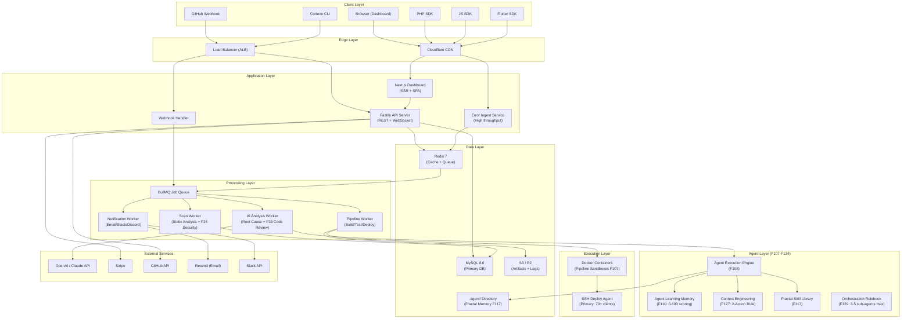

# Technical Architecture & Database Schema — Cortexo DevOps Platform

> **Parent Document:** [PRD v134](file:///D:/Cortexo/docs/01_PRD.md)
> **Last Updated:** 2026-04-23 | **Status:** Synced with PRD v134 (134 features / 21 categories)

---

## 1. Tech Stack (Production)

### Existing Stack (70+ Client Panels)

| Layer | Technology | Notes |
|---|---|---|
| **Backend** | PHP 7.4→8.2 (CodeIgniter 3→4) | F50: Phased migration |
| **Database** | MySQL 8.0 | F43-F44: `pt-online-schema-change` for zero-downtime |
| **Frontend** | jQuery + Bootstrap 5 | Gentelella-inspired admin panels |
| **Mobile** | Flutter + Ionic | F121: Specialist Agent Persona |
| **Deployment** | SSH/SFTP | Single-server per client |
| **Server** | Ubuntu + Apache/Nginx | Shared hosting environments |

### New Stack (Cortexo Platform)

| Layer | Technology | Justification |
|---|---|---|
| **Dashboard** | Next.js 14 (App Router) + TypeScript | SSR for SEO, RSC for dashboard performance |
| **UI Components** | Shadcn/UI + Radix | Accessible, customizable, no vendor lock-in |
| **Styling** | Tailwind CSS 4 | Rapid UI, consistent design system |
| **State** | Zustand + React Query | Lightweight, server-state caching |
| **Real-time** | Socket.IO | Live pipeline logs, error feed, rate ticker |
| **Backend API** | Node.js + Fastify | 2x Express, schema validation built-in |
| **Auth** | NextAuth.js v5 | GitHub/Google OAuth, JWT sessions |
| **Database** | MySQL 8.0 (primary) | Matches existing client stack |
| **ORM** | Drizzle ORM | Type-safe, fast, MySQL-native |
| **Cache** | Redis 7 | Session cache, rate limiting, pub/sub |
| **Job Queue** | BullMQ (Redis-backed) | Pipeline execution, scan jobs, AI analysis |
| **AI Engine** | OpenAI GPT-4o + Claude API | Root cause, code review, fix suggestions |
| **File Storage** | Cloudflare R2 / AWS S3 | Build artifacts, logs, screenshots |
| **Email** | Resend | Transactional alerts (F59) |
| **Payments** | Stripe | Subscriptions, usage-based billing |
| **Git Integration** | GitHub App + GitLab OAuth | Webhooks, repo access, PR comments |
| **Container Runtime** | Docker + Firecracker microVMs | Isolated pipeline execution (F107) |
| **Hosting** | AWS (ECS + RDS + ElastiCache) | Production-grade, auto-scaling |
| **CDN** | Cloudflare | Global edge, DDoS protection |
| **Monitoring** | Prometheus + Grafana | F97-F98: Observability stack |

---

## 2. System Architecture



---

## 3. Service Breakdown

| Service | Responsibility | Scale | PRD Features |
|---|---|---|---|
| **next-dashboard** | SSR pages, dashboard SPA | 2-4 instances | F62-F68 |
| **api-server** | REST API, WebSocket, auth | 2-8 instances | Core |
| **error-ingest** | Receive SDK errors at high throughput | 2-10 (auto-scale) | F18-F23 |
| **webhook-handler** | Process GitHub/GitLab webhooks | 1-2 instances | F1-F4 |
| **pipeline-worker** | Execute build/test/deploy jobs | 4-20 (auto-scale) | F1, F12-F16 |
| **scan-worker** | Run static analysis on code | 2-4 instances | F24-F25, F50 |
| **ai-worker** | AI root cause analysis + code review | 2-4 instances | F26-F32, F33 |
| **agent-engine** | Autonomous agent execution | 1-4 instances | F107-F134 |
| **notification-worker** | Email, Slack, webhooks, Discord | 1-2 instances | F59-F61 |
| **scheduler** | Cron jobs (cleanup, reports, health) | 1 instance | F97-F98 |

---

## 4. Database Schema (MySQL 8.0)

### 4.1 Multi-Tenancy Model
**Strategy:** Shared database, row-level isolation via `org_id` on every table.

### 4.2 Core Tables

```sql
-- ========================================
-- ORGANIZATIONS (Tenants)
-- ========================================
CREATE TABLE organizations (
    id              CHAR(36) PRIMARY KEY DEFAULT (UUID()),
    name            VARCHAR(100) NOT NULL,
    slug            VARCHAR(50) UNIQUE NOT NULL,
    plan            VARCHAR(20) DEFAULT 'free',
    stripe_customer_id VARCHAR(100),
    stripe_subscription_id VARCHAR(100),
    usage_deploys   INT DEFAULT 0,
    usage_errors    INT DEFAULT 0,
    usage_ai_calls  INT DEFAULT 0,
    usage_reset_at  DATETIME,
    settings        JSON DEFAULT ('{}'),
    created_at      DATETIME DEFAULT CURRENT_TIMESTAMP,
    updated_at      DATETIME DEFAULT CURRENT_TIMESTAMP ON UPDATE CURRENT_TIMESTAMP
) ENGINE=InnoDB DEFAULT CHARSET=utf8mb4 COLLATE=utf8mb4_unicode_ci;

-- ========================================
-- USERS
-- ========================================
CREATE TABLE users (
    id              CHAR(36) PRIMARY KEY DEFAULT (UUID()),
    org_id          CHAR(36),
    name            VARCHAR(100) NOT NULL,
    email           VARCHAR(255) UNIQUE NOT NULL,
    password_hash   VARCHAR(255),
    avatar_url      VARCHAR(500),
    role            VARCHAR(20) DEFAULT 'member',
    provider        VARCHAR(20),
    provider_id     VARCHAR(100),
    last_login_at   DATETIME,
    created_at      DATETIME DEFAULT CURRENT_TIMESTAMP,
    FOREIGN KEY (org_id) REFERENCES organizations(id)
) ENGINE=InnoDB DEFAULT CHARSET=utf8mb4 COLLATE=utf8mb4_unicode_ci;

-- ========================================
-- PROJECTS (Connected Repos / Client Panels)
-- ========================================
CREATE TABLE projects (
    id              CHAR(36) PRIMARY KEY DEFAULT (UUID()),
    org_id          CHAR(36),
    name            VARCHAR(100) NOT NULL,
    description     TEXT,
    repo_provider   VARCHAR(20) NOT NULL,
    repo_url        VARCHAR(500) NOT NULL,
    repo_full_name  VARCHAR(200),
    default_branch  VARCHAR(50) DEFAULT 'main',
    sdk_api_key     VARCHAR(64) UNIQUE NOT NULL,
    health_score    INT DEFAULT 100,
    settings        JSON DEFAULT ('{}'),
    is_active       BOOLEAN DEFAULT true,
    created_at      DATETIME DEFAULT CURRENT_TIMESTAMP,
    updated_at      DATETIME DEFAULT CURRENT_TIMESTAMP ON UPDATE CURRENT_TIMESTAMP,
    FOREIGN KEY (org_id) REFERENCES organizations(id),
    INDEX idx_projects_org (org_id)
) ENGINE=InnoDB DEFAULT CHARSET=utf8mb4 COLLATE=utf8mb4_unicode_ci;
```

### 4.3 CI/CD Tables (F1-F4)

```sql
-- PIPELINES, PIPELINE_RUNS, DEPLOYMENTS, DEPLOY_TARGETS
-- (Same structure as v1, adapted to MySQL syntax with UUID(), JSON, InnoDB)
CREATE TABLE pipelines (
    id              CHAR(36) PRIMARY KEY DEFAULT (UUID()),
    project_id      CHAR(36),
    name            VARCHAR(100) NOT NULL,
    config          JSON NOT NULL,
    trigger_on      JSON DEFAULT ('["push"]'),
    trigger_branches JSON DEFAULT ('["main"]'),
    is_active       BOOLEAN DEFAULT true,
    created_at      DATETIME DEFAULT CURRENT_TIMESTAMP,
    updated_at      DATETIME DEFAULT CURRENT_TIMESTAMP ON UPDATE CURRENT_TIMESTAMP,
    FOREIGN KEY (project_id) REFERENCES projects(id) ON DELETE CASCADE
) ENGINE=InnoDB DEFAULT CHARSET=utf8mb4 COLLATE=utf8mb4_unicode_ci;

CREATE TABLE pipeline_runs (
    id              CHAR(36) PRIMARY KEY DEFAULT (UUID()),
    pipeline_id     CHAR(36),
    project_id      CHAR(36),
    org_id          CHAR(36),
    status          VARCHAR(20) NOT NULL,
    trigger_type    VARCHAR(20),
    commit_sha      VARCHAR(40),
    branch          VARCHAR(100),
    commit_message  TEXT,
    commit_author   VARCHAR(100),
    stages_result   JSON DEFAULT ('[]'),
    started_at      DATETIME,
    finished_at     DATETIME,
    duration_ms     INT,
    logs_url        VARCHAR(500),
    created_at      DATETIME DEFAULT CURRENT_TIMESTAMP,
    FOREIGN KEY (pipeline_id) REFERENCES pipelines(id),
    FOREIGN KEY (project_id) REFERENCES projects(id),
    FOREIGN KEY (org_id) REFERENCES organizations(id),
    INDEX idx_runs_project_status (project_id, status, created_at DESC)
) ENGINE=InnoDB DEFAULT CHARSET=utf8mb4 COLLATE=utf8mb4_unicode_ci;

CREATE TABLE deployments (
    id              CHAR(36) PRIMARY KEY DEFAULT (UUID()),
    project_id      CHAR(36),
    org_id          CHAR(36),
    pipeline_run_id CHAR(36),
    environment     VARCHAR(50) DEFAULT 'production',
    status          VARCHAR(20) NOT NULL,
    deploy_target   JSON NOT NULL,
    commit_sha      VARCHAR(40),
    diff_summary    TEXT,
    files_changed   JSON,
    deployed_by     CHAR(36),
    rolled_back     BOOLEAN DEFAULT false,
    rollback_to     CHAR(36),
    deployed_at     DATETIME DEFAULT CURRENT_TIMESTAMP,
    FOREIGN KEY (project_id) REFERENCES projects(id),
    FOREIGN KEY (org_id) REFERENCES organizations(id),
    FOREIGN KEY (pipeline_run_id) REFERENCES pipeline_runs(id),
    FOREIGN KEY (deployed_by) REFERENCES users(id)
) ENGINE=InnoDB DEFAULT CHARSET=utf8mb4 COLLATE=utf8mb4_unicode_ci;
```

### 4.4 Bug Detection Tables (F18-F23)

```sql
CREATE TABLE errors (
    id              CHAR(36) PRIMARY KEY DEFAULT (UUID()),
    project_id      CHAR(36),
    org_id          CHAR(36),
    fingerprint     VARCHAR(64) NOT NULL,
    type            VARCHAR(100),
    message         TEXT NOT NULL,
    stack_trace     TEXT,
    file            VARCHAR(500),
    line            INT,
    environment     VARCHAR(50),
    severity        VARCHAR(20) DEFAULT 'error',
    status          VARCHAR(20) DEFAULT 'open',
    first_seen      DATETIME DEFAULT CURRENT_TIMESTAMP,
    last_seen       DATETIME DEFAULT CURRENT_TIMESTAMP,
    occurrence_count INT DEFAULT 1,
    affected_users  INT DEFAULT 0,
    linked_deploy_id CHAR(36),
    assigned_to     CHAR(36),
    resolved_at     DATETIME,
    resolved_by     CHAR(36),
    tags            JSON DEFAULT ('[]'),
    context         JSON DEFAULT ('{}'),
    breadcrumbs     JSON DEFAULT ('[]'),
    FOREIGN KEY (project_id) REFERENCES projects(id),
    FOREIGN KEY (org_id) REFERENCES organizations(id),
    INDEX idx_errors_fingerprint (project_id, fingerprint),
    INDEX idx_errors_status (project_id, status, last_seen DESC)
) ENGINE=InnoDB DEFAULT CHARSET=utf8mb4 COLLATE=utf8mb4_unicode_ci;
```

### 4.5 AI Root Cause Tables (F26-F32)

```sql
CREATE TABLE root_causes (
    id              CHAR(36) PRIMARY KEY DEFAULT (UUID()),
    error_id        CHAR(36),
    project_id      CHAR(36),
    org_id          CHAR(36),
    deploy_id       CHAR(36),
    summary         TEXT NOT NULL,
    detailed_cause  TEXT NOT NULL,
    suggested_fix   TEXT,
    affected_file   VARCHAR(500),
    affected_line   INT,
    confidence      INT,
    ai_model        VARCHAR(50),
    ai_tokens_used  INT,
    similar_bugs    JSON DEFAULT ('[]'),
    user_feedback   VARCHAR(20),
    feedback_note   TEXT,
    created_at      DATETIME DEFAULT CURRENT_TIMESTAMP,
    FOREIGN KEY (error_id) REFERENCES errors(id),
    FOREIGN KEY (project_id) REFERENCES projects(id),
    FOREIGN KEY (org_id) REFERENCES organizations(id)
) ENGINE=InnoDB DEFAULT CHARSET=utf8mb4 COLLATE=utf8mb4_unicode_ci;

CREATE TABLE bug_patterns (
    id              CHAR(36) PRIMARY KEY DEFAULT (UUID()),
    org_id          CHAR(36),
    pattern_name    VARCHAR(200) NOT NULL,
    description     TEXT,
    detection_rule  JSON NOT NULL,
    fix_template    TEXT,
    times_matched   INT DEFAULT 0,
    last_matched    DATETIME,
    is_global       BOOLEAN DEFAULT false,
    created_at      DATETIME DEFAULT CURRENT_TIMESTAMP,
    FOREIGN KEY (org_id) REFERENCES organizations(id)
) ENGINE=InnoDB DEFAULT CHARSET=utf8mb4 COLLATE=utf8mb4_unicode_ci;
```

### 4.6 Agent Learning Tables (F107-F134) — NEW

```sql
-- ========================================
-- AGENT SESSIONS (F108: Autonomous Execution Engine)
-- ========================================
CREATE TABLE agent_sessions (
    id              CHAR(36) PRIMARY KEY DEFAULT (UUID()),
    project_id      CHAR(36),
    org_id          CHAR(36),
    agent_type      VARCHAR(50) NOT NULL,  -- 'code_review', 'root_cause', 'tdd', 'deploy'
    status          VARCHAR(20) DEFAULT 'running',
    context_tokens  INT DEFAULT 0,
    tools_used      JSON DEFAULT ('[]'),
    result_summary  TEXT,
    performance_score INT,                  -- F110: 0-100 quantitative score
    llm_judge_score INT,                    -- F110: LLM-as-a-Judge score
    started_at      DATETIME DEFAULT CURRENT_TIMESTAMP,
    finished_at     DATETIME,
    duration_ms     INT,
    FOREIGN KEY (project_id) REFERENCES projects(id),
    FOREIGN KEY (org_id) REFERENCES organizations(id),
    INDEX idx_agent_sessions_project (project_id, agent_type, started_at DESC)
) ENGINE=InnoDB DEFAULT CHARSET=utf8mb4 COLLATE=utf8mb4_unicode_ci;

-- ========================================
-- AGENT MEMORY (F110: Agent Learning Memory)
-- ========================================
CREATE TABLE agent_memories (
    id              CHAR(36) PRIMARY KEY DEFAULT (UUID()),
    org_id          CHAR(36),
    project_id      CHAR(36),
    memory_type     VARCHAR(30) NOT NULL,  -- 'pattern', 'preference', 'lesson', 'fix'
    content         TEXT NOT NULL,
    embedding_hash  VARCHAR(64),            -- for semantic search
    quality_score   INT DEFAULT 50,         -- 0-100, decays over time
    access_count    INT DEFAULT 0,
    valid_from      DATETIME DEFAULT CURRENT_TIMESTAMP,
    valid_until     DATETIME,               -- temporal validity for stale detection
    source_session  CHAR(36),
    created_at      DATETIME DEFAULT CURRENT_TIMESTAMP,
    updated_at      DATETIME DEFAULT CURRENT_TIMESTAMP ON UPDATE CURRENT_TIMESTAMP,
    FOREIGN KEY (org_id) REFERENCES organizations(id),
    FOREIGN KEY (project_id) REFERENCES projects(id),
    INDEX idx_memories_type (org_id, memory_type, quality_score DESC)
) ENGINE=InnoDB DEFAULT CHARSET=utf8mb4 COLLATE=utf8mb4_unicode_ci;

-- ========================================
-- SKILL REGISTRY (F117: Fractal Skill Library)
-- ========================================
CREATE TABLE skill_registry (
    id              CHAR(36) PRIMARY KEY DEFAULT (UUID()),
    org_id          CHAR(36),
    skill_name      VARCHAR(100) NOT NULL,
    version         VARCHAR(20) DEFAULT '1.0.0',
    category        VARCHAR(50),            -- 'devops', 'code_review', 'testing', 'security'
    risk_level      VARCHAR(20) DEFAULT 'low',  -- F130: Skill Risk Classification
    content_hash    VARCHAR(64),
    usage_count     INT DEFAULT 0,
    avg_effectiveness INT DEFAULT 50,       -- 0-100
    is_active       BOOLEAN DEFAULT true,
    created_at      DATETIME DEFAULT CURRENT_TIMESTAMP,
    FOREIGN KEY (org_id) REFERENCES organizations(id)
) ENGINE=InnoDB DEFAULT CHARSET=utf8mb4 COLLATE=utf8mb4_unicode_ci;
```

### 4.7 System Tables

```sql
-- NOTIFICATIONS, AUDIT_LOGS
-- (Same structure as v1, adapted to MySQL syntax)
CREATE TABLE notifications (
    id              CHAR(36) PRIMARY KEY DEFAULT (UUID()),
    user_id         CHAR(36),
    org_id          CHAR(36),
    type            VARCHAR(50) NOT NULL,
    title           VARCHAR(200),
    message         TEXT,
    link            VARCHAR(500),
    is_read         BOOLEAN DEFAULT false,
    created_at      DATETIME DEFAULT CURRENT_TIMESTAMP,
    FOREIGN KEY (user_id) REFERENCES users(id),
    FOREIGN KEY (org_id) REFERENCES organizations(id)
) ENGINE=InnoDB DEFAULT CHARSET=utf8mb4 COLLATE=utf8mb4_unicode_ci;

CREATE TABLE audit_logs (
    id              BIGINT AUTO_INCREMENT PRIMARY KEY,
    org_id          CHAR(36),
    user_id         CHAR(36),
    action          VARCHAR(50) NOT NULL,
    resource_type   VARCHAR(50),
    resource_id     CHAR(36),
    details         JSON DEFAULT ('{}'),
    ip_address      VARCHAR(45),
    created_at      DATETIME DEFAULT CURRENT_TIMESTAMP,
    FOREIGN KEY (org_id) REFERENCES organizations(id),
    INDEX idx_audit_org_action (org_id, action, created_at DESC)
) ENGINE=InnoDB DEFAULT CHARSET=utf8mb4 COLLATE=utf8mb4_unicode_ci;
```

---

## 5. Agent Subsystem Architecture (F107-F134)

### 5.1 `.agent/` Directory Structure (F117)

```
D:\Cortexo\.agent/
├── memory/
│   ├── patterns.json          # Learned bug patterns (F110)
│   ├── preferences.json       # Org/project preferences
│   └── sessions/              # Per-session context snapshots
├── skills/
│   ├── code-review/SKILL.md   # F33 patterns
│   ├── tdd/SKILL.md           # F114 patterns
│   ├── security-scan/SKILL.md # F24 patterns
│   └── deploy/SKILL.md        # F1 patterns
├── context/
│   ├── active.json            # Current task context
│   └── history/               # Past context snapshots (2-Action Rule)
└── config/
    ├── orchestration.yaml     # F129: Agent Orchestration Rulebook
    └── risk-levels.yaml       # F130: Skill Risk Classification
```

### 5.2 Production Guardrails (from audits)

| Guardrail | Source | Implementation |
|---|---|---|
| **2-Action Rule** | Planning-with-Files | Persist findings to disk after every 2 external operations |
| **3-5 Sub-agent Cap** | Antigravity Skills (multi-agent-patterns) | Max 3-5 sub-agents per supervisor |
| **15x Token Budget** | Antigravity Skills | Budget multi-agent runs at 15x single-agent baseline |
| **70% Compaction Trigger** | Antigravity Skills (context-optimization) | Compact context at 70%, never wait until 90% |
| **Iron Law Verification** | Antigravity Skills (verification-before-completion) | 5-step gate before ANY completion claim |
| **LLM-as-a-Judge** | Antigravity Skills (evaluation) | Different model family evaluates agent output |
| **10-20 Tool Limit** | Antigravity Skills (tool-design) | Max tool count per agent context |
| **forward_message** | Antigravity Skills (multi-agent-patterns) | Direct sub-agent → user responses (prevent telephone game) |

---

## 6. Security Design

| Area | Implementation |
|---|---|
| **Auth** | OAuth 2.0 (GitHub, Google), JWT access tokens (15min), refresh tokens (7d) |
| **API Keys** | SDK keys per-project, scoped to error ingestion only |
| **Encryption at rest** | AES-256 for deploy credentials, SSH keys |
| **Encryption in transit** | TLS 1.3 everywhere |
| **Secrets in pipelines** | Stored encrypted, injected as env vars, never logged |
| **Pipeline isolation** | Each build in disposable Docker container / Firecracker microVM (F107) |
| **Rate limiting** | 100 req/min per user, 10,000 errors/min per project |
| **RBAC** | Owner > Admin > Member > Viewer roles per org |
| **Container scanning** | Docker CVE/Trivy (F24) |
| **PHP security** | Prepared statements, XSS protection, CSRF tokens (F24) |
| **MySQL hardening** | `performance_schema` monitoring, slow query logs (F44) |
| **SOC2 / GDPR** | Data residency options, deletion API, audit logs |

---

## 7. Scalability Plan

| Load Level | Users | Errors/day | Architecture |
|---|---|---|---|
| **Launch** | 0-1K | 50K | Single server, managed MySQL |
| **Growth** | 1K-10K | 500K | 3 API servers, read replica, Redis cluster |
| **Scale** | 10K-100K | 5M | K8s, auto-scaling workers, partitioned tables |
| **Enterprise** | 100K+ | 50M+ | Multi-region, dedicated clusters |

---

## 8. Database Optimization Patterns (F43-F44)

From **antigravity-awesome-skills** audit:

| Pattern | Implementation |
|---|---|
| **Zero-downtime migrations** | `pt-online-schema-change` for all ALTER TABLE operations |
| **Index monitoring** | `sys.schema_unused_indexes` weekly audit |
| **Slow query detection** | `performance_schema` + `slow_query_log` with 100ms threshold |
| **Connection pooling** | ProxySQL or MySQL Router for connection management |
| **Query optimization** | `EXPLAIN ANALYZE` on all queries >50ms |
| **Partitioning** | `error_events` table partitioned by month |
