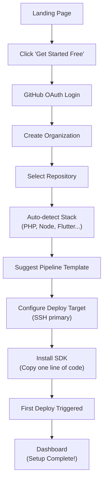
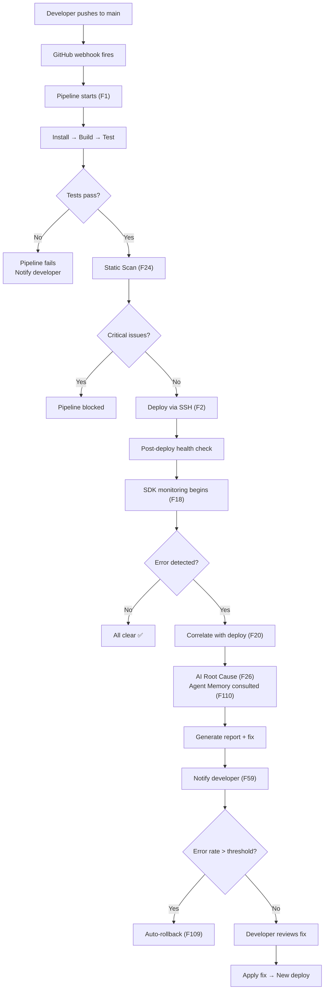
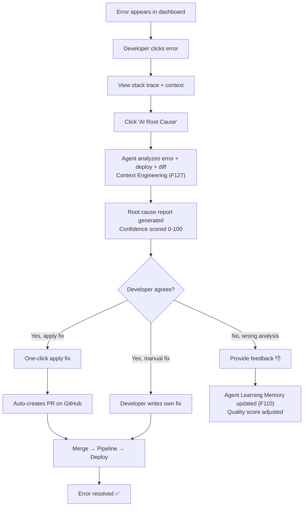

# UI/UX Design & User Flows — Cortexo DevOps Platform

> **Parent Document:** [PRD v134](file:///D:/Cortexo/docs/01_PRD.md)
> **Last Updated:** 2026-04-23 | **Status:** Synced with PRD v134 (134 features / 21 categories)

---

## 1. Design System

### Colors
| Token | Light Mode | Dark Mode | Usage |
|---|---|---|---|
| `--primary` | #4F46E5 (Indigo) | #818CF8 | Buttons, links, active states |
| `--primary-hover` | #4338CA | #6366F1 | Button hover |
| `--success` | #10B981 | #34D399 | Deploy success, passed scans |
| `--danger` | #EF4444 | #F87171 | Errors, critical alerts |
| `--warning` | #F59E0B | #FBBF24 | Warnings, medium severity |
| `--info` | #3B82F6 | #60A5FA | Information, low severity |
| `--bg` | #F9FAFB | #0F172A | Page background |
| `--surface` | #FFFFFF | #1E293B | Cards, panels |
| `--border` | #E5E7EB | #334155 | Borders, dividers |
| `--text-primary` | #111827 | #F1F5F9 | Headings, body |
| `--text-secondary` | #6B7280 | #94A3B8 | Labels, hints |
| `--agent` | #8B5CF6 | #A78BFA | Agent Intelligence features |

### Color Themes (Runtime-Switchable)

Inspired by Gentelella theme system — `data-theme` attribute on `<html>`:

| Theme | Primary | Best For |
|---|---|---|
| Default | Indigo `#4F46E5` | General purpose |
| Ocean | Sky `#0ea5e9` | Corporate, enterprise |
| Emerald | Green `#10b981` | DevOps, health monitoring |
| Midnight | Cyan `#22d3ee` | Dark mode optimized |
| Teal | Teal `#14b8a6` | Healthcare, wellness |

### Typography
| Element | Font | Size | Weight |
|---|---|---|---|
| H1 (Page title) | Inter | 28px | 700 |
| H2 (Section) | Inter | 22px | 600 |
| H3 (Card title) | Inter | 18px | 600 |
| Body | Inter | 14px | 400 |
| Small / Label | Inter | 12px | 500 |
| Code / Mono | JetBrains Mono | 13px | 400 |

### Spacing & Radius
| Token | Value |
|---|---|
| `--radius-sm` | 6px |
| `--radius-md` | 10px |
| `--radius-lg` | 14px |
| `--spacing-xs` | 4px |
| `--spacing-sm` | 8px |
| `--spacing-md` | 16px |
| `--spacing-lg` | 24px |
| `--spacing-xl` | 32px |

---

## 2. Navigation Structure

### Sidebar (Left)
```
┌─────────────────────────┐
│  🟣 Cortexo              │  ← Logo
│                          │
│  📊 Dashboard            │  ← Home
│                          │
│  PROJECTS                │  ← Section
│  📁 All Projects         │
│  + New Project           │
│                          │
│  CI/CD                   │  ← Section (F1-F4)
│  🔄 Pipelines            │
│  🚀 Deployments          │
│  ⏮️ Rollbacks            │
│                          │
│  BUGS                    │  ← Section (F18-F32)
│  🐛 Errors               │
│  🔍 Root Causes          │
│  📋 Scan Results         │
│                          │
│  AGENT INTELLIGENCE      │  ← Section (F107-F134) NEW
│  🧠 Agent Memory         │  ← F110
│  📚 Skill Library        │  ← F117
│  🎯 Context Monitor      │  ← F127
│  📊 Agent Performance    │  ← F110 scoring
│                          │
│  ANALYTICS               │  ← Section (F97-F98)
│  📈 Insights             │
│  📊 Reports              │
│                          │
│  ──────────────────────  │
│  ⚙️ Settings             │  ← Bottom pinned
│  👤 Team                 │
│  💳 Billing              │
└──────────────────────────┘
```

### Top Bar
```
┌──────────────────────────────────────────────────────────────┐
│  [🔍 Search... (⌘K)]           [🔔 3]  [Project ▼]  [👤 ▼] │
└──────────────────────────────────────────────────────────────┘
```

---

## 3. All Screens (22 Pages)

### Page 1: Landing Page (Public — `/`)
```
┌─────────────────────────────────────────────────────────────┐
│  NAV: Logo | Features | Pricing | Docs | [Login] [Sign Up]  │
├─────────────────────────────────────────────────────────────┤
│                                                              │
│  HERO SECTION                                                │
│  ┌──────────────────────────────────────────────────────┐    │
│  │  "Deploy. Detect. Debug.                             │    │
│  │   All in one platform."                              │    │
│  │                                                      │    │
│  │  The only DevOps tool that deploys your code,        │    │
│  │  catches bugs automatically, and tells you WHY       │    │
│  │  they happened — powered by AI.                      │    │
│  │                                                      │    │
│  │  [Get Started Free]  [Watch Demo →]                  │    │
│  └──────────────────────────────────────────────────────┘    │
│                                                              │
│  TRUST BAR: "Trusted by 500+ teams" + logos                  │
│                                                              │
│  4 FEATURE CARDS:                                            │
│  ┌──────────┐ ┌──────────┐ ┌──────────┐ ┌──────────┐       │
│  │ 🔄 CI/CD │ │ 🐛 Auto  │ │ 🔍 AI    │ │ 🧠 Agent │       │
│  │ Pipeline │ │ Bug Det. │ │ Root     │ │ Intelli- │       │
│  │ Builder  │ │          │ │ Cause    │ │ gence    │       │
│  └──────────┘ └──────────┘ └──────────┘ └──────────┘       │
│                                                              │
│  PRICING TABLE (Free / Pro / Team / Enterprise)              │
│  FAQ SECTION (Accordion)                                     │
│  FOOTER                                                      │
└─────────────────────────────────────────────────────────────┘
```

---

### Page 2: Dashboard (Home — `/dashboard`)
```
┌─────────────────────────────────────────────────────────────┐
│  SIDEBAR │  Dashboard                          [+ New Project]│
│          │                                                    │
│          │  ┌──────────┐ ┌──────────┐ ┌──────────┐ ┌───────┐│
│          │  │ Health   │ │ Deploys  │ │ Errors   │ │ Agent ││
│          │  │ Score    │ │ Today    │ │ (24h)    │ │ Score ││
│          │  │  94/100  │ │   12 ✅  │ │   3 🔴   │ │ 87/100││
│          │  └──────────┘ └──────────┘ └──────────┘ └───────┘│
│          │                                                    │
│          │  ┌─────────────────────┐ ┌────────────────────┐   │
│          │  │ Error Trend (7 day) │ │ Recent Deploys     │   │
│          │  │ ▁▂▁▃▁█▂             │ │ #84 main → prod ✅ │   │
│          │  │      ↑ Deploy #82   │ │ #83 fix/btn → ✅   │   │
│          │  │      caused spike   │ │ #82 feat/book ⚠️   │   │
│          │  └─────────────────────┘ └────────────────────┘   │
│          │                                                    │
│          │  ┌─────────────────────┐ ┌────────────────────┐   │
│          │  │ Active Alerts  (2)  │ │ Agent Activity     │   │
│          │  │ 🔴 Error spike in   │ │ 🧠 Code review     │   │
│          │  │    booking API      │ │    completed (92%) │   │
│          │  │ 🟡 Slow response    │ │ 🔍 Root cause      │   │
│          │  │    on /api/rates    │ │    analyzing...    │   │
│          │  └─────────────────────┘ └────────────────────┘   │
└─────────────────────────────────────────────────────────────┘
```

---

### Pages 3-8: (Same as v1 — Projects, Pipelines, Run Detail, Errors, Error Detail, AI Root Cause)

Updated with Cortexo branding. Same wireframe structure.

---

### Page 19: Agent Memory Dashboard (`/agent/memory`) — NEW

```
┌──────────────────────────────────────────────────────────────┐
│  🧠 Agent Memory                          [Consolidate Now]  │
│  F110: Agent Learning Memory | 847 active memories           │
│                                                              │
│  ┌──────────────────────┐ ┌───────────────────────────┐     │
│  │ Memory by Type       │ │ Quality Distribution      │     │
│  │ ████ Patterns   312  │ │ ██████████ 90-100: 142    │     │
│  │ ███  Lessons    245  │ │ ████████   70-89:  298    │     │
│  │ ██   Preferences 178 │ │ ████       50-69:  245    │     │
│  │ █    Fixes      112  │ │ ██         <50:    162    │     │
│  └──────────────────────┘ └───────────────────────────┘     │
│                                                              │
│  Recent Memories:                                            │
│  ┌──────────────────────────────────────────────────────┐   │
│  │ 🟢 Score: 95 │ Pattern │ "PHP null coalesce (??)    │   │
│  │              │         │  fixes 73% of undefined    │   │
│  │              │         │  property errors"          │   │
│  ├──────────────────────────────────────────────────────┤   │
│  │ 🟡 Score: 68 │ Lesson  │ "Client VijayBullion       │   │
│  │              │         │  requires 2-decimal for    │   │
│  │              │         │  silver, 0-decimal gold"   │   │
│  └──────────────────────────────────────────────────────┘   │
│                                                              │
│  Stale Memories (valid_until expired): 42 [Review →]         │
└──────────────────────────────────────────────────────────────┘
```

---

### Page 20: Skill Library (`/agent/skills`) — NEW

```
┌──────────────────────────────────────────────────────────────┐
│  📚 Skill Library                           [+ Install Skill] │
│  F117: Fractal Skill Library | 47 active skills              │
│                                                              │
│  [All] [DevOps] [Code Review] [Testing] [Security] [Deploy] │
│                                                              │
│  ┌──────────────────────────────────────────────────────┐   │
│  │ 🟢 code-review v2.0  │ Used 234x │ Effectiveness 91% │   │
│  │    Risk: LOW          │ Category: Code Review         │   │
│  ├──────────────────────────────────────────────────────┤   │
│  │ 🟢 tdd v1.5          │ Used 89x  │ Effectiveness 87% │   │
│  │    Risk: LOW          │ Category: Testing             │   │
│  ├──────────────────────────────────────────────────────┤   │
│  │ 🟡 deploy-ssh v1.2   │ Used 456x │ Effectiveness 94% │   │
│  │    Risk: MEDIUM       │ Category: Deployment          │   │
│  ├──────────────────────────────────────────────────────┤   │
│  │ 🔴 schema-migrate v1 │ Used 12x  │ Effectiveness 72% │   │
│  │    Risk: HIGH         │ Category: Database            │   │
│  └──────────────────────────────────────────────────────┘   │
└──────────────────────────────────────────────────────────────┘
```

---

### Page 21: Context Monitor (`/agent/context`) — NEW

```
┌──────────────────────────────────────────────────────────────┐
│  🎯 Context Monitor                                          │
│  F127: AI Context Engineering | Active sessions: 3           │
│                                                              │
│  ┌─────────────────────────────────────────────────────┐    │
│  │ Session: code-review-#84                             │    │
│  │ Context: ████████████████░░░░░ 68% (68K / 100K)     │    │
│  │ Status: 🟢 Healthy                                  │    │
│  │ 2-Action Rule: ✅ 4 persists / 8 operations         │    │
│  │ Degradation: None detected                           │    │
│  ├─────────────────────────────────────────────────────┤    │
│  │ Session: root-cause-analysis                         │    │
│  │ Context: ██████████████████████░░ 82% (82K / 100K)  │    │
│  │ Status: 🟡 Compaction recommended                   │    │
│  │ 2-Action Rule: ⚠️ 2 persists / 7 operations         │    │
│  │ Degradation: Lost-in-middle risk detected            │    │
│  └─────────────────────────────────────────────────────┘    │
│                                                              │
│  Degradation Alerts:                                         │
│  ⚠️ Session root-cause at 82% — compaction at 70% threshold │
│  ⚠️ 2-Action Rule violation — 3 operations without persist  │
└──────────────────────────────────────────────────────────────┘
```

---

### Page 22: Agent Performance (`/agent/performance`) — NEW

```
┌──────────────────────────────────────────────────────────────┐
│  📊 Agent Performance                                        │
│  F110 Scoring | Last 30 days                                 │
│                                                              │
│  ┌──────────┐ ┌──────────┐ ┌──────────┐ ┌──────────┐       │
│  │ Avg Score│ │ Sessions │ │ Fix Rate │ │ Accuracy │       │
│  │   87/100 │ │    342   │ │   78%    │ │   91%    │       │
│  └──────────┘ └──────────┘ └──────────┘ └──────────┘       │
│                                                              │
│  Performance by Agent Type:                                  │
│  ┌──────────────────────────────────────────────────────┐   │
│  │ Code Review:  ████████████████████ 91/100            │   │
│  │ Root Cause:   █████████████████   85/100             │   │
│  │ TDD:          ████████████████    82/100             │   │
│  │ Deploy:       ██████████████████████ 94/100          │   │
│  │ Security:     ███████████████     79/100             │   │
│  └──────────────────────────────────────────────────────┘   │
│                                                              │
│  LLM-as-a-Judge Evaluations:                                 │
│  │ Last 7 days │ 48 evaluations │ Avg: 88/100 │ Trend: ↑ │  │
└──────────────────────────────────────────────────────────────┘
```

---

## 4. User Flows

### Flow 1: New User Onboarding


### Flow 2: Deploy → Bug → Root Cause


### Flow 3: Error Resolution


---

## 5. Complete Page Index

| # | Page | Route | PRD Features | Status |
|---|---|---|---|---|
| 1 | Landing Page | `/` | — | ✅ Designed |
| 2 | Dashboard | `/dashboard` | F62-F68 | ✅ Designed |
| 3 | Projects List | `/projects` | F9 | ✅ Designed |
| 4 | Pipeline View | `/projects/:id/pipelines` | F1 | ✅ Designed |
| 5 | Pipeline Run | `/runs/:id` | F1 | ✅ Designed |
| 6 | Errors List | `/errors` | F18-F23 | ✅ Designed |
| 7 | Error Detail | `/errors/:id` | F18-F23 | ✅ Designed |
| 8 | AI Root Cause | `/errors/:id/root-cause` | F26-F32 | ✅ Designed |
| 9 | Deployments | `/deployments` | F2-F4 | ✅ Designed |
| 10 | Scan Results | `/scans` | F24-F25 | ✅ Designed |
| 11 | Analytics | `/analytics` | F97-F98 | ✅ Designed |
| 12 | Settings General | `/settings` | — | ✅ Designed |
| 13 | Settings Team | `/settings/team` | F56 | ✅ Designed |
| 14 | Settings Billing | `/settings/billing` | F72-F76 | ✅ Designed |
| 15 | Settings Integrations | `/settings/integrations` | F134 | ✅ Designed |
| 16 | Settings Notifications | `/settings/notifications` | F59-F61 | ✅ Designed |
| 17 | New Project Wizard | `/projects/new` | F9 | ✅ Designed |
| 18 | YAML Editor | `/pipelines/:id/edit` | F1 | ✅ Designed |
| 19 | **Agent Memory** | `/agent/memory` | **F110** | ✅ NEW |
| 20 | **Skill Library** | `/agent/skills` | **F117** | ✅ NEW |
| 21 | **Context Monitor** | `/agent/context` | **F127** | ✅ NEW |
| 22 | **Agent Performance** | `/agent/performance` | **F110** | ✅ NEW |
