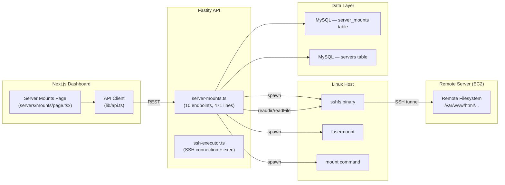
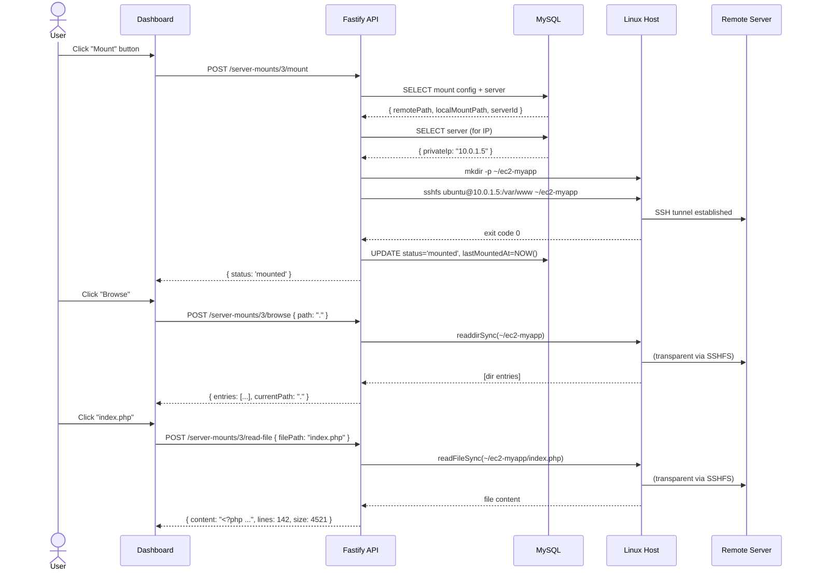

# 🗄️ Cortexo — Server Mounts Deep Analysis

> **Feature**: SSHFS-based remote server file access from the Cortexo dashboard  
> **Status**: Fully implemented (Phase 9 — Infrastructure)  
> **Last Updated**: April 28, 2026

---

## 1. Overview

The **Server Mounts** feature enables users to mount remote EC2/Linux server directories locally via **SSHFS** (SSH Filesystem), and then browse directories and read files directly from the Cortexo web dashboard.

### What it does:
- **Mount/Unmount** remote server directories via SSHFS from the dashboard
- **Browse** the mounted filesystem (directory listing with metadata)
- **Read** files with a built-in code viewer (with line numbers, syntax detection)
- **CRUD** management of mount configurations (name, remote path, local path, SSH user)
- **Live status** checking (mounted/unmounted/error) with disk usage info
- **Auto-mount** option (flagged per-config, for startup automation)

---

## 2. Architecture



### File Locations

| Layer | File | Size |
|---|---|---|
| **API Routes** | [server-mounts.ts](file:///run/media/lmx/LMX/Winbull/Personal/Cortexo/apps/api/src/routes/server-mounts.ts) | 471 lines / 18KB |
| **SSH Library** | [ssh-executor.ts](file:///run/media/lmx/LMX/Winbull/Personal/Cortexo/apps/api/src/lib/ssh-executor.ts) | 393 lines / 11KB |
| **DB Schema** | [infrastructure.ts](file:///run/media/lmx/LMX/Winbull/Personal/Cortexo/packages/db/src/schema/infrastructure.ts) | Lines 84–104 |
| **Frontend Page** | [mounts/page.tsx](file:///run/media/lmx/LMX/Winbull/Personal/Cortexo/apps/web/app/(dashboard)/servers/mounts/page.tsx) | 415 lines / 25KB |
| **API Client** | [api.ts](file:///run/media/lmx/LMX/Winbull/Personal/Cortexo/apps/web/lib/api.ts) | Lines 408–418 |

---

## 3. Database Schema

### `server_mounts` table (Drizzle ORM)

```typescript
export const serverMounts = mysqlTable(
  'server_mounts',
  {
    id:             int('id').primaryKey().autoincrement(),
    serverId:       int('server_id').notNull(),              // FK → servers.id
    name:           varchar('name', { length: 100 }).notNull(),
    remotePath:     varchar('remote_path', { length: 500 }).notNull(),
    localMountPath: varchar('local_mount_path', { length: 500 }).notNull(),
    sshUser:        varchar('ssh_user', { length: 50 }).notNull().default('ubuntu'),
    status:         varchar('status', { length: 20 }).default('unmounted'),
    autoMount:      boolean('auto_mount').default(false),
    createdAt:      datetime('created_at').default(sql`CURRENT_TIMESTAMP`).notNull(),
    lastMountedAt:  datetime('last_mounted_at'),
  },
  (table) => [
    index('idx_mounts_server').on(table.serverId),
    index('idx_mounts_status').on(table.status),
  ],
);
```

### Column Details

| Column | Type | Purpose |
|---|---|---|
| `id` | INT AUTO_INCREMENT PK | Unique mount ID |
| `server_id` | INT NOT NULL | References `servers.id` for IP/SSH key lookup |
| `name` | VARCHAR(100) | Human-readable label (e.g. "RubySilver") |
| `remote_path` | VARCHAR(500) | Path on the remote server (e.g. `/var/www/html/rubysilver`) |
| `local_mount_path` | VARCHAR(500) | Local path to mount to (e.g. `~/ec2-rubysilver`) |
| `ssh_user` | VARCHAR(50) | SSH username (default: `ubuntu`) |
| `status` | VARCHAR(20) | `mounted` / `unmounted` / `error` |
| `auto_mount` | BOOLEAN | Flag for auto-mount on startup |
| `created_at` | DATETIME | Creation timestamp |
| `last_mounted_at` | DATETIME | Last successful mount timestamp |

### Related: `servers` table

The mount references a server for connection details:

```typescript
export const servers = mysqlTable('servers', {
  id:            int('id').primaryKey().autoincrement(),
  name:          varchar('name', { length: 100 }).notNull(),
  privateIp:     varchar('private_ip', { length: 45 }),
  publicAddress: varchar('public_address', { length: 255 }),
  sshKey:        varchar('ssh_key', { length: 500 }),
  status:        varchar('status', { length: 20 }).default('active'),
  createdAt:     datetime('created_at').default(sql`CURRENT_TIMESTAMP`).notNull(),
});
```

---

## 4. API Endpoints (10 routes)

All routes are prefixed with `/v1/server-mounts`.

### CRUD Operations

| Method | Endpoint | Description |
|---|---|---|
| `GET` | `/server-mounts` | List all mounts (with live mounted/unmounted status) |
| `GET` | `/server-mounts/:id` | Get single mount + associated server info |
| `POST` | `/server-mounts` | Create new mount config |
| `PUT` | `/server-mounts/:id` | Update mount config |
| `DELETE` | `/server-mounts/:id` | Delete mount (auto-unmounts first if active) |

### Mount Operations

| Method | Endpoint | Description |
|---|---|---|
| `POST` | `/server-mounts/:id/mount` | Execute SSHFS mount |
| `POST` | `/server-mounts/:id/unmount` | Execute fusermount unmount |
| `GET` | `/server-mounts/:id/status` | Check live mount status + disk info |

### File Operations

| Method | Endpoint | Description |
|---|---|---|
| `POST` | `/server-mounts/:id/browse` | Browse mounted directory (body: `{ path: "." }`) |
| `POST` | `/server-mounts/:id/read-file` | Read file contents (body: `{ filePath: "src/index.php" }`) |

---

## 5. Mount/Unmount Lifecycle

### Mount Flow (`POST /server-mounts/:id/mount`)

```
1. Lookup mount config from DB
2. Lookup associated server (for IP address)
3. Check if already mounted (via `mount` command output)
4. Create local directory if not exists (mkdirSync recursive)
5. Validate shell-safety of sshUser, serverIp, remotePath
6. Execute: sshfs user@ip:/remote/path /local/path -o reconnect,...
7. On success: update DB status → 'mounted', set lastMountedAt
8. On failure: update DB status → 'error', return error details
```

### SSHFS Command

```bash
sshfs ubuntu@10.0.1.5:/var/www/html/myapp ~/ec2-myapp \
  -o reconnect,ServerAliveInterval=15,ServerAliveCountMax=3,\
     cache=yes,kernel_cache,auto_cache,compression=no,\
     StrictHostKeyChecking=no
```

**Options explained:**
- `reconnect` — Auto-reconnect on network drop
- `ServerAliveInterval=15` — Send keepalive every 15s
- `ServerAliveCountMax=3` — Disconnect after 3 missed keepalives (45s timeout)
- `cache=yes,kernel_cache,auto_cache` — Enable local caching for performance
- `compression=no` — Disabled for speed (SSH compression adds CPU overhead)
- `StrictHostKeyChecking=no` — Accept new host keys automatically

### Unmount Flow (`POST /server-mounts/:id/unmount`)

```
1. Lookup mount config
2. Check if actually mounted
3. Try: fusermount -u /local/path
4. If fails: fallback to lazy unmount: fusermount -uz /local/path
5. Update DB status → 'unmounted'
```

### Status Check (`GET /server-mounts/:id/status`)

```
1. Lookup mount config
2. Run `mount` command, check if localPath appears in output
3. If mounted: run `df -h /local/path` for disk usage info
4. Return: { status, localPath, diskInfo: { size, used, available, usePercent } }
```

---

## 6. File Browser & Reader

### Directory Browse (`POST /server-mounts/:id/browse`)

- Accepts `{ path: "relative/path" }` in request body (default: `"."`)
- Uses Node.js `readdirSync` + `statSync` on the locally-mounted SSHFS directory
- Returns entries with: `name`, `path`, `isDirectory`, `size`, `modified`, `type`
- **Sorting**: Directories first, then files alphabetically
- **Navigation**: Returns `currentPath` and `parentPath` for breadcrumb navigation

### File Type Detection

Supports 30+ file extensions with type hints:

| Category | Extensions |
|---|---|
| Languages | `.php`, `.js`, `.ts`, `.jsx`, `.tsx`, `.py`, `.rb`, `.java`, `.go`, `.rs`, `.dart`, `.swift`, `.kt` |
| Web | `.css`, `.scss`, `.html`, `.json`, `.xml`, `.sql` |
| Config | `.yml`, `.yaml`, `.sh`, `.md`, `.env`, `.gitignore`, `.htaccess` |
| Media | `.png`, `.jpg`, `.jpeg`, `.gif`, `.webp`, `.svg`, `.ico` |
| Binary | `.pdf`, `.zip`, `.tar`, `.gz` |

### File Reader (`POST /server-mounts/:id/read-file`)

- Accepts `{ filePath: "path/to/file" }` in request body
- **Max file size**: 2MB
- **Binary file rejection**: Returns 400 for images, PDFs, archives, fonts, etc.
- Returns: `{ filePath, fileName, content, size, lines, modified, type }`

---

## 7. Security Measures

### Shell Injection Prevention

```typescript
function validateShellSafe(input: string, fieldName: string): void {
  const dangerous = /[;|&$`"'\\\\\\n\\r(){}\\[\\]<>!#~]/;
  if (dangerous.test(input)) {
    throw new Error(`Invalid characters in ${fieldName}`);
  }
}
```

- Applied to `sshUser`, `serverIp`, and `remotePath` before SSHFS execution
- Uses `spawnSync` with argument arrays (not shell strings) to prevent injection
- All user inputs validated via Zod schemas at the route level

### Path Traversal Prevention

```typescript
function safePath(basePath: string, requestedPath: string): string {
  const base = resolve(expandHome(basePath));
  const target = resolve(base, requestedPath);
  if (!target.startsWith(base)) {
    throw new Error('Path traversal detected');
  }
  return target;
}
```

- Prevents `../../../etc/passwd` style attacks
- Resolves paths absolutely before comparison
- Returns HTTP 403 with "Access denied — path outside mount scope"

### Input Validation (Zod)

```typescript
const createMountSchema = z.object({
  serverId:       z.number(),
  name:           z.string().min(1).max(100),
  remotePath:     z.string().min(1).max(500),
  localMountPath: z.string().min(1).max(500),
  sshUser:        z.string().min(1).max(50).default('ubuntu'),
  autoMount:      z.boolean().default(false),
});
```

---

## 8. SSH Executor Library

The [ssh-executor.ts](file:///run/media/lmx/LMX/Winbull/Personal/Cortexo/apps/api/src/lib/ssh-executor.ts) is a shared library used across the platform (deployments, provisioning, etc.).

### Key Features

| Feature | Detail |
|---|---|
| **Connection** | `ssh2` library with 15s timeout |
| **Auth** | Private key (PEM file/string) or password |
| **Key Resolution** | Priority: explicit key → `SSH_PEM_KEY_PATH` env → `~/.ssh/` auto-detect |
| **Command Exec** | Streaming stdout/stderr with configurable timeout (default: 120s) |
| **Deploy Sequence** | 7-step pipeline: connect → verify path → pre-deploy → git pull → post-deploy → health check → capture SHA |
| **Connection Test** | Quick SSH test returning uptime, user, hostname |

### SSH Key Auto-Discovery

```typescript
const candidates = [
  'prod-ec2-key.pem',
  'key_Logimaxcbe.pem',
  'app-server-lmx.pem',
  'id_ed25519',
  'id_rsa',
  'id_ecdsa'
];
```

> [!NOTE]
> The key list includes project-specific PEM files (`prod-ec2-key.pem`, `key_Logimaxcbe.pem`, `app-server-lmx.pem`) alongside standard SSH keys.

---

## 9. Frontend UI

### Dashboard Page: `/dashboard/servers/mounts`

**Components:**
- **Mount Cards Grid** — Responsive grid (min 380px cards) showing all mounts
  - Color-coded accent bar (green = mounted, gray = unmounted)
  - Server IP, SSH user, remote/local paths
  - Mount/Unmount/Browse action buttons
  - Hover elevation effect with colored shadows

- **Create Modal** — Server selector, mount name, remote path, local path, SSH user, auto-mount toggle

- **File Browser Panel** — Slide-in panel from the right
  - Directory listing with file type icons
  - Back navigation for parent directories
  - Expands to 85vw when viewing a file
  - Inline code viewer with line numbers (JetBrains Mono font)
  - Copy-to-clipboard button

### API Client Methods

```typescript
class ApiClient {
  getServerMounts()
  getServerMount(id: number)
  createServerMount(data: Partial<ServerMount>)
  updateServerMount(id: number, data: Partial<ServerMount>)
  deleteServerMount(id: number)
  mountServer(id: number)
  unmountServer(id: number)
  getServerMountStatus(id: number)
  browseServerMount(id: number, path: string = '.')
  readServerFile(id: number, filePath: string)
}
```

---

## 10. Dependencies

### System Requirements (Linux Host)

| Package | Purpose |
|---|---|
| `sshfs` | FUSE-based SSH filesystem mount |
| `fuse` / `fuse3` | Filesystem in Userspace (required by sshfs) |
| `fusermount` | FUSE mount/unmount utility |
| SSH keys | PEM files or `~/.ssh/` keys for passwordless auth |

### Node.js Dependencies

| Package | Purpose |
|---|---|
| `ssh2` | SSH client for connection testing + remote command execution |
| `zod` | Request body validation |
| `drizzle-orm` | MySQL query builder |
| `child_process` | `spawnSync` for SSHFS and mount commands |
| `fs` | `readdirSync`, `statSync`, `readFileSync` for file operations |

---

## 11. Potential Improvements

> [!WARNING]
> **Windows Compatibility**: SSHFS relies on Linux FUSE. For Windows, consider:
> - **WinFsp + SSHFS-Win** — Windows SSHFS implementation
> - **SSH + SFTP** — Replace local mount with direct SSH/SFTP file operations via `ssh2`
> - **WebDAV** — Alternative network filesystem protocol

### Current Limitations & Enhancement Ideas

| Area | Current | Improvement |
|---|---|---|
| **Multi-tenancy** | No `orgId` on server_mounts | Add org scoping like other tables |
| **File editing** | Read-only | Add write-file endpoint for editing |
| **Search** | No file search | Add `grep`/`find` endpoints for mounted dirs |
| **Bulk ops** | Mount one at a time | Batch mount/unmount all |
| **Upload** | Not supported | Add file upload to mounted dirs |
| **Real-time** | Manual refresh | WebSocket for live status updates |
| **Windows** | Linux-only (SSHFS) | SFTP-based alternative for Windows hosts |
| **Caching** | SSHFS kernel cache only | Application-level directory cache |
| **File download** | Not supported | Add download endpoint |
| **Permissions** | No per-mount RBAC | Tie to user_menu_permissions |

---

## 12. Data Flow Example

### "Mount → Browse → Read File" sequence:



---

> **Summary**: The Server Mounts feature is a fully functional, secure SSHFS-based remote file access system with 10 API endpoints, a rich dashboard UI with inline file viewer, and proper security guards. The primary limitation is Linux-only host requirement due to SSHFS/FUSE dependency. For Windows sharing, consider implementing an SFTP-based alternative using the existing `ssh2` library.

---

## 13. Migration Note: MySQL → PostgreSQL (v4 Architecture)

> **Added**: 2026-05-08 (Documentation audit)

The server mounts feature was built against the **v1 prototype** which used **MySQL + Drizzle ORM** (`mysqlTable`).
The **v4 architecture** mandates **PostgreSQL 16** with RLS for all tenant-scoped tables.

### Changes Required for v4:

| Area | Current (v1) | Target (v4) |
|---|---|---|
| Schema helper | `mysqlTable(...)` | `pgTable(...)` |
| Primary key | `int('id').autoincrement()` | `uuid('id').default(sql\`gen_random_uuid()\`)` |
| Datetime | `datetime(...)` | `timestamp(..., { withTimezone: true })` |
| Tenant isolation | None (`server_id` only) | Add `tenant_id UUID NOT NULL REFERENCES tenants(id)` + RLS |
| Index | `index(...)` | Same syntax, add `tenant_id` to compound indexes |

### v4 Schema (Target):
The v4 equivalent is `server_mount_sessions` in [`04_data_model.md`](../architecture/04_data_model.md) (Domain 6),
which already uses PostgreSQL patterns with `tenant_id`, `BIGINT IDENTITY` PK, and proper FK references.

> ⚠️ The v1 `server_mounts` MySQL table and the v4 `server_mount_sessions` PostgreSQL table serve
> slightly different purposes (config vs session tracking). During migration, both may coexist as
> `server_mount_configs` (CRUD) and `server_mount_sessions` (active session tracking).

